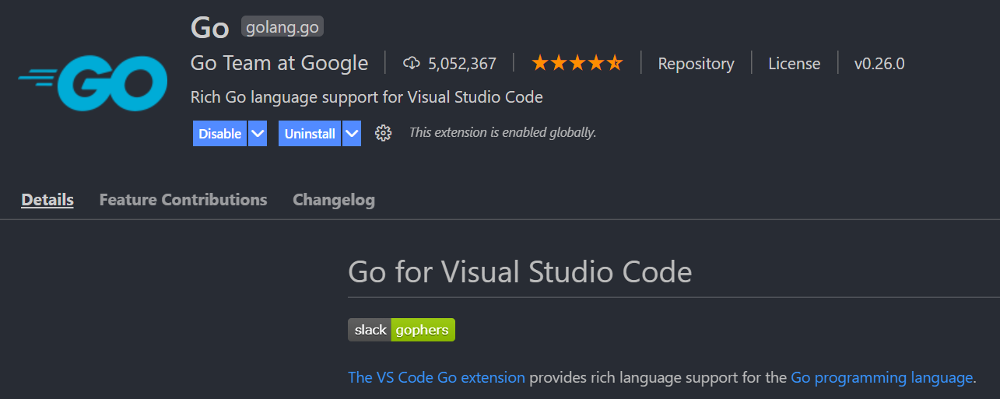

# Win10+go+vscode 环境配置

其实就是想记录一下正确设置`GOPROXY`的命令

<!--more-->

## 0x00 Go环境安装

windows的go安装是十分简单的。直接去[官网](https://golang.org/dl/)下载msi安装包，然后运行即可，环境变量、`GOPATH`什么的也不用自己配置，它会自动帮你弄好。如果是升级的话，还能自动卸载旧版本的go。

## 0x01 vscode环境配置

安装go插件

然后按照跳出来的提示，安装`gopls`/`go-outline`等一系列工具。正常情况下，`go env`可以看到，默认的`GOPROXY`为`https://proxy.golang.org,direct`，但是国内是无法访问的。于是解决办法来了，在不fq的情况下，执行命令`go env -w GOPROXY=https://goproxy.cn,direct`，然后再安装，就可以成功下载并安装这些工具。

于是，就可以在windows上使用vscode进行go开发了。

除此之外，[windows还可以配合wsl配置linux上的go开发环境](https://1iu2y.github.io/posts/2021-04-04-windows10-wsl2-vscode%E9%85%8D%E7%BD%AEgo%E5%BC%80%E5%8F%91%E7%8E%AF%E5%A2%83/)
