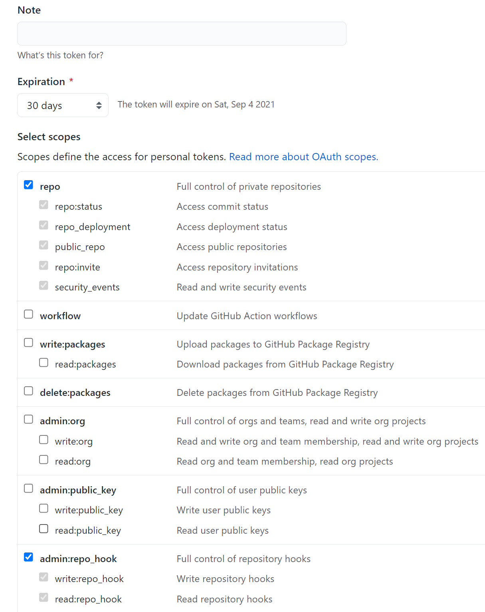
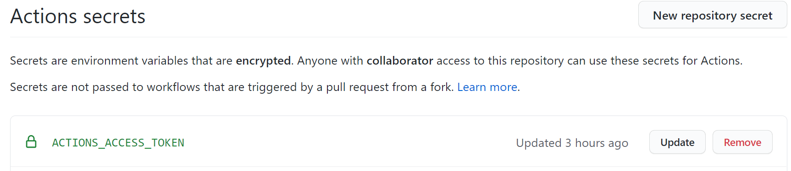
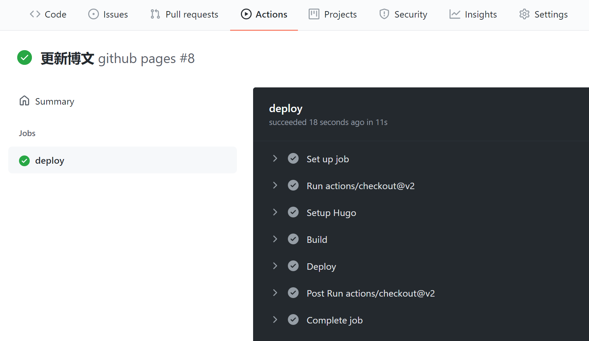

# Github Actions 设置记录


众所周知，hugo的github page部署有两种方式，分别是手动部署与github actions部署。

手动部署就是手动将生成的`public`文件夹中的静态网页内容推送到远程GitHub page仓库，但是比较繁琐，而且源码文件夹本身就是一个git仓库，嵌套的git仓库操作非常麻烦，容易出一些奇奇怪怪的问题。

所以，自动化的github actions就显得非常高效简洁了。


我们从一个现有的hugo项目开始。



### 建立远程仓库

- `git init`初始化
- `git remote add ...`添加远程仓库

### 生成personal_token

找到个人资料的`Settings->Develop settings->Personal access tokens`，点击`Generate new token`生成personal token。勾选如下内容，并且注意到默认的token有效期是30天，这也不用去修改为永不过期，因为永久的token是非常危险的。



将该token的内容复制下来，然后添加到github上源码仓库的secrets之中。



记得过期之后再去创建一个，然后修改secret的内容。

### 添加github action

添加`.github/workflows/xxx.yml`文件，创建github action。
```yaml
name: github pages

on:
  push:
    branches:
      - master  # Set a branch to deploy
  pull_request:

jobs:
  deploy:
    runs-on: ubuntu-20.04
    steps:
      - uses: actions/checkout@v2
        with:
          submodules: true  # Fetch Hugo themes (true OR recursive)
          fetch-depth: 0    # Fetch all history for .GitInfo and .Lastmod

      - name: Setup Hugo
        uses: peaceiris/actions-hugo@v2
        with:
          hugo-version: 'latest'
          # extended: true

      - name: Build
        run: hugo -D

      - name: Deploy
        uses: peaceiris/actions-gh-pages@v3
        with:
          personal_token: ${{ secrets.ACTIONS_ACCESS_TOKEN }} # 这里的 ACTIONS_DEPLOY_KEY 则是上面设置 Private Key的变量名
          external_repository: 1iu2y/1iu2y.github.io # Pages 远程仓库 
          publish_dir: "./public"
          keep_files: false # remove existing files
          publish_branch: master  # deploying branch，对应于1iu2y.github.io仓库的branch，该仓库的默认分支是master，所以我这里也定义为了master
          commit_message: ${{ github.event.head_commit.message }} #commit_message: ${{ github.event.head_commit.message }}
```

### It works!






除去`personal_token`之外，还可以使用`public_key`的方式进行action部署，有待尝试。




如果使用deploy_key的话，将yml文件对应内容进行修改。这种方式的好处在于密钥不会过期。

```yaml
        with:
          # personal_token: ${{ secrets.ACTIONS_ACCESS_TOKEN }} # 这里的 ACTIONS_DEPLOY_KEY 则是上面设置 Private Key的变量名
          deploy_key: ${{ secrets.ACTIONS_DEPLOY_KEY }}
          external_repository: 1iu2y/1iu2y.github.io # Pages 远程仓库 
          publish_dir: "./public"
          keep_files: false # remove existing files
          publish_branch: master  # deploying branch
          commit_message: ${{ github.event.head_commit.message }} #commit_message: ${{ github.event.head_commit.message }}
```

### 参考链接：

- [https://zhuanlan.zhihu.com/p/109057290](https://zhuanlan.zhihu.com/p/109057290)
