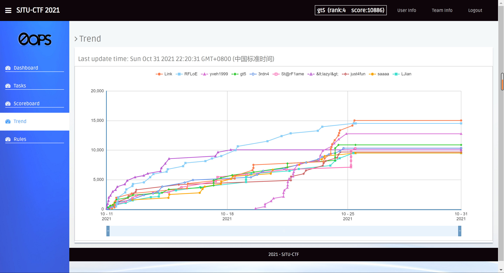
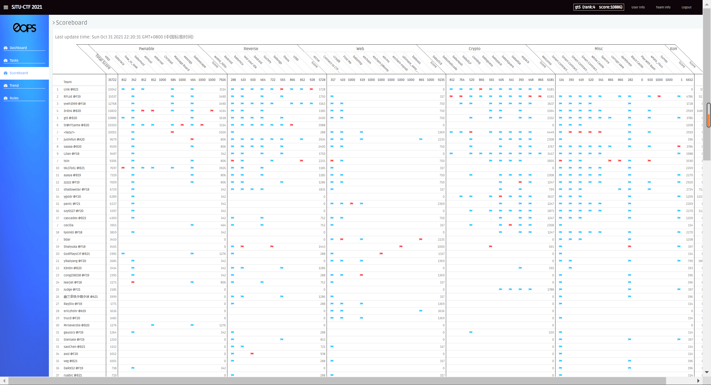

# 10月随笔

月末的一点点文字...

<!--more-->

## 入冬

今天是10.28日，10月就快要过去了。在这个月里，天气渐渐转凉，上海在某一天直接从夏天转到了深秋。不止上海，全国各地的天气似乎也都在各自的“某一天”里瞬间转凉，“一秒入冬”的梗在网络上成为了一时的热词。冬天的过早到来似乎也与10月这个月份格格不入，有种雨下错了季候的感觉，给人以错乱且奇妙的氛围。再加上最近几天还看到了「[拉尼娜年](https://zh.wikipedia.org/wiki/%E6%8B%89%E5%B0%BC%E5%A8%9C%E7%8E%B0%E8%B1%A1)」的相关新闻，想必今年的冬天也会比较寒冷吧。

## 10月回顾

总的来说，10月是较为忙碌的一个月。我回想了一下，在这个月里，我主要完成了3件事。

### 婚礼

10月2号是表哥的婚礼。为此，我9月份就提前和导师请好了假，在9月底回了家。随着年龄的增长，婚礼参加得也越来越多。看着曾经带着还是小屁孩的我玩游戏的几位哥哥，如今都已经成为人夫，走入婚姻殿堂。作为晚辈，心里由衷的开心和祝福是肯定的，但同时也少不了几分感慨，心想曾经还是和我现在一样年纪的少年，转眼间就已经三十而立，成为了一个家的中流砥柱，要努力去面对生活的压力、经营婚姻与家庭、创造并教育下一代（原谅我暂时想不出创造之外的词）。这些事情，光是想想就不禁令人神情肃穆，心里怎么也泛不起一丝轻松调侃的情绪。这也越发令我意识到我正当下所拥有的青春年华是多么的可贵。

准确的来说，婚礼其实从我回家之前就已经开始了。置办请柬、预定酒店、购买婚礼上要用的物资，这些事情在婚礼开始前一周基本上就得全部安排妥当。在回家后的第二天，我就被叫去帮忙干活了。而我姑姑，作为我哥的老妈以及婚礼的总指挥，更是从早忙到晚。中国的父母想必大多如此吧，将来我爸妈在我婚礼的时候估计也会忙得焦头烂额。

婚礼是中式与西式结合的形式：穿着中式的红色龙凤褂（查了一下才知道原来叫这名字）去接亲。接亲的车队到达酒店之后，新郎新娘再换上西式的西装与婚纱，进行西式的婚礼流程。

婚礼结束之后，我在家待到了4号。期间回了老家一次，剩下的时间都在家里休息。5号早晨，我爸送我到高速口，然后我搭乘另一个表哥返杭的顺风车，跟他一起回了杭州。7号中午，我才再从杭州东站出发，乘高铁回到上海。

仔细回想，这好像是我从去南昌读高中以来，第一次在国庆期间回家。没想到不知不觉间，我已经有8年是在家以外的地方度过一年中的大多数时间。那时刚刚结束初三的我，肯定也没想到后来的这些事情。

### 上研&Huawei

第二件事则是花了2周的时间，完成了与华为合作的实验室项目的一个小任务。具体工作内容也没啥好说的，并不是我感兴趣的领域，所以在那边的工作积极度也并不高。好在最终和另外一名同学合作，取得了一点能够在项目例会上提一嘴的工作成果，也算是给导师交差了。

在那里的两周有两件事令我印象深刻，同时也是值得吐槽的两点：第一点，上海全季酒店的早餐真的不敢恭维，品种单一，连着住一个礼拜绝对会让你吃腻。要不是为了方便，早上能够多睡那么几分钟，我真的就去外面的早餐店买早餐了。第二点，华为上研所内部的人员流动管理真的巨严格，这种严格甚至让我回想起了小学忘戴红领巾而被拦在校门外的体验。从东莞溪村过来的负责对接我们的同事也对此感到诧异和无语😅，上研内部人员通行规则的严格与古板可见一斑。

在住了2个礼拜的酒店之后，我终于回到了学校，并且又一次深深地感受到了当代打工人在结束工作之后面对将要来临假期时的幸福感。

### SJTU-CTF-2021

第三件事是今年的校赛。SJTU-CTF-2021，开始于2021.10.11 8:00AM，结束于2021.10.25 8：00PM（这么长时间的比赛，真是~~卷得我够累的:tired_face:~~适合一边学习一边做题）。

19年的校赛，我做出了一道密码题。当时算是通过这次比赛知道了CTF这么一个东西，比赛之后也就没有去关注过相关方面得内容了。

20年的校赛，我学习了一点点基础知识，想着这次应该可以有点不一样的体验了。但由于时间冲突以及知识储备不够等原因，最后还是只做了3道还是4道题，排名40+。

21年的校赛，终于终于有了一点点进步。这次由于比赛第一天提交了2道简单题，所以在一开始就排进了前10（真正的大佬都是后面才开始交flag的）。然后我就被这前10的排名给拿捏住了，因为不想让自己的排名掉太多，所以每天都被迫在卷各个分类的题（web除外）。再加上这次校赛和上研所那2周基本上是完美重合的，所以我在10.11到10.25这段时间里，基本就是白天上班，晚上做题。最后运气加上一点点实力，拿到了第5的名次，已经算是远远超出预期了:laughing:。

## 后记

25号结束比赛，26号交完writeup。之后在学校里摸了几天鱼，就到了月底了。

这篇随笔的创建日期是10.28，但实际上我一直拖到了今天，也就是10.31号才写完。回头一看，一个月的时间过得还是很快的。希望即将到来的11月能够平稳、充实地度过，希望自己能够多读书，多学习，多运动，继续前进。

