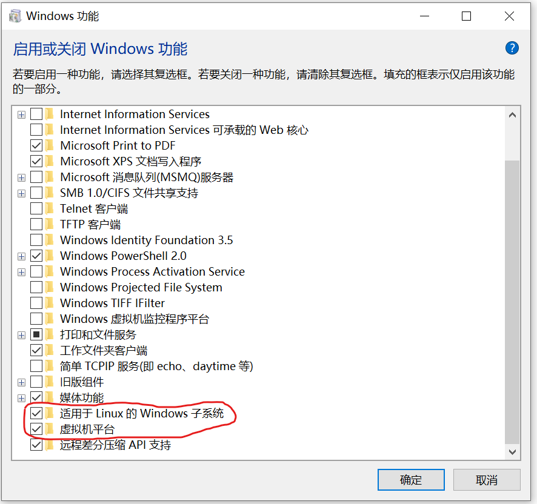
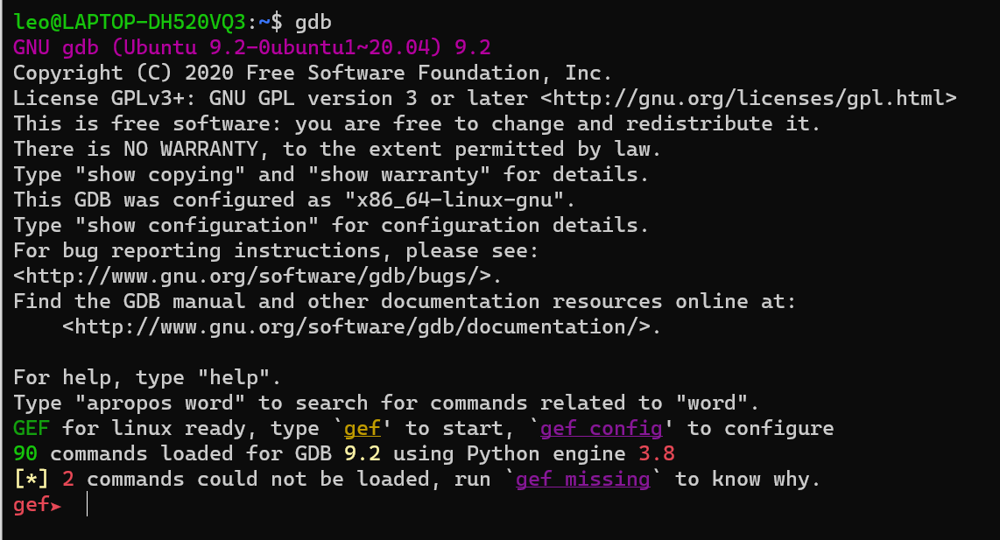
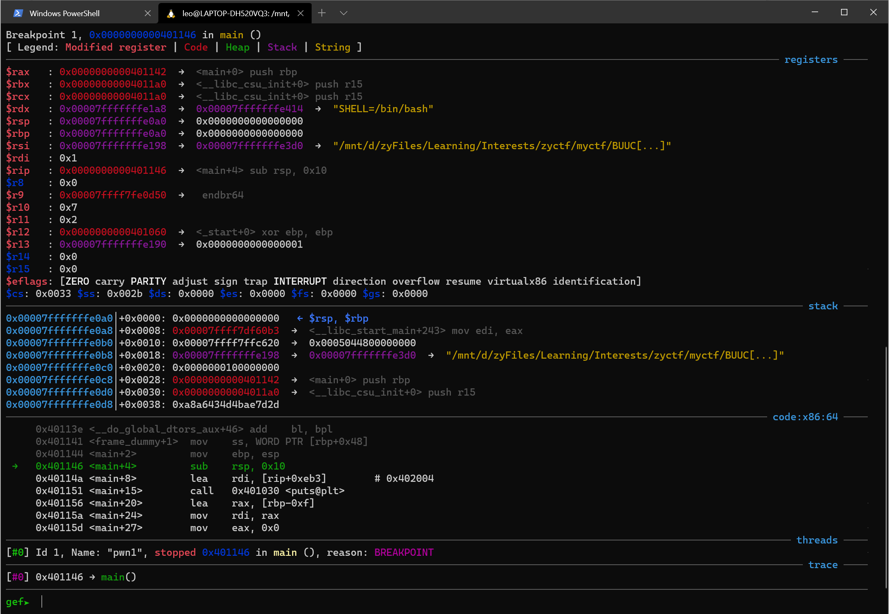

# wsl2-ubuntu20安装以及gef调试工具安装


> 对于配置完全且好用的工具，真是没有抵抗力。。。

### Let's start exploiting!

- 首先，开启你的windows系统中的wsl。打开windows功能，勾选以下两项

  

- Powershell输入`wsl -l -v`查看wsl版本，如果是1的话还需要升级到2。按照[微软的文档](https://docs.microsoft.com/zh-cn/windows/wsl/install-win10#step-4---download-the-linux-kernel-update-package)，下载升级程序并点击安装即可

- 接下来选择ubuntu20作为待安装的Linux版本，在Microsoft Store中搜索并安装即可

- 初始化ubuntu并且设置用户名密码

- 执行以下命令更新源

  `````sh
  $ sudo apt update
  $ sudo apt upgrade
  `````

- 安装gdb

  ```shell
  $ sudo apt install gdb
  ```

- 安装[gef](https://github.com/hugsy/gef)，这里我尝试curl，wget都不行，会卡住，但是明明网站是可以访问的，没办法只要复制网站内容然后粘贴到自己创建的`.gdbinit-gef.py`文件中，然后source写入。以下是官方给出的几种安装方式

  ```shell
  # via the install script
  ## using curl
  $ bash -c "$(curl -fsSL http://gef.blah.cat/sh)"
  
  ## using wget
  $ bash -c "$(wget http://gef.blah.cat/sh -O -)"
  
  # or manually
  $ wget -O ~/.gdbinit-gef.py -q http://gef.blah.cat/py
  $ echo source ~/.gdbinit-gef.py >> ~/.gdbinit
  
  # or alternatively from inside gdb directly
  $ gdb -q
  (gdb) pi import urllib.request as u, tempfile as t; g=t.NamedTemporaryFile(suffix='-gef.py'); open(g.name, 'wb+').write(u.urlopen('https://tinyurl.com/gef-master').read()); gdb.execute('source %s' % g.name)
  ```

- 如果一切无误的话，启动gdb，你会看到以下内容:

  

- 打开一个文件看看，beautiful and elegant

  
