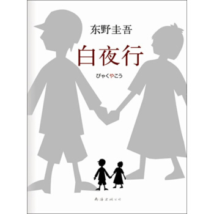

# 重读白夜行

第一次读《白夜行》应该是在高一的时候，当时同学们手中有一本，所以就借来看过。几年过去了，我对于书中的内容早已记不太清，只记得大概是个悲惨的凶手的故事。今年寒假在家的时候和别人聊到了东野圭吾，于是又从网上下载了《白夜行》的mobi文件，重新开始了阅读。

第二遍的阅读应该是比第一遍读得更加顺利、记忆更加深刻的（从我现在还能记起书中的主要故事情节就能知道）。毫无疑问，这是一个令人悲伤的故事。书中的两个主人公，唐泽雪穗与桐原亮司，都是非常悲剧性的人物。童年时代遭遇的苦难和打击，使得他们就像光与暗一般，互相依靠，互相帮助，通过自己对这个世界的残忍手段来努力活着。书中的警察笹垣润三（笹：tì）将他们形容为枪虾与虾虎鱼两种动物，互相帮助，生存在弱肉强食的自然界。

虽然犯罪是因为小时候的苦难，但犯罪终究是犯罪。所以，东野圭吾在书中也交代了象征性的正义获胜的结局，活在暗处的桐原亮司在书中的警察的追捕下选择了畏罪自杀，以自己的生命换取雪穗的平安无事。他把一切罪恶与黑暗都带在自己身上，然后结束于从高楼的纵身一跃中。亮司应该是喜欢雪穗的，或许他们小时候只是单纯的好友关系，但是在一些事情发生之后，他和雪穗的心态都发生了巨大变化，因此他能够心甘情愿地为雪穗付出。当然，雪穗也不是什么单纯弱小的受害者，她在书中是一个外表光鲜亮丽的女人，她懂得利用自己的这方面优势来谋取利益。而且我觉得，可能是雪穗主动找亮司合作的，各种大方向上的决定也是她完成的。这样的一个女人如果在现实世界中存在的话，那肯定非常令人可怕。

> 一天当中，有太阳升起的时候，也有下沉的时候。人生也一样，有白天和黑夜，只是不会像真正的太阳那样，有定时的日出和日落。看个人，有些人一辈子都活在太阳的照耀下，也有些人不得不一直活在漆黑的深夜里。人害怕的，就是本来一直存在的太阳落下不再升起，也就是非常害怕原本照在身上的光芒消失。 我的天空里没有太阳，总是黑夜，但并不暗，因为有东西代替了太阳。虽然没有太阳那么明亮，但对我来说已经足够。凭借着这份光，我便能把黑夜当成白天。你明白吗？我从来就没有太阳，所以不怕失去。

这是书中雪穗对自己的店员说的一句话（如果我没记错的话），听起来有种悲悯而又令人生畏的感觉。也正是因为她从来就不觉得自己拥有太阳，所以她能够不顾一切地去达到自己的目的。

书的封面图案是一张剪纸，剪纸的模样是一个小男孩与小女孩牵手的样子，也就是亮司与雪穗小时候的场景。读完整本书再看到这一封面的时候，确实有种意味深长的感觉啊。书中一切恶的来源，就是大人对小孩犯下的罪恶。在罪恶于黑暗的环境中成长的人，也许真的注定了一生都无法拥有美好的太阳。白夜之行，令人惋惜。

