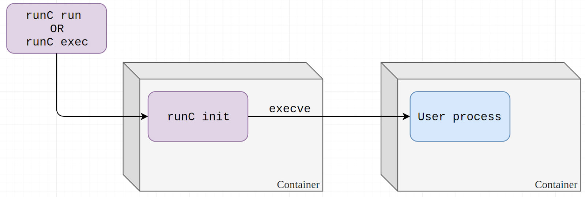
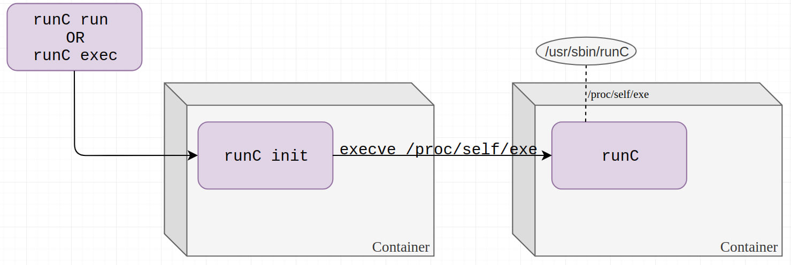
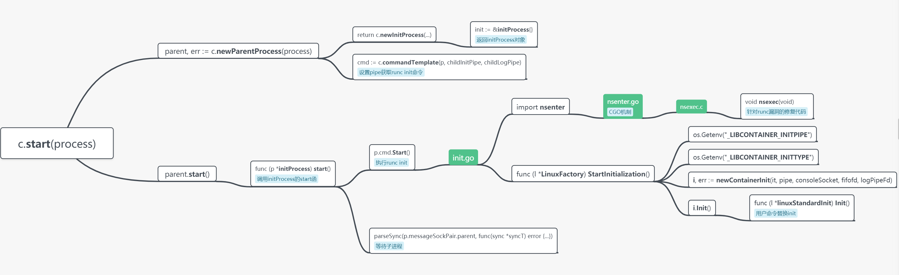

# docker-runc(CVE-2019-5736)漏洞分析-第二版


## 漏洞背景

[runc](https://github.com/opencontainers/runc)是一个根据OCI(Open Container Initiative)标准创建并运行容器的命令行工具，docker引擎也是基于runc构建的。2019年2月11日，runc的相关研究人员通过[oss-security邮件发布了runc逃逸漏洞的详情](https://www.openwall.com/lists/oss-security/2019/02/11/2)。

攻击者可以利用该漏洞在容器内通过特定操作覆盖宿主机上的runc二进制文件，从而在宿主机上以root权限执行代码，达到容器逃逸的目的。

> 影响版本：runc <= 1.0-rc6

## 漏洞成因

docker通过runc启动容器的流程可以概括为以下几步：
- docker-cli根据用户命令发出请求给docker-daemon，docker-daemon经过`docker-daemon -> contained -> containerd-shim -> runc`的调用链启动runc
- runc执行`runc run`命令，创建容器外的runc进程
- 容器外的runc进程处理生成创建容器所需信息，再执行runc init命令创建子进程
- `runc init`子进程对namespace等进行处理，将自身进程转变成为容器进程，并最终将自身的进程映像替换为用户指定的内容

rc6版本及之前的runc创建的runc init进程使用的二进制文件就是宿主机上的runc文件，因此攻击者可以在容器内修改容器内待执行文件的内容，写入`#!/proc/self/exe`，获取宿主机上的runc文件描述符，从而进行修改。

正常的创建容器并在容器内执行命令的过程示意图如下图所示



而修改了待执行文件的内容之后，runc init进程会执行自身，从而将宿主机上的runc文件暴露给了容器内部



### 具体代码分析

首先runc run会执行run命令对应的action，从而执行[startContainer](https://github.com/opencontainers/runc/blob/42a18e7f02528a6269b4ad5e01b8204931d921a6/utils_linux.go#L402-L458)函数

```go
func startContainer(context *cli.Context, spec *specs.Spec, action CtAct, criuOpts *libcontainer.CriuOpts) (int, error) {
    id := context.Args().First()
    if id == "" {
        return -1, errEmptyID
    }

    notifySocket := newNotifySocket(context, os.Getenv("NOTIFY_SOCKET"), id)
    if notifySocket != nil {
        if err := notifySocket.setupSpec(context, spec); err != nil {
            return -1, err
        }
    }

    container, err := createContainer(context, id, spec)
    if err != nil {
        return -1, err
    }

    if notifySocket != nil {
        if err := notifySocket.setupSocketDirectory(); err != nil {
            return -1, err
        }
        if action == CT_ACT_RUN {
            if err := notifySocket.bindSocket(); err != nil {
                return -1, err
            }
        }
    }

    // Support on-demand socket activation by passing file descriptors into the container init process.
    listenFDs := []*os.File{}
    if os.Getenv("LISTEN_FDS") != "" {
        listenFDs = activation.Files(false)
    }

    logLevel := "info"
    if context.GlobalBool("debug") {
        logLevel = "debug"
    }

    r := &runner{
        enableSubreaper: !context.Bool("no-subreaper"),
        shouldDestroy:   true,
        container:       container,
        listenFDs:       listenFDs,
        notifySocket:    notifySocket,
        consoleSocket:   context.String("console-socket"),
        detach:          context.Bool("detach"),
        pidFile:         context.String("pid-file"),
        preserveFDs:     context.Int("preserve-fds"),
        action:          action,
        criuOpts:        criuOpts,
        init:            true,
        logLevel:        logLevel,
    }
    return r.run(spec.Process)
}
```

函数最后的`r.run()`函数创建新进程并调用[linuxContainer结构实现的Run()方法](https://github.com/opencontainers/runc/blob/master/libcontainer/container_linux.go#L273-L281)。

```go
func (c *linuxContainer) Run(process *Process) error {
	if err := c.Start(process); err != nil {
		return err
	}
	if process.Init {
		return c.exec()
	}
	return nil
}
```

函数调用`Start()`函数，`Start()`是对[start()](https://github.com/opencontainers/runc/blob/master/libcontainer/container_linux.go#L361-L400)函数的封装。该函数会调用[newParentProcess()](https://github.com/opencontainers/runc/blob/master/libcontainer/container_linux.go#L472-L499)函数生成[initProcess](https://github.com/opencontainers/runc/blob/master/libcontainer/process_linux.go#L269-L281)类型的对象，再调用initProcess结构实现的start()方法

```go
func (c *linuxContainer) start(process *Process) (retErr error) {
    parent, err := c.newParentProcess(process)
    if err != nil {
        return newSystemErrorWithCause(err, "creating new parent process")
    }

    ...

    if err := parent.start(); err != nil {
        return newSystemErrorWithCause(err, "starting container process")
    }

    ...
    return nil
}
```

[initProcess结构实现的start()方法](https://github.com/opencontainers/runc/blob/master/libcontainer/process_linux.go#L329-L560)会执行runc init命令，并等待runc init子进程完成容器创建以及进程映像替换之后退出

```go
func (p *initProcess) start() (retErr error) {
    defer p.messageSockPair.parent.Close()
    err := p.cmd.Start()
    p.process.ops = p

    ...

    ierr := parseSync(p.messageSockPair.parent, func(sync *syncT) error {
        switch sync.Type {
        case procReady:
            // set rlimits, this has to be done here because we lose permissions
            ...
            sentRun = true
        case procHooks:
            // Setup cgroup before prestart hook, so that the prestart hook could apply cgroup permissions.
            ...
            sentResume = true
        default:
            return newSystemError(errors.New("invalid JSON payload from child"))
        }

        return nil
    })
    return nil
}
```

随着runc init命令被执行，同理，init命令对应的[action](https://github.com/opencontainers/runc/blob/master/init.go#L44-L56)也会被执行，并且此时的runc init进程会最终变成启动的容器进程。

```go
var initCommand = cli.Command{
    Name:  "init",
    Usage: `initialize the namespaces and launch the process (do not call it outside of runc)`,
    Action: func(context *cli.Context) error {
        factory, _ := libcontainer.New("")
        if err := factory.StartInitialization(); err != nil {
            // as the error is sent back to the parent there is no need to log
            // or write it to stderr because the parent process will handle this
            os.Exit(1)
        }
        panic("libcontainer: container init failed to exec")
    },
}
```

[StartInitialization()函数](https://github.com/opencontainers/runc/blob/master/libcontainer/factory_linux.go#L337-L403)调用[linuxStandardInit类型](https://github.com/opencontainers/runc/blob/master/libcontainer/standard_init_linux.go#L23-L30)的信息对象，并调用Init()函数创建初始化进程

```go
// StartInitialization loads a container by opening the pipe fd from the parent to read the configuration and state
// This is a low level implementation detail of the reexec and should not be consumed externally
func (l *LinuxFactory) StartInitialization() (err error) {
    ...
    envInitType := os.Getenv("_LIBCONTAINER_INITTYPE")
    it := initType(envInitType)
    ...
    i, err := newContainerInit(it, pipe, consoleSocket, fifofd, logPipeFd)
    if err != nil {
        return err
    }

    // If Init succeeds, syscall.Exec will not return, hence none of the defers will be called.
    return i.Init()
```

[Init()函数](https://github.com/opencontainers/runc/blob/master/libcontainer/standard_init_linux.go#L48-L231)完成网络、路由、namespace、rootfs等设置，并最终替换进程映像为用户指定的内容。

```go
func (l *linuxStandardInit) Init() error {
    runtime.LockOSThread()
    defer runtime.UnlockOSThread()
    ...
    if err := setupNetwork(l.config); err != nil {
        return err
    }
    if err := setupRoute(l.config.Config); err != nil {
        return err
    }

    // initialises the labeling system
    selinux.GetEnabled()
    if err := prepareRootfs(l.pipe, l.config); err != nil {
        return err
    }
    // Set up the console. This has to be done *before* we finalize the rootfs,
    // but *after* we've given the user the chance to set up all of the mounts
    // they wanted.
    if l.config.CreateConsole {
        if err := setupConsole(l.consoleSocket, l.config, true); err != nil {
            return err
        }
        if err := system.Setctty(); err != nil {
            return errors.Wrap(err, "setctty")
        }
    }

    // Finish the rootfs setup.
    if l.config.Config.Namespaces.Contains(configs.NEWNS) {
        if err := finalizeRootfs(l.config.Config); err != nil {
            return err
        }
    }
    ... 
    // Compare the parent from the initial start of the init process and make
    // sure that it did not change.  if the parent changes that means it died
    // and we were reparented to something else so we should just kill ourself
    // and not cause problems for someone else.
    if unix.Getppid() != l.parentPid {
        return unix.Kill(unix.Getpid(), unix.SIGKILL)
    }
    // Check for the arg before waiting to make sure it exists and it is
    // returned as a create time error.
    name, err := exec.LookPath(l.config.Args[0])    
    ...
    if err := unix.Exec(name, l.config.Args[0:], os.Environ()); err != nil {
        return newSystemErrorWithCause(err, "exec user process")
    }
    return nil
}
```

而因为这里的runc init进程使用的是宿主机上的runc文件，因此如果攻击者在容器内部修改了待执行命令对应的文件内容（如/bin/sh），写入`#!/proc/self/exe`，就会使得runc init执行宿主机上的runc文件，从而将其暴露给容器内部。攻击者就可以在容器内部获取文件描述符，修改宿主机上的runc文件，实现宿主机上的root权限命令执行，完成逃逸。

POC可见[https://github.com/Frichetten/CVE-2019-5736-PoC](https://github.com/Frichetten/CVE-2019-5736-PoC)

以[linuxContainer实现的start()方法](https://github.com/opencontainers/runc/blob/master/libcontainer/container_linux.go#L361-L400)被调用作为起点的话，可以绘制出调用图与修复代码的位置关系



## 漏洞修复

runc团队在之后的版本中进行了修复。根据go的CGO机制，init.go文件中引入了nsenter包，而[nsenter.go](https://github.com/opencontainers/runc/blob/master/libcontainer/nsenter/nsenter.go)中的CGO内容指定了[nsexec.c中定义的nsexec()函数](https://github.com/opencontainers/runc/blob/master/libcontainer/nsenter/nsexec.c#L602-L1115)会在包引入前被执行。

团队在nsexec()函数中增加了对宿主机的runc文件进行自我复制的操作。

```c
void nsexec(void)
{
    int pipenum;
    jmp_buf env;
    int sync_child_pipe[2], sync_grandchild_pipe[2];
    struct nlconfig_t config = { 0 };

    /*
     * Setup a pipe to send logs to the parent. This should happen
     * first, because bail will use that pipe.
     */
    setup_logpipe();

    /*
     * If we don't have an init pipe, just return to the go routine.
     * We'll only get an init pipe for start or exec.
     */
    pipenum = initpipe();
    if (pipenum == -1)
        return;

    /*
     * We need to re-exec if we are not in a cloned binary. This is necessary
     * to ensure that containers won't be able to access the host binary
     * through /proc/self/exe. See CVE-2019-5736.
     */
    if (ensure_cloned_binary() < 0)
        bail("could not ensure we are a cloned binary");
    ...
}
```

[encure_cloned_binary()函数](https://github.com/opencontainers/runc/blob/master/libcontainer/nsenter/cloned_binary.c#L540-L564)会复制runc文件并将其覆盖到当前进程

```c
int ensure_cloned_binary(void)
{
    int execfd;
    char **argv = NULL;

    /* Check that we're not self-cloned, and if we are then bail. */
    int cloned = is_self_cloned();
    if (cloned > 0 || cloned == -ENOTRECOVERABLE)
        return cloned;

    if (fetchve(&argv) < 0)
        return -EINVAL;

    execfd = clone_binary();
    if (execfd < 0)
        return -EIO;

    if (putenv(CLONED_BINARY_ENV "=1"))
        goto error;

    fexecve(execfd, argv, environ);
    error:
    close(execfd);
    return -ENOEXEC;
}
```

## 修补建议
- 及时升级docker使用的runc版本到rc6以上
- 对runc init进程进行监控，确保其执行的二进制文件位于容器内部

