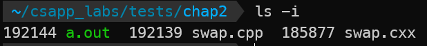
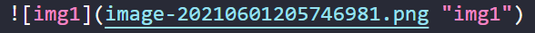

# hugo: hello world


Hello World!

# 标题测试
## 二级标题
### 三级标题
#### 四级标题
##### 五级标题

### 代码块
```python
def main():
    print("hello world")
```
行内代码块`code`

### 表格
| test1 | retes   | essetqq |
| ----- | ------- | ------- |
| eqf24 | 13      | 13      |
| 36u6  | 63y4t25 | 13      |
| edwfd | 24      | t5y6    |


### 数学公式？

- 行内公式

$x = y\times z$

- 多行公式

$$
x^{y^z}=(1+{\rm e}^x)^{-2xy^w}
$$

### 文字样式

> 引用

==高亮==

**加粗**

~~划线~~

*斜体*

正常文字内容

[链接](https://www.google.com)

emoji： :smile:

### 图片引用



### shortcode使用

#### admonition

一个 **注意** 横幅



一个 **摘要** 横幅



一个 **信息** 横幅



一个 **技巧** 横幅



一个 **成功** 横幅



一个 **问题** 横幅



一个 **警告** 横幅



一个 **失败** 横幅



一个 **危险** 横幅



一个 **Bug** 横幅



一个 **示例** 横幅



一个 **引用** 横幅


> bilibili




<!--  -->

## 从hexo换到hugo

之前的博客是使用hexo+github page做的。一开始感觉还行，但是到后来发现，hexo很令人感到厌烦以及恐惧的一点，就是依赖众多的js库，且需要频繁更新，以及庞大的`node_mudoles`目录，这些会给博客后续的维护带来混乱。之前看过别人用[hugo](https://gohugo.io/)搭博客的，于是也自己尝试了一下，把以前的文章迁移到了现在的博客上。

### 一些需要注意的点

- hexo使用的frontmatter中的目录字段为`categories`，与hexo的`category`略有不同
- 由于hexo会自动解析`index.md`/`index.zh-cn.md`等文件的内容，所以目前写文章的模式，是先创建一个文章标题的文件夹，然后在其中添加`index.md`文件。因为我没有设置多语言，所以也就不同加上`zh-cn`等后缀
  -  对于一份内容为空(不算frontmatter)的md文件，hugo渲染会出错。解决办法就是将其命名为`_index.md`
- 关于这一主题[LoveIt](https://github.com/dillonzq/LoveIt)，注意到不太懂的一点，如果想要将文章内的图片以画廊形式展示的话，除了在`config.toml`配置文件中将`lightgallery`值设为`true`，还需要在md文件中插入图片时，将其写成``的形式，就像这样：
- 
- 将选好的图标在网站[https://realfavicongenerator.net/](https://realfavicongenerator.net/)生成所有图标资源，然后直接放在`/static/`目录即可

ps：记录一个用valine+leancloud完成评论系统与统计功能的[博文](https://liubingxuan.xyz/blog-comments-valine-leancloud/)

### 关于部署

我使用的是直接生成静态文件，然后手动将静态文件push到远程仓库的方法。并且由于我有多个不同的github账户，所以在通过ssh key进行push的过程中，还需要解决**自定义私钥**的问题。

#### git推送

- 在博客工程项目目录下运行`hugo`，生成静态文件。如果运行`hugo -D`的话，则会把`draft: true`的文章也进行渲染
- 进入到存放静态文件的`public`目录下，执行以下命令
  - `git remote add origin <your ssh git url>`
  - `git add .`
  - `git commit -m 'first commit message'`
  - `git push -u origin master`


#### 自定义私钥

- 打开你的ssh config文件，windows的路径应该为`C:\Users\<username>\.ssh\config`

- 在其中加入以下内容

  ```plain
  Host <一个能够起标识作用的别名>
    HostName github.com
    User git
    IdentityFile <你自定义的私钥>
    IdentitiesOnly yes
  ```

- 例如，我将`Host`的值填为`gitForLzy`，那么我在add origin的时候就会这样：`git remote add origin git@gitForLzy:myname/myname.github.io`
